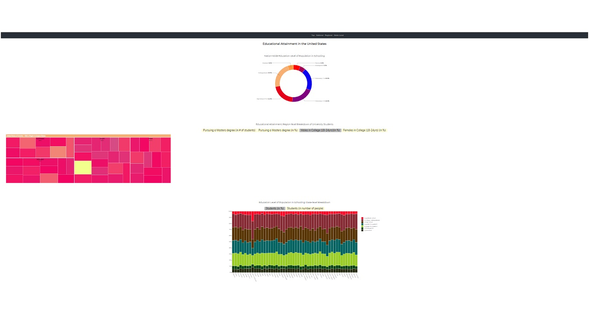

# Μάθημα : Επικοινωνία Ανθρώπου Υπολογιστή

## Οπτικοποίηση δεδομένων εκπαιδευτικού συστήματος (USA)

## Ονοματεπώνυμο : Ντάτζης Παναγιώτης 
## ΑΜ : Π2015042 ##
## e-mail : p15ntat@ionio.gr
## Github Username : Pangntat  

## Link προσωπικόυ αποθετήριου κώδικα: https://github.com/Pangntat/D3js-US-educational-attainment 
## Link εκτελέσιμου κώδικα: https://pangntat.github.io/D3js-US-educational-attainment/  

## Παραδοτέο 1 : Αρχικό έργο και ενδιάμεση αναφορά προόδου (20%), 7 Νοεμβρίου

### Ζητούμενα στα οποία απαιτούνται αλλαγές στο προσωπικό μου αποθετήριο

### <ul> Για την αλλαγή χρώματος στα 3 γραφήματα τροποποίησα χωριστά τα 3 αρχεία script_1.js , script_2.js , script_3.js 
  Συγκεκριμένα στις σειρές :
  
 colour = d3.scaleOrdinal().range(["#ff0000", "#a60059", "#0d00f2", "#800080", "#e6001a", "#f7af72", "#FF9B42"]), 
 var color = d3.scaleLinear().domain([0, 1/4*5000000, 2/4*5000000, 3/4*5000000, 5000000]).range(["#FF0000", "#00610d", "#f2919e", "#ffff00"]);
 var colors = d3.scaleOrdinal().range(["#262b0f", "#054214", "#99cc26", "#006361", "#573300", "#852933", "#ff0026"]); 

## Αντίστοιχα
### Στιγμιότυπο : 

### <ul> Για την αντικατάσταση των διεπαφών στο 2ο και 3ο γράφημα με άλλες της επιλογής μου τροποποίησα τον κώδικα της CSS που βρίσκεται στο φάκελο assets/stylesheets/style.css :  
  .radio-toolbar label {  display: inline-block;  background-color: #fefbd8;  padding: 2px 14px;  font-family: cursive;  font-size: 25px;
  cursor: pointer;} .radio-toolbar input[type="radio"]:checked+label { background-color: #bbb; } 

## Για την πρόσθεση ήχου όταν το ποντίκι διέρχεται πάνω απο menu αρχικά κατέβασα ένα .wav αρχείο με τον ήχο του κλείστρου μιας κάμερας και το σύνδεσα με την εντολή <audio id="sound"> και την εντολή <a onmouseover> στο αρχείο index.html :
  <audio id="sound" src="music.wav"></audio>  
