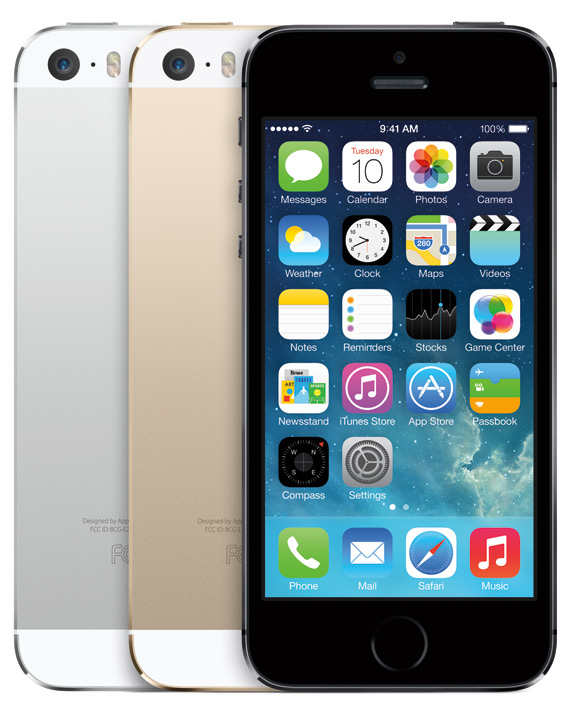
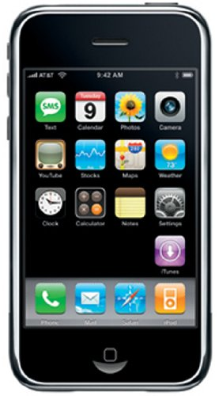
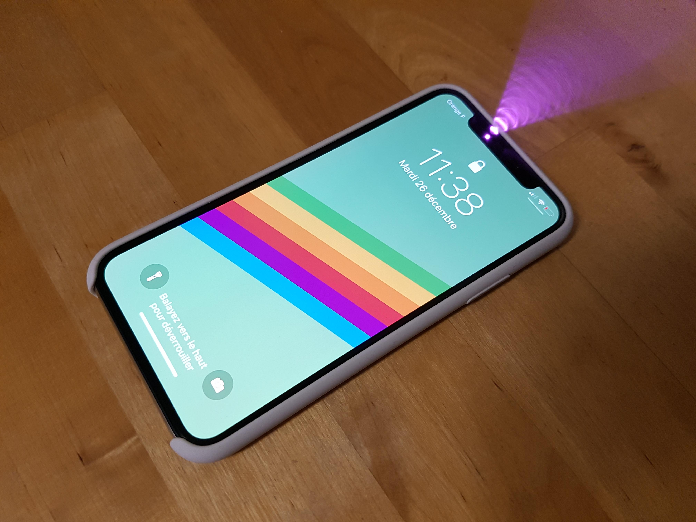

# **First Smartphone with Touch ID**

Link:https://www.google.com/search?q=iphone+5s&client=firefox-b-ab&source=lnms&tbm=isch&sa=X&ved=0ahUKEwiojsXby5XeAhXqKcAKHU-aDg0Q_AUIDigB&biw=1280&bih=664#imgrc=vUT6VYFLdtSxjM:

Το παραπάνω κινητό τηλέφωνο ονομάζεται iphone 5s και είναι το πρώτο κινητό το οποίο κυκλοφόρησε με δαχτυλικό αποτύπωμα (touch ID). Κυκλοφόρησε στις 20 Σεπτεμβρίου του 2013 από την εταιρία Apple Inc. και επέφερε τρομερό αντίκτυπο σε όλη την κοινότητα των κινητών τηλεφώνων.

# **Iphone**

Link:https://www.google.com/search?q=iphone+2g&client=firefox-b-ab&source=lnms&tbm=isch&sa=X&ved=0ahUKEwiovsz81pXeAhXBL8AKHbIEAXcQ_AUIDigB&biw=1280&bih=664#imgrc=ImZMKlLWuRCEiM:

Το παραπάνω κινητό τηλέφωνο ακούει στο όνομα iphone ή αλλιώς iphone 2g, το πρώτο smartphone της αγοράς το οποίο αποτέλεσε τη βάση για όλα τα σημερινά smartphones. Το iphone κυκλοφόρησε στις 29 Ιουνίου του 2007 από την Apple.Inc "φορώντας" και την πρώτη οθόνη αφής.

# **Google**

Link:https://www.google.com/search?client=firefox-b-ab&biw=1280&bih=664&tbm=isch&sa=1&ei=KZnLW-v_BuakrgTympLICA&q=google&oq=google&gs_l=img.3..0i67k1l3j0l4j0i67k1l3.27849.29314.0.29609.6.4.0.2.2.0.274.667.0j1j2.3.0....0...1c.1.64.img..1.5.701....0.HIYclamnx0Q#imgrc=5wK_L1umstSwXM:

Πρόκειται για την μεγαλύτερη εταιρεία διαδικτυακών υπηρεσιών στον κόσμο και δημοφιλέστερη μηχανή αναζήτησης στο διαδίκτυο. Ιδρύθηκε το 1998 από δυο φοιτητές του αμερικανικού Πανεπιστήμιου Stanford, τους Sergey Brin και Lawrence Page και διατέθηκε ελεύθερα στο κοινό το 2004. Η λέξη Google προήλθε από τον μαθηματικό όρο Googol, ο οποίος γράφεται με τον αριθμό 1 ακολουθούμενος απο 100 μηδενικά.

# **Instagram**

Link:https://www.google.com/search?client=firefox-b-ab&biw=1280&bih=664&tbm=isch&sa=1&ei=yZjLW-74Me_irgS33p2YDQ&q=instagram&oq=instagram&gs_l=img.3..0i67k1l2j0l6j0i67k1j0.69731.72395.0.72638.17.9.1.2.2.0.422.1783.2-4j1j1.6.0....0...1c.1.64.img..9.8.1424....0.rn97N9vaVl0#imgdii=ft6DlDjt-gA-pM:&imgrc=JrPXlOeRYtR1YM:

Πρόκειται για ένα από τα δημοφιλέστερα μέσα κοινωνικής δικτύωσης και πολύ πιθανά σύντομα το κυρίαρχο μέσο. Το Instagram ιδρύθηκε το 2010 από δύο απόφοιτους του Πανεπιστήμιου Stanford, τους Kevin Systrom και Mike Krieger. Το όνομα δόθηκε από τον συνδυασμό της λέξης **Insta**nt Tele**gram**. Από το 2012 και έπειτα η εφαρμογή αυτή ανήκει στο Facebook έναντι ενός δισεκατομμυρίου δολλαρίων.

# **First Smarthphone with Face ID**

Link:https://www.google.com/search?client=firefox-b-ab&biw=1280&bih=664&tbm=isch&sa=1&ei=UYjLW_eLL6yGrwSavJaYAQ&q=iphone+x+face+id&oq=iphone+x+face+id&gs_l=img.3..0j0i30k1l9.2555.3659.0.5278.8.7.0.0.0.0.355.959.0j1j2j1.4.0....0...1c.1.64.img..4.4.952...0i10k1.0.pRkuvHcEkNU#imgrc=oA1tintd3jVp7M:

Το παραπάνω κινητό κυκλοφόρησε στις 3 Νοεμβρίου του 2017 από την Apple Inc. με την ονομασία Iphone X. Πρόκειται για το πρώτο κινητό που διαθέτει αναγνώριση προσώπου ως προς την είσοδο στη συγκεκριμένη συσκευή (face ID) αλλάζοντας έτσι για άλλη μια φορά τον τρόπο σκέψης των μεγάλων εταιριών παραγωγής κινητών τηλεφώνων.
