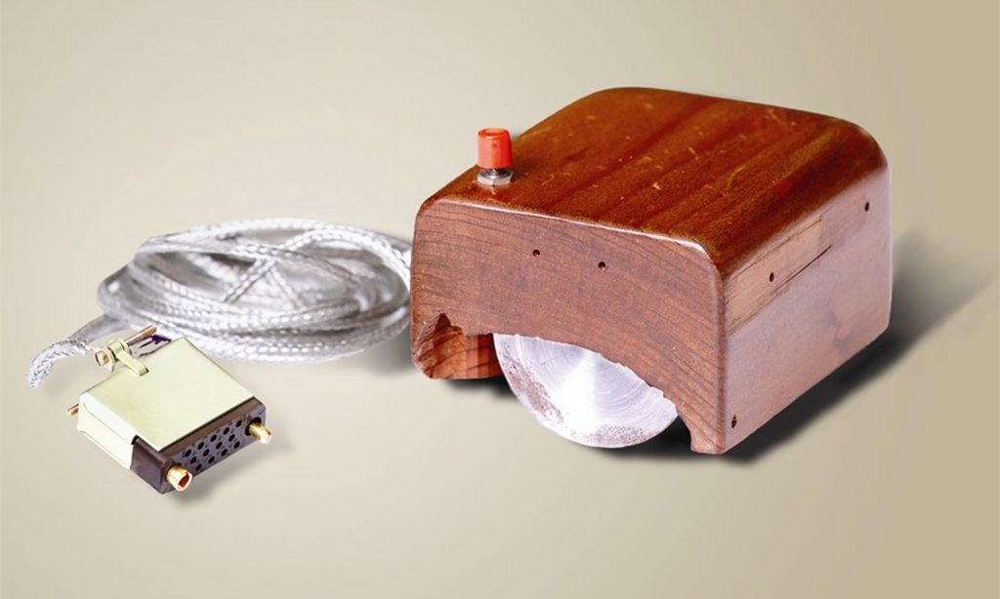
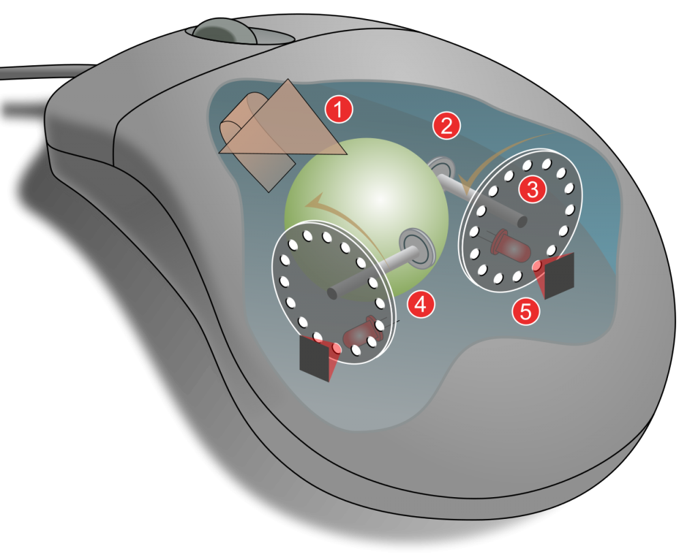
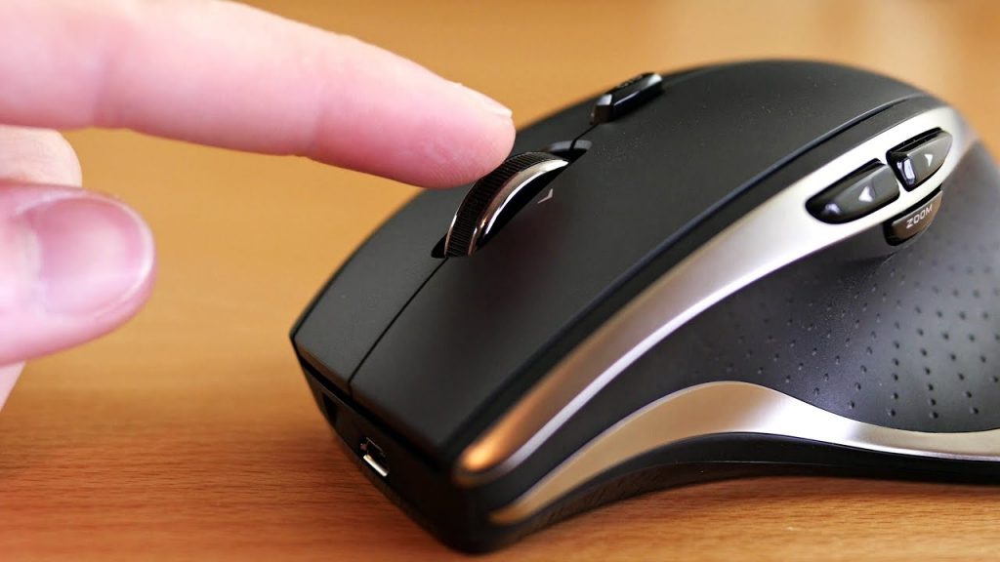
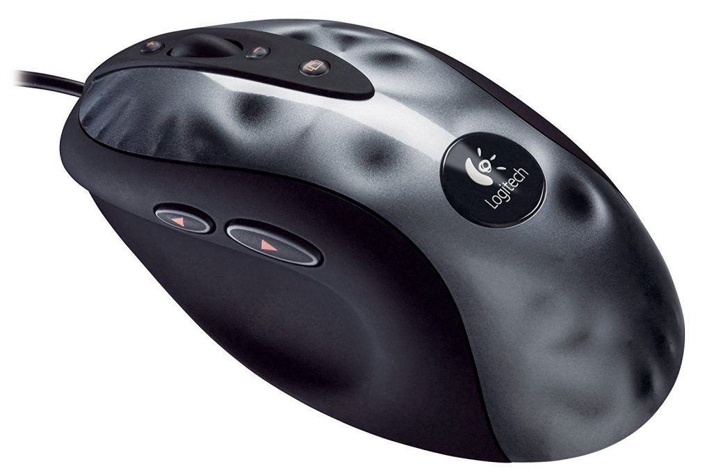
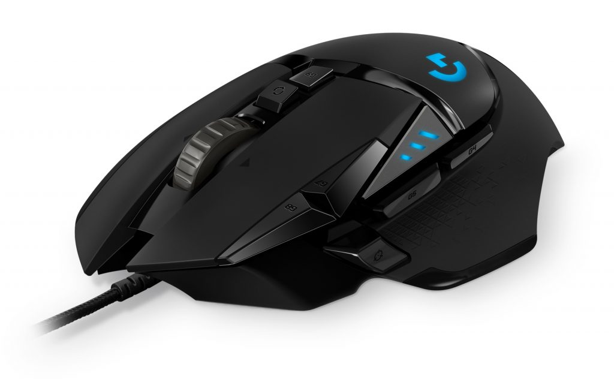

 ## **Μάθημα: Επικοινωνία Ανθρώπου - Υπολογιστή**
 ## **Ονοματεπώνυμο: ΔΗΜΗΤΡΙΟΣ ΔΙΑΤΣΙΓΚΟΣ**
> ## **Αριθμός Μητρώου: Π2018218** 
> ## **[GitHub Profile](https://github.com/DIATSIGK)**
### ***Παραδοτέο 1***
> #### **Assignments:**
> -- Set-up the main dependencies and demostrate your base system.
> #### **deliverables:**
> - Change your command prompt with your student ID.
> - List your dot files.
> - Display your shell configuration file.
> - Display system information (hardware + software).
> #### **asciinema links:**
> - [Set-up the main dependencies and demostrate your base system.](https://asciinema.org/a/OhAfah4usc1Xp4Kdi1n7boX8D)

### ***Παραδοτέο 2***
> #### **Assignments:**
> - Get familiar with basic commands, reading documentation and editing files.
> #### **deliverables:**
> - Browse and view files on your system.
> #### **asciinema links:**
> - [Visit 1](https://asciinema.org/a/280350)

> ## **Διεργασίες - Σχόλια - Πρόσθετη Εργασία:**

> - [The Bug](douglas-engelbart-invention-89869206-1024x614.jpg)
> - [Mouse με μπίλια](mouse-function-1024x819.png)
> - [Optical mice](maxresdefault-1024x576.jpg)
> - [Gaming mice](logitechmx518-1024x677.jpg)
> - [programmable buttons mice,](g502-hero-intro-1024x632.jpg)

| Author |  Title | Image Url|Caption |Lisence Url|Lisence Text|Categories|Tags|
| :---:  |  :---: | :---:    |:---:    |:---:      |:---:       |:---:     |:---:|
| DIATSIGK|  The Bug| [Link](https://www.digitallife.gr/ena-goiteftiko-taksidi-stin-istoria-ton-gaming-mice-92127)|Στα μέσα των 60s, o Douglas Engelbart, ένας διακεκριμένος επιστήμονας στο πανεπιστήμιο του Stanford στην Καλιφόρνια, είχε την έμπνευση να δημιουργήσει ένα περιφερειακό, το οποίο θα ήταν τελείως διαφορετικό από το πληκτρολόγιο και θα είχε σαν στόχο να μεταδίδει data |[Link](https://commons.wikimedia.org/wiki/File:SRI_Computer_Mouse.jpg)|Reusing content outside Wikimedia|MOUSE|trackball.|

| Author |  Title | Image Url|Caption |Lisence Url|Lisence Text|Categories|Tags|
| :---:  |  :---: | :---:    |:---:    |:---:      |:---:       |:---:     |:---:|
| DIATSIGK|  Mouse με μπίλια | [Link](https://fr.wikipedia.org/wiki/Souris_(informatique)#/media/Fichier:Mouse_mechanism_diagram.svg)|H γερμανική Telefunken έφερε πιο κοντά τον σχεδιασμό του εν λόγω περιφερειακού στην εικόνα που έχουμε σήμερα, με τα δύο (ή και τρία) χαρακτηριστικά Buttons (αριστερά και δεξιά), αλλά και μηχανικά μέρη στο εσωτερικό του που επέτρεπαν την κύλιση μίας μπίλιας|[Link](https://commons.wikimedia.org/wiki/File:Mouse_mechanism_diagram.svg?uselang=fr)|Reusing content outside Wikimedia|P.C.|	Mechanical mice|

| Author |  Title | Image Url|Caption |Lisence Url|Lisence Text|Categories|Tags|
| :---:  |  :---: | :---:    |:---:    |:---:      |:---:       |:---:     |:---:|
| DIATSIGK|  Optical_mouse | [Link](https://en.wikipedia.org/wiki/Optical_mouse)|Ο μηχανισμός της μπίλιας άρχισε σταδιακά να χαρίζει τη θέση της στην LED-based optical τεχνολογία, η οποία προσέφερε υψηλή ακρίβεια, ομαλή ροή της κίνησης (χωρίς δηλαδή ενοχλητικά skips στην κίνηση του κέρσορα) |[Link](https://mytechmethods.com/reviews/best-wireless-mouse-logitech-performance-mx-review/)|Reusing content outside Wikimedia|Optical mouse|LED optical mouse|

| Author |  Title | Image Url|Caption |Lisence Url|Lisence Text|Categories|Tags|
| :---:  |  :---: | :---:    |:---:    |:---:      |:---:       |:---:     |:---:|
| DIATSIGK|  Gaming mice | [Link](https://static.digit.in/default/111ed7cffa81a1dcac7fc43340903f7c2d48e4df.jpeg)|Ο σχεδιασμός των ποντικιών που εστίαζαν στο gaming ήταν τελείως διαφορετικός από τα mice που χρησιμοποιούσαν οι casual users στην καθημερινότητα τους, καθώς προσέφερε (και εξακολουθεί να προσφέρει) μια σειρά από unique features. Με ειδικά controls και buttons, τη δυνατότητα παραμετροποίησης των options τους μέσω του ειδικού software και ρύθμιση ακόμη και της επιτάχυνσης, κοσμητικά και ατμοσφαιρικά LEDs|[Link](https://pixabay.com/el/photos/%CF%80%CE%BF%CE%BD%CF%84%CE%AF%CE%BA%CE%B9-logitech-%CF%83%CF%85%CF%83%CE%BA%CE%B5%CF%85%CE%AD%CF%82-%CE%B5%CE%B9%CF%83%CF%8C%CE%B4%CE%BF%CF%85-1163490/)|Simplified Pixabay License| computer games.|FPS και MOBA genres|

|:---:|:---:|

| Author |  Title | Image Url|Caption |Lisence Url|Lisence Text|Categories|Tags|
| :---:  |  :---: | :---:    |:---:    |:---:      |:---:       |:---:     |:---:|
| DIATSIGK|  Programmable buttons mice | [Link](https://www.gameslife.gr/wp-content/uploads/2019/03/g502-hero-intro-1024x632.jpg)|Tο Logitech G502 Hero διαθέτει 11 programmable buttons, τα οποία μπορείτε να ορίσετε σύμφωνα με τις δυνατότητες σας|[Link](https://www.gameslife.gr/a-trip-to-the-history-of-gaming-mice-76896)|Reusing content outside Wikimedia|Multiple-mouse systems|Programmable buttons|

|

#### *Παραπομπές*
> - [1] https://en.wikipedia.org/wiki/Computer_mouse#Multiple-mouse_systems
> - [2] https://www.gameslife.gr/a-trip-to-the-history-of-gaming-mice-76896
> - [3] http://www.cnn.com/SPECIALS/2004/explorers/interactive/profiles/computer.mouse/content.html
> - [4] https://www.digitaltrends.com/computing/optical-vs-laser-mouse-explanation/
> - [5] https://www.pcworld.idg.com.au/article/650737/optical-vs-laser-mice-which-better-gaming/
