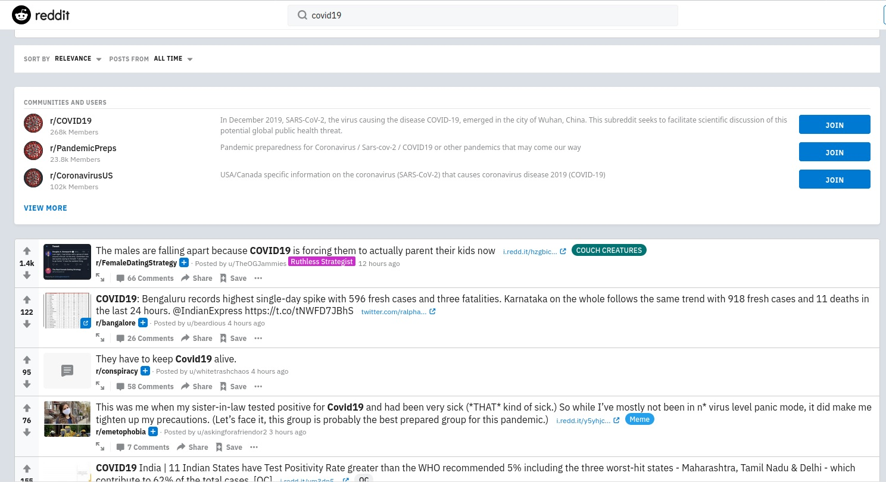

# ΙΟΝΙΟ ΠΑΝΕΠΙΣΤΗΜΙΟ, ΤΜΗΜΑ ΠΛΗΡΟΦΟΡΙΚΗΣ
## Επικοινωνία Ανθρώπου-Υπολογιστή
## Επιβλέπων καθηγητής: Χωριανόπουλος Κωνσταντίνος
### Στοιχεία φοιτήτριας
### Μαρία Δήμα
### Α.Μ Π2013029

### Εισαγωγή
Οι ασκήσεις γίνανε σε λαπτοπ με windows 10 σε περιβάλλον wsl2 (Windows Subsystem for Linux). Το hardware του συστήματος μου είναι intel core duo 2.40 ghz και 4gb ddr2 ram. To λειτουργικό linux είναι ubuntu 18.04 LTS το οποίο κατεβάστηκε απο το windows store. Για να λειτουργήσει το wsl2 και να γίνει η εγκατάσταση του ubuntu πρεπει πρώτα να έχει ενεργοποιηθεί το windows Windows Subsystem for Linux απο τo control panel -> Programs and Features -> turn Windows features On or Off. Έγιναν και οι 4 ασκήσεις, και χρησιμοποιήθηκαν τα προτεινόμενα εργαλεία.

### Συμμετοχικό εκπαιδευτικό υλικό
##### repository σελίδας βιβλίου https://github.com/p13dima/gr
##### url σελίδας βιβλίου https://p13dima-gr.netlify.app/

#### Παραδοτέο 1.Α
Δύο νέες εικόνες
##### 1. Deep web https://p13dima-gr.netlify.app/gallery/deep-web/
##### 2. Windows 7 https://p13dima-gr.netlify.app/gallery/windows7/

###### πηγές
https://el.wikipedia.org/wiki/Deep_Web

https://en.wikipedia.org/wiki/Windows_7

#### Παραδοτέο 1.Γ.1
##### Μελέτη περίπτωσης: Playstation https://p13dima-gr.netlify.app/case-study/playstation/

###### πηγές
https://www.playstation.com/en-gb/explore/ps4/playstation-through-the-years/

https://el.wikipedia.org/wiki/PlayStation

#### Παραδοτέο 1.Γ.2
##### Βιογραφία: Joseph Carl Robnett Licklider https://p13dima-gr.netlify.app/biography/licklider/

###### πηγές
https://en.wikipedia.org/wiki/J._C._R._Licklider

### Άσκηση 1. Set-up the main dependencies and demonstrate your base system - Change your command prompt with your student ID, list your dot files, display your shell configuration file and display system information (hardware+software)
#### asciinema: https://asciinema.org/a/xdeBp0SW242760i84gmzhzZbg
Άλλαξα το command promt με το Α.Μ μου. Για να αλλάξω το command prompt έκανα edit το αρχείο .bashrc με τον nano editor. To configuration του αρχείου φαίνεται στο session του asciinema.
```
sudo nano .bashrc
```
Eμφάνισα τα dot files με την εντολή

```
ls -a
```

Εγκατέστησα το neofetch για να δελιξω το σύστημά μου, hardware και software.
```
sudo apt-get instal neofetch
neofetch
```

### Άσκηση 2. Get familiar with basic commands, reading documentation and editing files. Browse and view files on your system.
#### asciinema: https://asciinema.org/a/RbtBN5UgEGdQQoNfIjXBRz8iE
Εγκατέστησα το the fuck πως περιγράφεται στο https://github.com/nvbn/thefuck. Εγκατέστησα το ranger. To vim ήταν ήδη εγκατεστημένο σ
το σύστημα μου.

```
sudo apt-get install ranger
```
Έκανα browse το file system μου με τη χρήση του ranger.

```
ranger
```
Δημιούργησα directory documents όπου δημιούργησα ενα αρχείο test με τον vim editor.

```
vim test
```
Στη συνέχεια είδα τα manuals του ranger και του vim.

```
man vim
man ranger
```

### Άσκηση 3. Βecome productive with a todo list. Create a list of todos, edit, delete, and check some of them.
#### asciinema: https://asciinema.org/a/IErO3dxTpnMeovcC184ZF1TpC
Εγκατέστησα το taskwarrior https://taskwarrior.org/docs/start.html.

```
sudo apt-get install taskwarrior
```

Δημιούργησα, επεξεργαστηκα, έσβησα και ολοκλήρωσα tasks.
To edit ανοίγει τον default editor (για εμένα nano) και μπορείς να επεξεργαστείς όλες τις πληροφορίες του task και να προσθέσεις tags και άλλα.

```
task add <your task>
task add <your task> due:<due date>
task <index> edit
task <index> delete
task <index> done
```
Για να δώ τα ενεργα tasks

```
task
task list
```

Δύο πολυ ωραίες λειτουργίες του taskwarrior είναι το calendar και το burndown https://taskwarrior.org/docs/commands/burndown.html.
To calendar σου δείχνει όλα τα tasks με τη μορφή ημερολογίου, ενώ το burndown δειχνει σε διαγραμμα τα completed active και τα task με προθεσμία.

```
task calendar
task burndown
```
#### Βίντεο που πήρα πληροφορίες
https://www.youtube.com/watch?v=jutN_S7v13k

### Άσκηση 4. Organise the terminal window into multiple areas. Use one window to search-edit local files or browse the web and another window for performance monitoring.
#### asciinema: https://asciinema.org/a/HypZOVhuLZv2GwQ33R0yQAxnm

Εγκατέστησα το tmux καθώς μου φάνηκε το πιο απλό στη χρήση https://en.wikipedia.org/wiki/Tmux.

```
sudo apt-get install tmux
```

Δημιούργησα 2 παράθυρα. Στο ένα έκανα performance monitoring με την εντολή

```
htop
```

Και στο άλλο εκανα browse το file system μου με τη χρήση του ranger που έμαθα απο την άσκηση 2. δημιούργησα directory askisi4 και δημιούργησα νέο αρχείο με τον nano editor το οποίο ξαναεπεξεργαστηκα και με τον vim

#### Βίντεο που πήρα πληροφορίες
https://www.youtube.com/watch?v=5iXzqN8-34E

### Επιπλέον άσκηση 5. Track your time with a simple journal.
#### asciinema: https://asciinema.org/a/vunq6FMee4H3QDvuN2mFMThHY
Χρησιμοποίησα το jrnl για να το εγκαταστήσω χρειάστηκε να εγκαταστήσω το pipx και το python3-venv.

```
pipx install jrnl
```

Επεξεργαστηκα το αρχείο jrnl.yaml, ώστε να ορίσω default editor για να μπορώ να επεξεργάζομαι τα entries. 
To jrnl υποστηρίζει add, delete, edit, search και tagging

```
jrnl // compose new entry
jrnl date: entry // compose new entry
jrnl @tag // tagging in the entry
jrnl @tag --delete //deleting based on tag
jrnl -n 10 // Listing last 10 entries
```

#### Πληροφορίες
https://github.com/jrnl-org/jrnl

https://jrnl.sh/overview/

### Επιπλέον άσκηση 6. Surf the web. Create a new elvi
#### asciinema: https://asciinema.org/a/JSemEM6z9cQpvuZcmAuvWM2PS
Εγκατέστησα το surfraw και δημιουργησα νέο local elvi για να κάνω αναζήτηση στο reddit. Tα local elvi αποθηκευονται στο /home/user/.config/surfraw/elvi

για να δείς τα υπάρχοντα elvi

```
sr -elvi
surfraw -elvi
sr reddit covi19
```



#### Πληροφορίες
https://www.youtube.com/watch?v=FvimaTL_kJU

### Συμπεράσματα
Απο τις παραπάνω εργασίες έμαθα να χρησιμοποιώ το λειτουργικό συστημα linux. Εμαθα τη δομή των αρχείων και τις βασικές εντολες του terminal. Έμαθα να χρησιμοποιώ αρκετά και χρήσιμα εργαλεία και εξοικειώθηκα με τους διάφορους editors καθώς και να διαβάζω τα manuals των εργαλείων. Εξοικειώθηκα με τη χρήση του asciinema καθώς δημιούργησα λογαριασμό όπου έχω όλα τα recorded terminal sessions μου. Τέλος η χρήση terminal linux σε περιβάλλον windows είναι πολύ σημαντική για πολλούς χρήστες καθώς σε άλλη περίπτωση θα έπρεπε να χρησιμοποιούμε vitual machines ή ακόμα και να εγκαταστήσουμε κάποιο distribution σε dedicated σύστημα.

