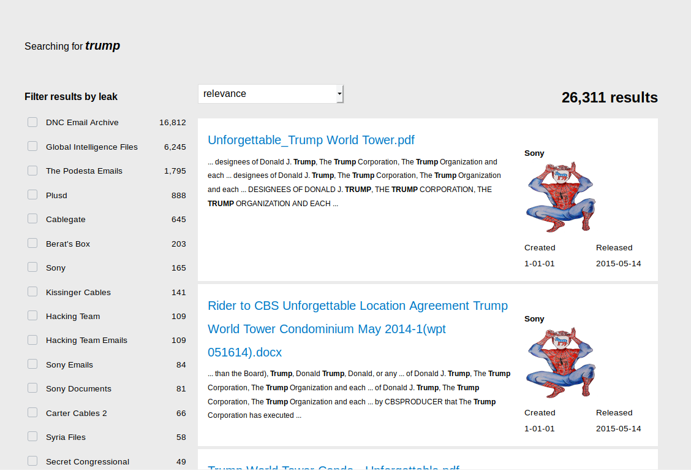

# ΙΟΝΙΟ ΠΑΝΕΠΙΣΤΗΜΙΟ, ΤΜΗΜΑ ΠΛΗΡΟΦΟΡΙΚΗΣ

## ΜΑΘΗΜΑ
## Επικοινωνία Ανθρώπου-Υπολογιστή
#### Επιβλέπων καθηγητής: Χωριανόπουλος Κωνσταντίνος

## Στοιχεία φοιτητή
### Γιώργος Σιάνος
### ΑΜ: Π2013040

## Εισαγωγή
Έγιναν συνολικά 6 (2 επιπλέον αντι γραπτής εξέτασης) ασκήσεις σε περιβάλλον linux με τη χρήση του terminal οπως περιγραφεται στις οδηγίες. Για την υλοποίηση των ασκήσεων εγκατέστησα το Oracle vm virtual box https://www.virtualbox.org/, καθώς και ένα linux image Ubuntu 19.10 Eoan Ermine από https://www.osboxes.org/ubuntu/. Το εικονικό σύστημα έχει 2gb ram. Η υλοποίηση όλων των εργασιών έχει καταγραφεί σε asciinema sessions. Όπου έχει γίνει αναζήτηση στο διαδίκτυο για πληροφορίες παραθέτοντε τα σχετικά urls. Επιπλέον υλοποίησα 4 παραδοτέα συμμετοχικού εκπεδευτικού υλικού (2 επιπλέον αντι γραπτής εξέτασης όπως αναφαίρουν οι οδηγίες).

## Συμμετοχικό περιεχόμενο
### Url σελίδας βιβλίου https://p13sian-gr.netlify.app/
### Αποθετήριο βιβλίου https://github.com/p13sian/gr

#### Παραδοτέο 1.Α
Προσθήκη δύο νέων εικόνων 

##### Remarkable https://p13sian-gr.netlify.app/gallery/remarkable/
##### Virtuix omni https://p13sian-gr.netlify.app/gallery/omni/

#### Παραδοτέο 1.Γ.2
Νέα βιογραφία

##### Jef Raskin https://p13sian-gr.netlify.app/biography/raskin/

###### Πηγή 
https://en.wikipedia.org/wiki/Jef_Raskin

#### Επιπλέον παραδοτέο 1.Γ.1
Νέα μελέτη περίπτωσης

##### Raspberry pi https://p13sian-gr.netlify.app/case-study/raspberry-pi/

###### Πηγή 
https://en.wikipedia.org/wiki/Raspberry_Pi

#### Επιπλέον παραδοτέο 1.B
Nέο διαδραστικό παράδειγμα

##### Image hover effect https://p13sian-gr.netlify.app/remix/hover/

###### Πηγές
https://css-tricks.com/snippets/css/scale-on-hover-with-webkit-transition/


### Άσκηση 1. Set-up the main dependencies and demonstrate your base system - Change your command prompt with your student ID, list your dot files, display your shell configuration file and display system information (hardware+software)
#### asciinema: https://asciinema.org/a/xcewjj3h9W8XBDfm8WNn93UtN
Άλλαξα το command prompt απο το αρχείο .bashrc. Το configuration του αρχείου φαίνεται στο recorded session. Για να τροποποιήσω το αρχείο χρησιμοποίησα τον nano editor

```
sudo nano .bashrc
```

Εμφάνισα όλα τα dot files στο home directory.

```
ls -a
```

Eγκατέστησα το neofech για να δείξω το σύστημά μου hardware και software.
```
sudo apt install neofetch
neofech
```

### Άσκηση 2. Βrowse and view files on your system.
#### asciinema: https://asciinema.org/a/4x32iogQLLddAoK1VVt2abiBq
Εγκατέστησα το ranger και το vim.

```
sudo apt-get install ranger
sudo aot-get install vim
```

Χρησιμοποίησα το ranger για να περιηγηθώ στο filesystem μου.

```
ranger
```

Χρησιμοποίησα τον vim editor για να δημιουργήσω ένα νέο αρχείο στο οποίο πρόσθεσα κείμενο και το έσωσα.
Τα maual του ranger και του vim είναι αναλυτικότατα.

```
man ranger
man vim
```

### Άσκηση 3. Edit the vim or the shell configuration file.
#### asciinema: https://asciinema.org/a/xaIsS9BGrrAMSOBXeAnz0k9d9

Στην συγκεκριμένη έκδοση του vim 8.1.1401. To code highlighting ειναι ενεργοποιημένο by default. Για να γίνει οποιαδήποτε αλλαγή στο configuration του vim χρησιμοποιούμε το αρχείο .vimrc το οποίο αν δεν υπάρχει το δημιουργούμε στο home directory.

```
nano .vimrc
```

Για να ενεργοποιήσουμε και να απενεργοποιήσουμε το code highlighting ανάλογα προσθέτουμε τα παρακάτω στο αρχείο .vimrc

```
:syntax on

:syntax off
```

Για να ενεργοποιήσω το auto completion χρησιμοποίησα το omni completion, το οποίο δεν είναι ενεργοποιημένο by default στον vim editor.
Το omni completion υποστηρίζει αρκετές γλώσσες τις οποίες καταλαβαίνει απο την επέκταση του αρχείου. Για να ενεργοποιήσω το omni completion προσθεσα τα παρακάτω στο αρχείο .vimrc.

```
filetype plugin on
set omnifunc=syntaxcomplete#Complete
```

Για να δοκιμάσω τις νέες αυτές δυνατότητες δημιούργησα ένα αρχείο .html.

#### Πληροφορίες σχετικά με την υλοποίηση της άσκησης βρήκα:
https://www.cyberciti.biz/faq/turn-on-or-off-color-syntax-highlighting-in-vi-or-vim/
https://vim.fandom.com/wiki/Omni_completion

### Άσκηση 4. Organise the terminal window into multiple areas.	Use one window to search-edit local files or browse the web and another window for performance monitoring.
#### asciinema: https://asciinema.org/a/WDgoJn05qnP3XJFAAHTg5BKjC

Χρησιμοποίησα το tmux. Βρήκα αρκετές πληροφορίες και βίντεο σχετικά με τη χρήση και τη λειτουργία του.

```
sudo apt-get install tmux
```

Αφού έκανα split το terminal σε δυο windows, στο ένα χρησιμοποίησα το top για performance monitoring, και στο άλλο παράθυρο άνοιξα να επεηεργαστώ ένα αρχείο html που είχα δημιουργήσει σε προηγούμενη εργασία.

#### Πληροφορίες σχετικά με την υλοποίηση της άσκησης βρήκα:
https://stackoverflow.com/questions/7771557/how-to-terminate-a-window-in-tmux

https://www.youtube.com/watch?v=BHhA_ZKjyxo

https://www.howtoforge.com/tutorial/ubuntu-performance-monitoring/

### Επιπλέον άσκηση 5. Surf the web. Create a new elvi.
#### asciinema: https://asciinema.org/a/CX1L2YlotFDCM7DdtVViIDSJl
Χρησιμοποίησα το surfraw και το εγκατέστησα με την εντολή

```
sudo apt-get install surfraw
```

στη συνέχεια δημιούργησα τα απαραίτητα directory καθώς το surfraw διαβάζει local elvi apo /home/user/.config/surfraw/elvi
αντέγραψα στο νέο directory ένα ήδη υπάρχον elvi και το μετονόμασα σε wikileaks

```
cp /usr/lib/surfraw/youtube wikileaks
```

Eπεξεργαστηκα το αρχείο ώστε να το κάνω να ψάχνει στο wikileaks αντι για το youtube.

Xρησιμοποίησα το surfraw για να κανω αναζητηση στο wikileaks σχετικά με τον Trump

```
sr wikileaks trump
```



#### Πληροφορίες σχετικά με την υλοποίηση της άσκησης βρήκα:
https://www.youtube.com/watch?v=FvimaTL_kJ

https://gitlab.com/surfraw/Surfraw

### Επιπλέον άσκηση 6. Become productive with a todo list. Create a list of todos, edit, delete, and check some of them.
Εγκατέστησα το taskwarrior

```
sudo apt-get install taskwarrior
```

Πρόσθεσα tasks, τα επεξεργάστηκα, τσέκαρα κάποια απο αυτα και έσβησα μερικά.

```
task add <your task>
task add <your task> due:<date>
task <task number> edit
task <task number> delete
task <task number> done
```

#### Πληροφορίες σχετικά με την υλοποίηση της άσκησης βρήκα:
https://taskwarrior.org/docs/start.html

## Συμπεράσματα
Η χρήση του linux command line για την υλοποίηση καθημερινών tasks, μπορεί να φαντάζει δύσκολη αρχικά, όμως με την εξοικείωση του χρήστη δεν έχει τίποτα να ζηλέψει απο τα windows. Οι δυνατότητες του terminal είναι πολλές, και υπάρχουν πάρα πολλα εργαλεία με documentation που μπορύν να κάνουν τη ζωή (ειδικά ενός developer) πολύ πιο εύκολη. Με την υλοποίηση των παραπάνω ασκήσεων eξοικειώθηκα στις βασικές εντολές του linux terminal και του filesystem γενικότερα, ενώ έμαθα να χρησιμοποίώ τα παραπάνω εργαλεία.
