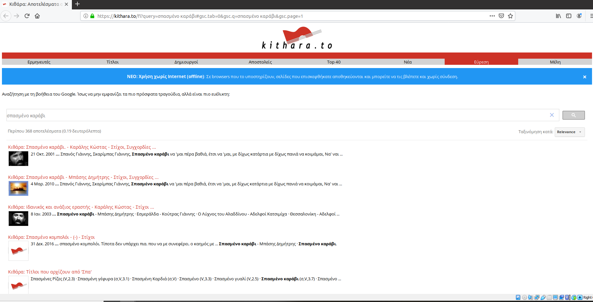

# ΙΟΝΙΟ ΠΑΝΕΠΙΣΤΗΜΙΟ, ΤΜΗΜΑ ΠΛΗΡΟΦΟΡΙΚΗΣ 
## ΜΑΘΗΜΑ
### Επικοινωνία Ανθρώπου-Υπολογιστή
Επιβλέπων καθηγητής: Χωριανόπουλος Κωνσταντίνος 

## Στοιχεία φοιτητή  
### Φοίβος Αργυρίδης
### ΑΜ: Π2013041

## Εισαγωγή
Έγιναν 6 ασκήσεις σε περιβάλλον linux ubuntu WSL2 (Windows Subsystem for Linux) και σε virtual με ubuntu 19.01 και 4 παραδοτέα απο το συμμετοχικό περιεχόμενο (προστέθηκαν 2 νέες εικόνες, 1 νέο διαδραστικό παράδειγμα, μία νέα μελέτη περίπτωσης, και μία νέα βιογραφία). Σε κάθε μία απο τις 6 ασκήσεις υπάρχει το asciinema url και φαίνονται αναλυτικά τα βήματα υλοποίησής της καθώς και πηγές άντλησης πληροφοριών απο το διαδύκτιο γαι τα tools που χρησιμοποιήθηκαν.

### Συμμετοχικό περιεχόμενο
#### Αποθετήριο https://github.com/fivosf/gr
#### URL σελίδας βιβλίου https://fivos-gr.netlify.app/

### Παραδοτέο 1Α

#### Neurosky mindwave https://fivos-gr.netlify.app/gallery/neurosky/
#### Android auto https://fivos-gr.netlify.app/gallery/android-auto/

### Παραδοτέο 1.Β
#### Νέο διαδραστικό παράδειγμα (animated button & menu) https://fivos-gr.netlify.app/remix/animated-button-menu/

### Επιπλέον παραδοτέο 1.Γ.1
#### Νέα μελέτη περίπτωσης (Android) https://fivos-gr.netlify.app//case-study/android/

##### πηγή 
https://en.wikipedia.org/wiki/Android_(operating_system)

### Επιπλέον παραδοτέο 1.Γ.2
#### Βιογραφία Douglas Carl Engelbart https://fivos-gr.netlify.app/biography/engelbart/

##### πηγή 
https://en.wikipedia.org/wiki/Douglas_Engelbart

### Άσκηση 1. Set-up the main dependencies and demonstrate your base system. Change your command prompt with your student ID, list your dot files, display your shell configuration file and display system information (hardware+software).
#### url asciinema: https://asciinema.org/a/qgSUwkBsC4WBCzimAIisNoNbo
Χρησιμοποίησα το αρχείο .bashrc στο home directory μου, το οποίο επεξεργάστηκα με τον nano editor για να αλλάξω το command prompt με τον AM μου. Για να δω αμέσως μετά την αλλαγή χρησιμοποίησα το source.

```
sudo nano .bashrc
source .bashrc
```

Έκανα list τα dot files 

```
ls -a
```

Εγκατέστησα το neofetch και έκανα display το σύστημά μου.

```
sudo apt-get instal neofetch
neofetch
```

### πηγές
https://www.cyberciti.biz/tips/howto-linux-unix-bash-shell-setup-prompt.html

https://www.cyberciti.biz/faq/bash-shell-display-only-hidden-dot-files/

https://github.com/dylanaraps/neofetch


### Άσκηση 2. Get familiar with basic commands, reading documentation and editing files. Browse and view files on your system.
#### asciinema: https://asciinema.org/a/mKw5DczeWCvs00bpYOvgF4TSt
Εγκατέστησα το vim και το ranger

```
sudo apt-get install vim
sudo apt-get install ranger
```

Δημιούργησα directory askisi2 όπου εφτιαξα με τον vim ένα νέο αρχείο askisi2

```
mkdir askisi2
vim askisi2
```

Είδα τα manuals του vim και του ranger

```
man vim
man ranger
```

Έτρεξα τον ranger και επεξεργάστηκα πάλι το αρχείο askisi2 μεσα απο τον ranger επιλέγοντας editor.

```
ranger
```

### πηγές
https://ranger.github.io/

https://www.computerhope.com/unix/umkdir.htm

https://www.linux.com/tutorials/vim-101-beginners-guide-vim/

### Άσκηση 3. Organise the terminal window into multiple areas.	Use one window to search-edit local files or browse the web and another window for performance monitoring.
#### asciinema: https://asciinema.org/a/VOzza59aAEOnBabXFgbUNzvUt
Εγκατέστησα το tmux, και δημιουργησα νέο παράλληλο παράθυρο.

```
sudo apt-get install tmux
tmux
ctrl+b %
```
Για το performance monitoring χρησιμοποίησα το htop όπου επεξεργάστηκα το layout του.

```
htop
```

Στο πρώτο παράθυρο χρησιμοποίησα τον ranger για να περιηγηθώ στο file system και δημιούργησα directory και αρχεία με τον vim

```
ctrl+b w
ranger
mkdir askisi3
cd askisi3 
vim askisi3
```

### πηγές
https://www.hamvocke.com/blog/a-quick-and-easy-guide-to-tmux/


### Άσκηση 4. Become productive with a todo list.	Create a list of todos, edit, delete, and check some of them.
#### asciinema:  https://asciinema.org/a/Zmbyjpj5dCtOpCuwBYOgS7a1F
Eγκατέστησα το taskwarrior

```
sudo apt-get install taskwarrior
```

Πρόσθεσα επεξεργάστηκα, έσβησα και μάρκαρα ως done διάφορα tasks

```
task add <task name>
task <number> edit
task add <task name> due:<deadline>
task <number> delete
task <number> done
```

Το edit ανοίγει με τον default editor και μπορείς να επεξεργαστείς και να προσθέσεις επιπλέον πληροφορίες όπως tags, τα οποία χρησιμοποιείς αργότερα για να κάνεις αναζήτηση. Μπορείς να μετρήσεις όλα τα tasks με την εντολή

```
task count
```

Η να μετρήσεις όλα τα tasks που έχουν ή δεν έχουν κάποιο tag

```
task +<tag> count
task -<tag> count
```

Τέλος το taskwarrior έχει ένα calendar mode όπου μπορείς να δείς όλα τα task σε μορφή ημερολογίου, και ένα graph mode όπου μπορείς να δέις διαγραμματικά τα task (pending, done, overdue etc).

```
task calendar
task burndown
```

### πηγές
https://taskwarrior.org/docs/start.html

https://taskwarrior.org/docs/filter.html#filters

### Επιπλέον άσκηση 5. Surf the web, create a new elvi.
#### asciinema:  https://asciinema.org/a/Npw44l5yIH1g43wHmsQtcFHjl
Χρησιμοποίσησα το surfraw και δημιούργησα νέο τοπικό elvi για να κάνω αναζήτηση τραγουδιών στο https://kithara.to/. To surfraw τρέχει τα local elvi στο /home/user/.config/surfraw/elvi. Δημιουργησα τα απαραιτητα directories και αντέγραψα το youtube elvi, ωστε να το επεξεργαστώ για να κάνει την αναζήτηση που θέλω.

```
sudo apt install surfraw
cd .config/surfraw/elvi
cp /usr/lib/surfraw/youtube kithara
nano kithara
```

για να δω τα υπάρχοντα elvi

```
surfraw -elvi
```

και η αναζήτηση

```
surfraw kithara σπασμένο καράβι
```

το surfraw ανοίγει το mozzila με τα αποτελέσματα της αναζήτησης.



### πηγές
https://www.youtube.com/watch?v=FvimaTL_kJU

### Επιπλέον άσκηση 6. Track your time with a simple journal.
#### asciinema: https://asciinema.org/a/8n88A25tJqrYB73oUFhjDAng6
Εγκατέστησα το jrnl

```
pip3 install jrnl
```
Την πρώτη φορά που τρέχει το jrnl ζητάει path για να αποθηκευει τα entries, μπορείς να αφήσεις το default η να ορίσεις όποιο θές. Για να τρέξεις το jrnl

```
jrnl
jrnl date: your entry
```
Υποστιρίζει search και tags

```
jrnl -contains "search term" --edit
jrnl @tag --edit
```

Για να μπορέσεις να κάνεις edit ένα entry πρέπει να έχεις ορίσει editor απο το configuration file. /home/user/.config/jrnl/jrnl.yaml. Για να σβήσεις ένα entry προσθέτεις --delete

```
jrnl @tag --delete
```

### πηγές
https://jrnl.sh/overview/

## Συμπεράσματα
Μέσω της διαδικασίας υλοποίησης των παραπάνω εργασιών έμαθα να χρησιμοποιώ τα linux μέσα απο τα windows (WSL). Έμαθα τις βασικές εντολές του terminal, καθώς και να εγκαθιστώ παραμετροποιώ τα διάφορα tools. Έμαθα να δημιουργώ φακέλους και αρχεία και να ενισχύω τη λειτουργεία του command line με νέες δυνατότητες.


