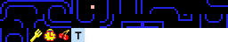
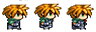
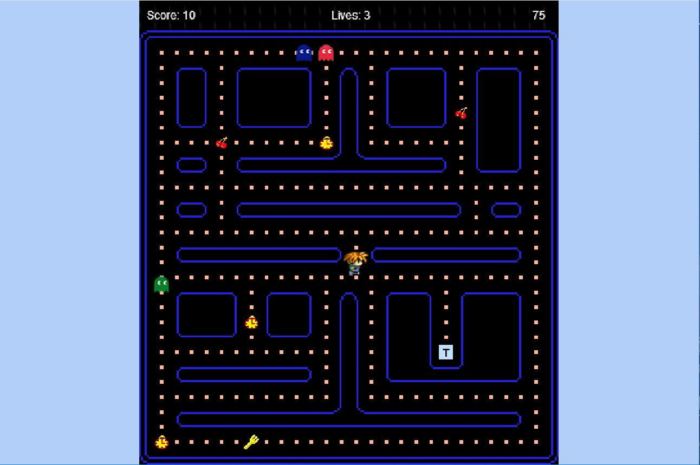

# ΙΟΝΙΟ ΠΑΝΕΠΙΣΤΗΜΙΟ 

# ΤΜΗΜΑ ΠΛΗΡΟΦΟΡΙΚΗΣ 

# ΜΑΘΗΜΑ
## Επικοινωνία Ανθρώπου-Υπολογιστή

# Επιλογή Εργασίας
## PACMAN

Κυριακή Μουταφίδου
ΑΜ Π2013097

## Παραδοτέο 1
### Ο σύνδεσμος της σελίδας με το βιντεοπαιχνίδι.

https://kikh.github.io/pacman/

### Αποθετήριο κώδικα.

https://github.com/kikh/pacman

## Παραδοτέο 2

#### 1) Δημιούργησε μια νέα πίστα για το παιχνίδι χρησιμοποιώντας το Tiled.

διμιούργησα νέα πίστα χρησιμοποιώντας το tiled. Για τη δημιουργία της πίστας χρησιμοποίησα την είκόνα απο το φάκελο assets και την εμπλούτισα με νέα tiles με τη βοήθεια του photoshop.

#### 2) Άλλαξε την εμφάνιση του Pacman ή χρησιμοποίησε έναν άλλο χαρακτήρα για πρωταγωνιστή του παιχνιδιού.

Άλλαξα το χαρακτήρα και αντί για τον pacman χρησιμοποίησα έναn χαρακτήρα απο τη σειρά παιχνιδιών final fantasy.

#### 3) Αντί ο πρωταγωνιστής να μαζεύει μόνο dots θα μπορούσε να μαζεύει διάφορα αντικείμενα όπως κέρματα, λουλούδια, φρούτα κτλ.
Αντί για dots ο προταγωνιστής μαζεύει κεράσια ρολόγια και πιρούνια.

#### 4) Πρόσθεσε ήχους και μουσική.
Προστέθηκε μουσική στο παιχνίδι. Είναι μια trap εκδοχή του original pacman theme. Προστέθηκαν ήχοι για κάθε αντικείμενο που μαζεύει ο προταγωνιστής.

#### 5) Επέκτεινε το παιχνίδι ώστε να προσθέσεις score, χρόνο, bonus και ζωές. Το bonus θα δίνεται όταν ο πρωταγωνιστής τρώει κάποιο αντικείμενο που εμφανίζεται-εξαφανίζεται ξαφνικά στη πίστα.
Προστεθηκε score με αρχική τιμή το 0, και 10 πόντους για κάθε dot που μαζεύει ο πρωταγωνιστής. Το παιχνίδι ξεκινάει με 3 ζωές, ενώ κερδίζεις μια ζωή με κάθε κεράσι. Προστέθηκε χρόνος (80 δευτερόλεπτα) για να ολοκληρώσεις το παιχνίδι ενώ κερδίζει 20 επιπλέων δευτερόλεπτα με κάθε ρολόι που μαζεύει ο πρωταγωνιστής. Αν τελειώσει ο χρόνος χάνεις μια ζωή. Κάθε φορά που χάνει μια ζωή ο πρωταγωνιστής Τηλεμεταφέρετε στο σημείο εκίνησης (κέντρο της πίστας).

## Παραδοτέο 3

#### 1) Πρσθήκη εχθρών. Οι εχθροί θα πρέπει να κινούνται τυχαία στην πίστα και να μπορούν να φάνε τον πρωταγωνιστή.
Προστέθηκαν 3 εχθροι. Είναι 3 φαντασματάκια με διαφορετικά χρώματα το καθένα. Τα σημεία εκίνησης των εχθρών είναι προκαθορισμένα. Για να μπορέσουν να κινούντε τυχαία στην πίστα, εφτιαξα ένα σύστημα 4 κατευθύνσεων όπου ο κάθε εχθρός αλλάζει τυχαία κατεύθυνση ανα 2 δευτερόλεπτα. Εάν ο πρωταγωνιστής έρθει σε επαφή με τους εχθρούς χάνει μια ζωή. Οι εχθροί μπορούν να περνάνε ο ένας πάνω απο τον άλλον. 

#### 2) Δυνατότητα teleport για τον πρωταγωνιστή σε συγκεκριμένα σημεία της πίστας.
Προστέθηκε tile στο οποίο όταν Εισέρχεται ο πρωταγωνιστής τηλεμεταφέρεται στην κάτω αριστερή γωνία της πίστας. 

#### 3) Ο πρωταγωνιστής επίσης θα μπορούσε να αντιμετωπίσει τους εχθρούς συλλέγοντας το κατάλληλο αντικείμενο. Είτε θα μπορούσε να έχει τη δυνατότητα να τους τρώει για κάποιο χρονικό διάστημα, είτε θα μπορούσε να του πετάει κάτι από απόσταση και να τους εξολοθρεύει.
Όταν ο πρωταγωνιστής μαζέψει το πιρούνι, έχει τη δυνατότητα να φάει τους εχθρούς για 12 δευτερόλεπτα. (αλλάζει η μουσική του παιχνιδιού κατα τη διάρκεια). Ο εχθροί δν πεθαίνουν αλλά τηλεμεταφέροντε στο κέντρο της πίστας

ενδεικτική εικόνα παιχνιδιού

