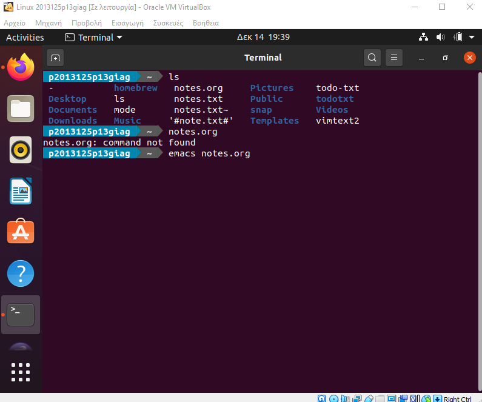
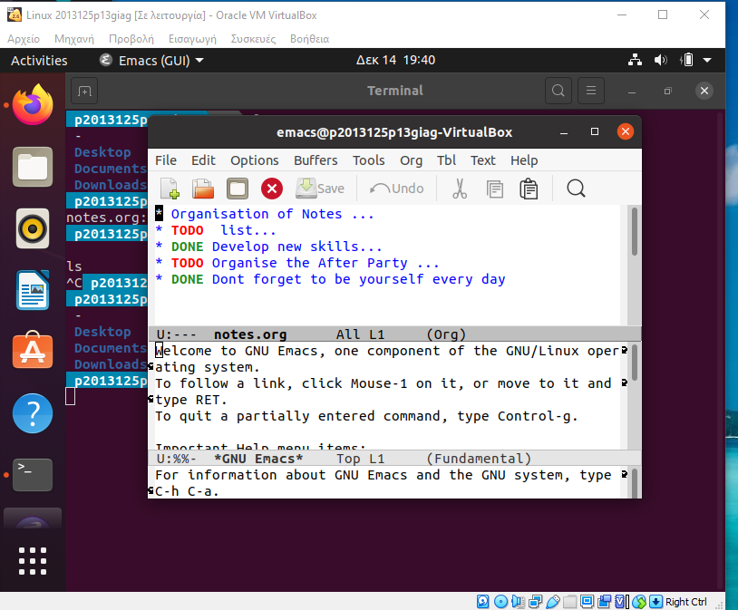

## ΙΟΝΙΟ ΠΑΝΕΠΙΣΤΗΗΜΙΟ 
# Μάθημα: Επικοινωνία Ανθρώπου-Υπολογιστή
# Παραδοτέα και Τελική αναφορά

## Πίνακας με σύνοψη των προθεσμιών και των παραδοτέων

[Αντιγράψτε τον κώδικα markdown του παρακάτω πίνακα περιεχομένων](https://raw.githubusercontent.com/courses-ionio/help/master/deliverables/index.md) στην σύνοψη της αναφοράς σας (αμέσως μετά τα προσωπικά σας στοιχεία) και (σταδιακά) [προσθέστε εσωτερικά λινκ](https://stackoverflow.com/questions/53091847/github-markdown-anchor-only-linking-to-top-of-the-page) προς τους υπότιτλους (στα αγγλικά) των επιμέρους παραδοτέων σας στην δεύτερη στήλη.

## Α.Μ. : Π2013125
## Ονοματεπώνυμο: Αλέξανδρος Γιαγτζόγλου

| Εβδομάδα* | Παραδοτέο |
| --- | --- |
| 1 | Φορκ του αποθετηρίου και δημιουργία της σελίδας της αναφοράς με τα προσωπικά στοιχεία σας, της σύνοψης με αυτόν τον πίνακα περιεχομένων, και συγγραφή της εισαγωγής με περιγραφή των αναγκών και των στόχων σας για το μάθημα |
| 2 |[ Άσκηση προγραμματισμού](https://github.com/p13giag/site/blob/master/_remix/button.md)
| 3 | [Άσκηση γραμμής εντολών](https://asciinema.org/a/hLDShqnr6ZNgDOd8i5YEEfCrG)
| 4 | [Άσκηση προγραμματισμού](https://github.com/p13giag/site/blob/2013125/_remix/image.md)
| 5 | [Άσκηση γραμμής εντολών](https://asciinema.org/a/QZmPztfYWq8gXteJeYC8ofJa8)
| 6 | [Συμμετοχικό περιεχόμενο]
| 7 | [Άσκηση προγραμματισμο](https://github.com/p13giag/site/blob/2013125/_remix/form-validation.md)
| 8 | [Άσκηση γραμμής εντολών](https://asciinema.org/a/fennDBfGDVfst08jiunqhVMGJ)
| 9 | [Άσκηση προγραμματισμού](https://github.com/p13giag/site/blob/master/_remix/css-queries.md)
| 10 | [Άσκηση γραμμής εντολών](https://asciinema.org/a/4McFVl6cSvPEnV6su2Y41V4HT)
| 11 | [Συμμετοχικό περιεχόμενο]
| 12 | Τελική αναφορά και αίτημα ενσωμάτωσης για βαθμολόγηση |

# Εισαγωγή 
## Περιγραφή των αναγκών και των στόχων μου για το μάθημα  της Επικοινωνίας Ανθρώπου - Υπολογιστή

Οι ανάγκες μου για το μάθημα είναι κατανοήσω τη σχεδίαση και τη βελτίωση των συστημάτων διάδρασης ανθρώπου και υπολογιστή μέσω των σύγχρονων τεχνολογιών, με την συνεχή  πρακτική εξάσκηση στην σχεδίαση και την ανάπτυξη της διάδρασης , κύριο ρόλο καθιστά η ανάγνωση και κατανόηση των οδηγιών του μαθήματος αλλά και η συνεχή παρακολούθηση των εβδομαδιαίων μαθημάτων για την επίλυση μελλοντικών αποριών. Κύριος στόχος μου για το μάθημα είναι η προσωπική μου εξοικείωση με την πλατφόρμα του github ώστε να αναπτύξω τις δεξιότητες-ικανότητες μου πάνω σε αυτό το εργαλείο διότι αντιλαμβάνομαι ότι αποτελεί ένα από τα σημαντικότερα εργαλεία για την εύρεση εργασίας στο κλάδο της πληροφορικής.Επίσης η πλατφόρμα του github πιστεύώ θα μπορούσε να διαμορφωθεί κάπως διαφορετικά για να αναγνωρίζεται κάπως πιο φιλική ως προς το χρήστη ο οποίος δεν την έχει ξαναχρησιμοποιήσει και οι οδηγίες του μαθήματος θα μπορούσαν να διατίθενται και στην πλατφόρμα του opencourses ώστε η προσαρμογή του κάθε νέου χρήστη στην πλατφόρμα του github να είναι πιο ομαλή.

## Παραδοτέο 2
## Άσκηση Προγραμματισμού 
## Button
[Σύνδεσμος Άσκησης](https://github.com/p13giag/site/blob/master/_remix/button.md)

[Σύνδεσμος Άσκησης στο site του Βιβλίου](https://p13giag.netlify.app/remix/button/)

[Σύνδεσμος Βιβλιογραφίας](https://www.w3schools.com/colors/colors_names.asp) , 

[Σύνδεσμος Βιβλιογραφίας 2](https://fontawesome.com/icons/edit?style=solid&fbclid=IwAR0P3SxOWQL7_snxwp5T7ZJycGrzidZUCGffMSxrwSbnRY72z_GmYkasxyU)

## Αλλαγές στην Άσκηση του προγραμματισμού.

Οι αλλαγές που έκανα στον κώδικα της άσκησης ήταν η αλλαγή του συμβόλου x στο σύμβολο της επεξεργασίας(edit), η αλλαγή της λέξης στο κουμπί από remove σε edit.Επίσης πρόσθεσα ένα κείμενο πρίν το κουμπί το οποίο λέει στο χρήστη αν θέλει να επεξεργαστεί κάτι να πατήσει το κουμπί επεξεργασίας(edit), άλλαξα το χρώμα της οθόνης (background-color) στo css κώδικα αλλά και το αποτέλεσμα του πατήματος του κουμπιού που εμφανίζεται σε πιο σκούριο χρώμα.

## Παραδοτέο 3
## Άσκηση γραμμής εντολών
## become productive with a todo/task list

[Σύνδεσμος asciinema ](https://asciinema.org/a/hLDShqnr6ZNgDOd8i5YEEfCrG)

[Σύνεδσμος βιβλιογραφίας](https://taskwarrior.org/docs/start.html)

[Σύνεδσμος βιβλιογραφίας 2](https://github.com/todotxt/todo.txt-cli/blob/master/README.md)

## Τι έκανα : 
Ειχα δημιουργήσει μέσω της βιβλιογραφίας και ένα task list. Στο σύνδεσμο φαίνεται το task list με τις σημειώσεις που έχω προσθέσει, μετά επεξεργάστηκα (modify) το όνομα μίας σημείωσης μετά την σημείωσα ότι υλοποιήθθηκε(done),πρόσθεσα στην συνέχεια νέα σημείωση ,έλεγξα την λίστα μου μετά σημείωσα ότι υλοποιήθηκε η 4 σημείωση μετά πρόσθεσα και άλλη σημείωση μετά έλεγξα την λίστα μου μετά πρόσθεσα και άλλη μία σημείωση στην λίστα μου μετά έλεγξα την λίστα μου και διέγραψα την 7 σημείωση.

## Παραδοτέο 4
## Άσκηση Προγραμματισμού
## Image
[Σύνδεσμος Άσκησης](https://github.com/p13giag/site/blob/2013125/_remix/image.md)

[Σύνδεσμος Άσκησης στο site του Βιβλίου](https://p13giag.netlify.app/remix/image/)

[Σύνδεσμος Βιβλιογραφίας](https://www.w3schools.com/cssref/css3_pr_transform.asp)

[Σύνδεσμος Βιβλιογραφίας 2](https://www.w3schools.com/csS/css3_flexbox.asp)

## Αλλαγές στην Άσκηση του προγραμματισμού.
Αρχικά σκέφτηκα ότι θα μπορώ να δημιουργήσω άλλο ένα svg απλά θα πρέπει να φτιάξω το μέγεθος του μέσω της css και το που πρέπει να φαίνεται στην οθόνη.Έτσι έφτιαξα και το δεύτερο svg απλά έβαλα το κάθε div με διαφορετικό id(first,second) για να μπορώ να επεξεργαστώ το μέγεθος του δεύτερου(second) svg ξεχωριστά.Όταν πρόσθεσα το δεύτερο svg έπρεπε να βάλω στο css κώδικα και συγκεκριμένα στο body την εντολή display:flex; για να φαίνεται το ένα svg δίπλα στο άλλο.Και μετά έπρεπε να μετατρέψω το μέγεθος του second svg βάζοντας στον κώδικα css στα χαρικτιριστικά του second την εντολή να μετατραπεί το μέγεθος του svg ώστε το second svg να είναι το μισό από το first svg.Αυτό έγινε με την εντολή "transform:scale(0.5);
,και μας δίνεται το επιθυμητό αποτέλεσμα.

## Παραδοτέο 5
## Άσκηση γραμμής εντολών
## Check the weather	fetch
## The weather forecast for your home city and one more city that you want to travel to

[Σύνδεσμος asciinema ](https://asciinema.org/a/QZmPztfYWq8gXteJeYC8ofJa8)

[Σύνεδσμος βιβλιογραφίας](https://github.com/chubin/wttr.in)

## Τι έκανα: 
Σύμφωνα με την βιβλιογραφία στο παραπάνω σύνδεσμο αρχικά υλοποίησα την εντολή "$ curl wttr.in" για να μου δώσει τα καιρικά φαινόμενα για την τοποθεσία μου, μετά υλοποίησα την εντολή "$ curl wttr.in/Berlin" για να μου δώσει τα καιρικά φαινόμενα για ένα μέρος που θέλω να επισκεφθώ και στο τέλος υλοποίησα την εντολή "$ curl wttr.in/ath " για να μου δώσει τα καιρικά φαινόμενα του αεροδρομίου της Αττικής.

## Παραδοτέο 6
## Συμμετοχικό Περιερχόμενο Α1,Α2
## [Site](https://p13giag.netlify.app/)
## Παραδοτέο 1 Α1 : Δύο νέες εικόνες με λεζάντα και με ελεύθερα πνευματικά δικαιώματα ή που επιτρέπουν εμπορική χρήση π.χ., apple mouse

 [Εικόνα 1 :](https://github.com/p13giag/images/blob/a98cecadbcbb28da32f56e8a9c523c716f263561/ipod_2g.png)
 [Εικόνα 1 160px :](https://github.com/p13giag/images/blob/a98cecadbcbb28da32f56e8a9c523c716f263561/ipod_2g-thumb.png)
 
 [Εικόνα 2 :](https://github.com/p13giag/images/blob/a98cecadbcbb28da32f56e8a9c523c716f263561/ipod_3g.png)
 [Εικόνα 2 160px :](https://github.com/p13giag/images/blob/a98cecadbcbb28da32f56e8a9c523c716f263561/ipod_3g-thumb.png)
## Παραδοτέο 2 Α2 : Ένα σετ από Θεματικές Διαφάνειες και ένα Χρονολόγιο

[Θεματικές Διαφάνειες](https://github.com/p13giag/site/blob/2013125/_slides/ipod.md)

[Χρονολόγιο] (https://github.com/p13giag/site/edit/2013125/_timeline/mobile.md)

## Παραδοτέο 7
## Άσκηση Προγραμματισμού
## Form Validation
[Σύνδεσμος Άσκησης](https://github.com/p13giag/site/blob/2013125/_remix/form-validation.md)
[Σύνδεσμος Άσκησης στο site του Βιβλίου](https://p13giag.netlify.app/remix/form-validation/)

## Αλλαγές στην Άσκηση του προγραμματισμού
## SubmitHandler για τον έλεγχο του Ελληνικού τηλεφωνικό νούμερο
[Σύνεδσμος βιβλιογραφίας](https://www.w3schools.com/jsref/event_onsubmit.asp), [Σύνεδσμος βιβλιογραφίας 2] (https://www.w3schools.com/jsref/met_form_submit.asp)

Άλλαξα το pattern για να έχω ελληνικό τηλεφωνικό νούμερο και δημιούργησα ένα κώδικα javascript για να ελέγχο αν ο αριθμός είναι ελληνικό νούμερο και αν είναι σωστή η φόρμα θα μου επιβεβαιώνει την ολοκλήρωση της φόρμας και μου εμφανίζει τον ελληνικό τηλεφωνικό νούμερο.

## Πρόσθεσα Έλεγχο για email και credit card 
[Σύνδεσμος βιβλιογραφίας](https://www.w3schools.com/html/html_forms.asp)

Αρχικά πρόσθεσα το div για email μέσω html κώδικα με το περιορισμό "required".Μετά πρόσθεσα τα div για την credit card με τα απαραίτητα στοιχεία ώστε να επιβεβαιώνεται και η κάρτα για τα απαραίτητα("required") στοιχεία όπως : "Cardholder, Cardnumber, Exp.Motnh, Exp.Year, CVV" .Το cardholder πρέπει να είναι το ονοματεπώνυμο του κάτοχου της κάρτας, το cardnumber πρέπει να έχει 16 ψηφία τον αριθμό του κάτοχου της κάρτας ,το exp.motnh πρέπει να έχει επιλογή από 1 εώς 12 μήνες για να επιλέξει ο κάτοχος, Το exp.year πρέπει η κάρτα να λήγει μετά το 2021 και για αυτό χρειάζεται να γράψουν τα δύο τα τελευταία ψηφία του έτους οιυ λήγει η credit card και τέλος το CVV τα τρία ψηφία της credit card στο πίσω μέρος.
## Προσθήκες στο κώδικα της CSS 
## Προσθήκη για την θέση του button submit-container, της φόρμας form και των inputs της φόρμας
[Σύνδεσμος Βιβλιογραφίας](https://www.w3schools.com/csS/css3_flexbox_container.asp),

[Σύνδεσμος Βιβλιογραφίας](https://www.w3schools.com/csS/css_dimension.asp),

[Σύνδεσμος Βιβλιογραφίας](https://www.w3schools.com/csS/css_padding.asp)

## Παραδοτέο 8
## Άσκηση γραμμής εντολών
## Emacs
## Organize your notes with emacs
## Emacs.org

[Συνδεσμος Βιβλιογραφίας](https://www.gnu.org/software/emacs/)

## Τι έκανα: Στο συγκεκριμένο παραδοτέο έβαλα τα screenshots της λίστας οιυ εφτιαξα στο emacs διότι το asciinema δεν έκανε rec το αρχείο notes.org όταν το επεξεργαζόμουν.
Αρχικά εγκατέστησα τον emacs στο τερματικό του ubuntu για να έχω όλα τα απαραίτητα αρχεία του emacs και να μπορεί να τρέξει,έφτιαξα μια λίστα με τις σημειώσεις(notes.org) μου, στο τέλος αποθήκευσα το αρχείο με την εντολή (Ctrl+x  + Ctrl+s ) και βγαίνω από το emacs αρχείο με την εντολή (Ctrl+x + Ctrl+c).Μετά τις αλλαγές που έγιναν στο αρχείο notes.org ξαναμπαίνω για να επιβεβαιώσω ότι οι αλλαγές που έκανα ολοκληρώθηκαν.

## Παραδοτέο 9
## Άσκηση Προγραμματισμού
## Media queries example

[Σύνδεσμος Άσκησης](https://github.com/p13giag/site/blob/master/_remix/css-queries.md)

[Σύνδεσμος Άσκησης στο site του Βιβλίου](https://p13giag.netlify.app/remix/css-queries/)

## Αλλαγές στην άσκηση προγραμματισμού
Αρχικά έβαλα μόνο ένα είδος γραμματοσειράς για το μήνυμα "RESIZE BROWSER'S WINDOW",μετά άλλαξα όλα τα χρώμματα των γραμμάτων και των background-colors σε κάθε media query (max-width) που υπήρχε και πρόσθεσα ένα media query min-width:420px με νέα χρώμματα στα γραμματα και στο background-color.

[Σύνδεσμος Βιβλιογραφίας 1](https://www.w3schools.com/colors/colors_names.asp)

[Σύνδεσμος Βιβλιογραφίας 2](https://www.w3schools.com/css/css3_mediaqueries.asp)

## Παραδοτέο 10
## Άσκηση γραμμής εντολών
## Add a status bar to your shell/editor and configure a color-theme

[Σύνδεσμος Άσκησης](https://asciinema.org/a/4McFVl6cSvPEnV6su2Y41V4HT)

## Τι έκανα :
Αρχικά έκανα install κάποια απαραίτητες εντολές για το powerline όπως : install python3-pip και install pip3  και εγκατέστησα και το git εργαλέιο  του powerline για linux ,αφού το εγκατάστήσω εκτελώ την εντολή "pip3 install git+git://github.com/Lokaltog/powerline"  του παραδείγματος της tecmint για την εγκατάσταση του powerline.Η εντολή pip3 shpw powerline-status μας δείχνει την τωρινή κατάσταση και την τοποθεσία του αρχείου μας.Μετά εγκαθιστώ νέες γραμματοσειρές του powerline και οι νέες γραμματοσειρές πρέπει να μπούν στο σωστό φάκελο δηλαδή το font directory έτσι εκτελούμε της εντολές :" sudo mv PowerlineSymbols.otf /usr/share/fonts/" και "sudo mv 10-powerline-symbols.conf /etc/fonts/conf.d/" αφού έχει εγκατασταθεί το fontconfig file.Επίσης εγκαθιστώ και το tmux και έπειτα μπορώ μέσω του vim να κάνω edit το αρχείο " .basrc" και το  " .vim/vimrc" και να προσθέσω τον κώδικα για να αλλάξει το status line.

[Σύνδεσμος Βιβλιογραφίας](https://www.tecmint.com/powerline-adds-powerful-statuslines-and-prompts-to-vim-and-bash/)

## Παραδοτέο 11
## Συμμετοχικό Περιερχόμενο Β1,Β2
## Παραδοτέο Β1 Μια νέα μελέτη περίπτωσης

[Νέα Μελέτη Περίπτωσης](https://github.com/p13giag/site/blob/2013125/_case-study/ipod.md)

## Παραδοτέο Β2 Μια νέα βιογραφία
[Νέα Βιογραφία](https://github.com/p13giag/site/blob/2013125/_biography/apple-ipod.md)

## Πηγές Βιογραφίας
[Πηγές Apple](https://support.apple.com/en-us/HT204217#ipod)

## Τελική Αναφορά 
Από το μάθημα της Επικοινωνίας ανθρώπου-υπολογιστή έμαθα νέα πράγραμματα σε προγραμματιστικές ασκήσεις αλλά και σε ασκήσεις γραμμης εντολών.Οι ασκήσεις των γραμμών εντολών μου έμαθαν πως μπορώ να βρω αρκετές πληροφορίες λόγω των διαφορετικών απόψεων που υπάρχουν στο διαδύκτιο αλλά και των διαφορετικών τρόπων να επιλύσουμε το πρόβλημα μας.Δεν είχα ασχοληθεί αρκετά με τη γραμμή εντολών τα προηγούμενα έτη.Υπήρξαν κάποιες δυσκολίες στο συμμετοχικό περιεχόμενο αλλά δεν κατάφερα να εμαφνίσω τις αλλαγές στο site μου.Πιστεύω ότι έχετε ξοδέψει αρκετό χρόνο για το μάθημα και αυτό εννοείται ότι φαίνεται με όλες αυτές τις οδηγίες και την επίλυση του κάθε προβλήματος.Υπήρχαν πολλοί στόχοι μου που εκπληρώθηκαν στο μάθημα και θα συνεχίσω να εξασκούμε στο github και στο command line διότι κάποιες φορές δεν υπάρχει κατι καλύτερο από το αίσθημα της ολοκλήρωσης ενός στόχου σου μετά από αρκετό ψάξιμο.Όλα τα παραδοτέα υλοποιήθηκαν εντός προθεσμίας εκτός από το Συμμετοχικό περιεχόμενο Α που είχα δημιουργηθεί τα αντίστοιχα αρχεία αλλά δεν κατάφερα να τα εμφανίσω στο netlify..
## [Link αποθετηρίου για την τελική αναφορά](https://github.com/p13giag/hci/tree/2013125/projects/2013125)
