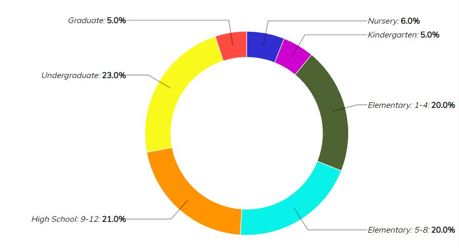
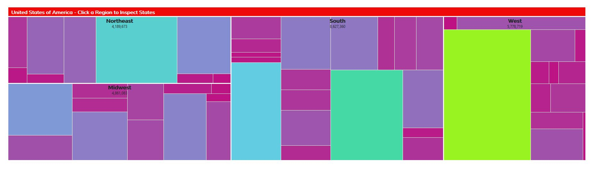
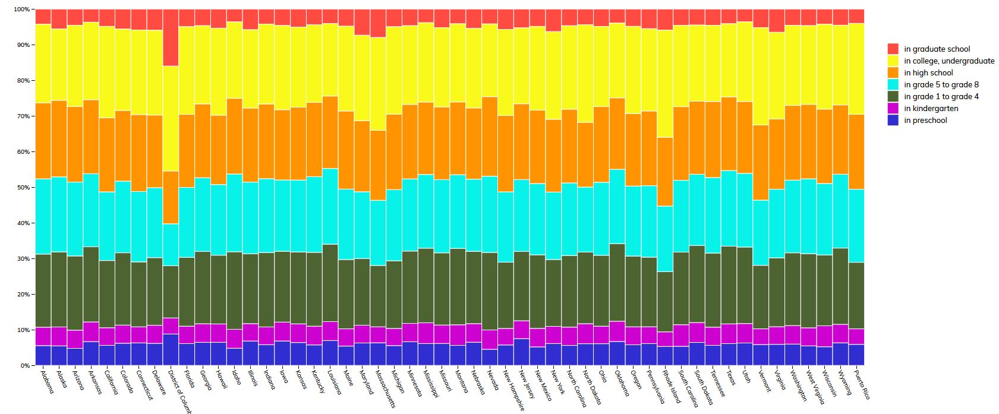
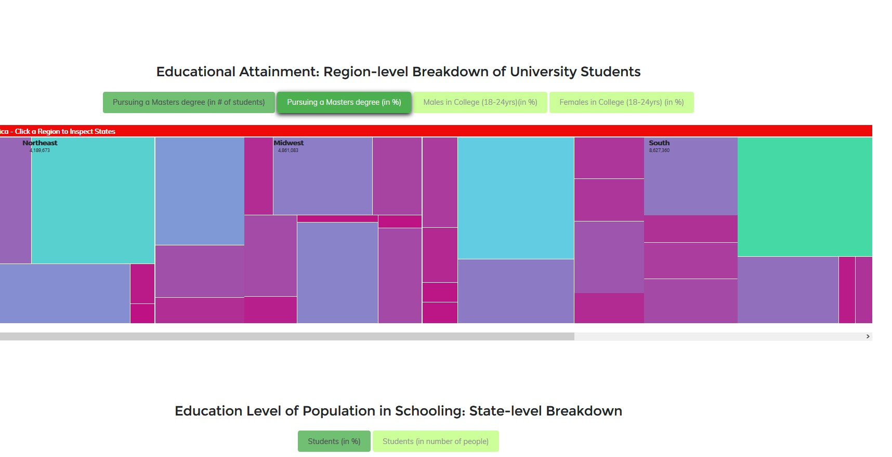
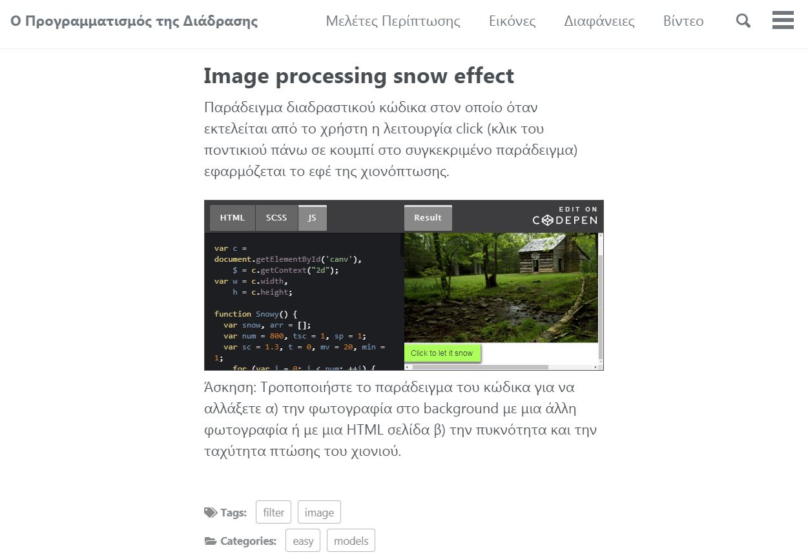
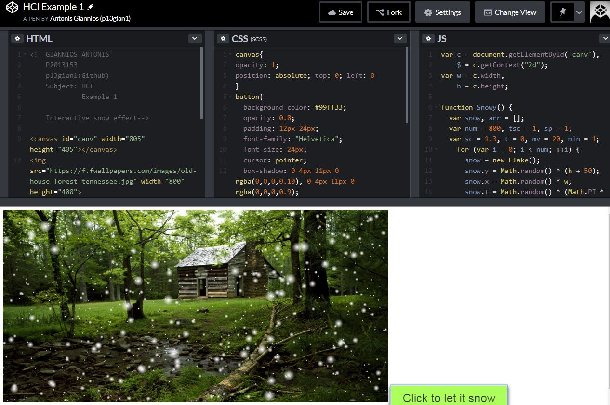
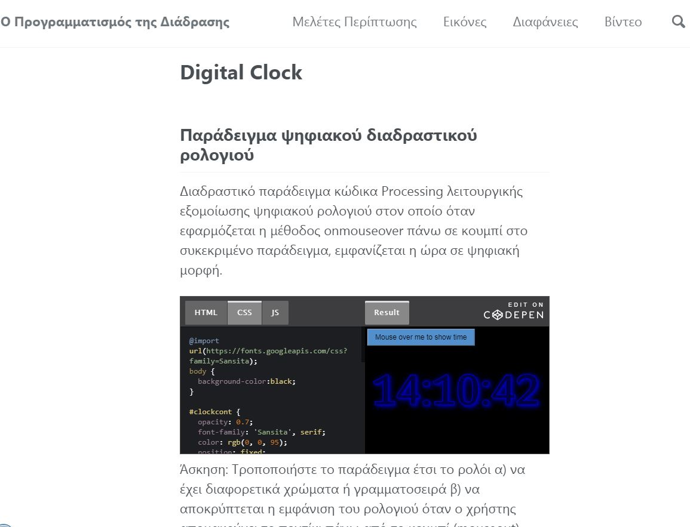
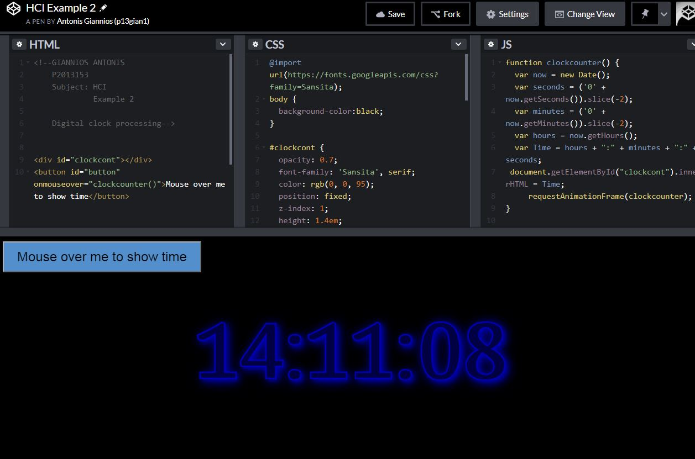

# Μάθημα: Επικοινωνία Ανθρώπου - Υπολογιστή
 
### Ονοματεπώνυμο: Γιαννιός Αντώνιος
### Αριθμός Μητρώου: Π2013153

## Εργασία Περιεχομένου: Συμμετοχική μελέτη και προσθήκη εκπαιδευτικού υλικού

## Παραδοτέο Α

#### link αποθετηρίου κώδικα: https://github.com/p13gian1/gr
#### link στο εκτελέσιμο: https://p13gian1.github.io/gr

### Εκπλήρωση ζητούμενων A παραδοτέου

#### link  αρχείου config.yml https://github.com/p13gian1/gr/blob/gh-pages/_config.yml

#### link 1ης εικόνας https://p13gian1.github.io/gr/gallery/augmented_reality/

#### link 2ης εικόνας https://p13gian1.github.io/gr/gallery/dc++/

#### link 3ης εικόνας https://p13gian1.github.io/gr/gallery/e_mule/

#### link 4ης εικόνας https://p13gian1.github.io/gr/gallery/first_person/

#### link 5ης εικόνας https://p13gian1.github.io/gr/gallery/zx-spectrum_48k/

-------------------------------------------------------------------------------------------
-------------------------------------------------------------------------------------------

## Εργασία Ανάπτυξης: Οπτικοποίηση Δεδομένων

## Παραδοτέο 1

#### [Link αποθετηρίου κώδικα]: https://github.com/p13gian1/D3js-US-educational-attainment/
#### [Link στο εκτελέσιμο]: https://p13gian1.github.io/D3js-US-educational-attainment/

### Εκπλήρωση ζητούμενων πρώτου παραδοτέου

[x] Άλλαξα τα χρώματα στα 3 γραφήματα.

[x] Αντικατέστησα τις διεπαφές στα "κουμπιά" του 2ου και 3ου γραφήματος.

[x] Όταν το ποντίκι διέρχεται επάνω από κάθε επιλογή του menu στην κορυφή της σελίδας, ακούγεται κάποιος ήχος.

[x] Όταν το ποντίκι διέρχεται πάνω από κάποια πρόταση/κείμενο της σελίδας ή περιοχή που περιλαμβάνει γραπτή πληροφορία (π.χ. κάποιο τμήμα     γραφήματος), ακούγεται αυτόματα η αφήγηση του κειμένου (text-to-speech).

[x] Εφάρμοσα responsive design στη σελίδα (Bootstrap) και κυρίως στο αρχικό menu έτσι ώστε να προσαρμόζεται σε οθόνες διαφορετικών διαστάσεων.

### Τεκμηρίωση ζητουμένων πρώτου παραδοτέου

Α) Άλλαξα τα χρώματα στα 3 γραφήματα

Β) Αντικατέστησα τις διεπαφές στα "κουμπιά" του 2ου και 3ου γραφήματος.

Γ) Δ) Ε) Δείτε το εκτελέσιμο στο https://p13gian1.github.io/D3js-US-educational-attainment/

Για την μετατροπή text to speech χρησιμοποίησα το responsivevoice.js.

-------------------------------------------------------------------------------------------
-------------------------------------------------------------------------------------------

## Εργασία Περιεχομένου: Συμμετοχική μελέτη και προσθήκη εκπαιδευτικού υλικού

## Παραδοτέο B

#### link αποθετηρίου κώδικα: https://github.com/p13gian1/gr
#### link στο εκτελέσιμο: https://p13gian1.github.io/gr

### Εκπλήρωση ζητούμενων B παραδοτέου

[x] Πρόσθεσα δύο νέα διαδραστικά παραδείγματα, τα οποία συνδέονται με βασικές έννοιες του βιβλίου και της διάδρασης ανθρώπου-υπολογιστή και επιτρέπουν σε κάποιον 2ο χρήστη να τα αλλάξει ή/και να τα προσθέσει σε διαφορετικές εφαρμογές ως αρχέτυπα.

### Τεκμηρίωση ζητουμένων Β παραδοτέου

1o παράδειγμα: Ιmage processing snow effect

2o παράδειγμα: Digital clock processing

