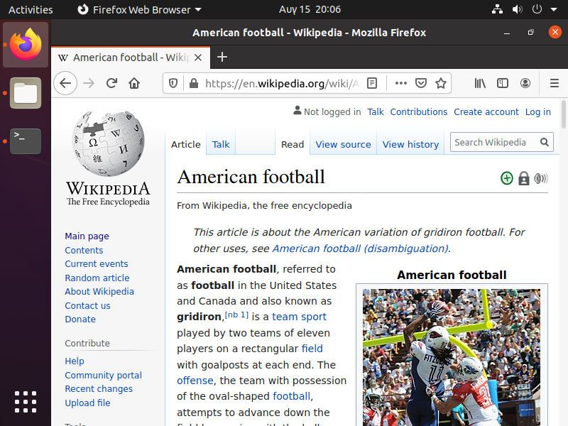

# ΙΟΝΙΟ ΠΑΝΕΠΙΣΤΗΜΙΟ, ΤΜΗΜΑ ΠΛΗΡΟΦΟΡΙΚΗΣ 
## ΜΑΘΗΜΑ
### Επικοινωνία Ανθρώπου Υπολογιστή  
Επιβλέπων καθηγητής: Χωριανόπουλος Κωνσταντίνος 

## Στοιχεία φοιτητή 
### Παπακωστούλης Αντώνιος
### ΑΜ: Π2014055

### [Προσωπικό αποθετήριο](https://github.com/p14papa1/hci)

## Εισαγωγή
Για τις 6 ασκήσεις που έγιναν χρησιμοποιήθηκε το Oracle VM virtual box και λειτουργικό σύστημα Ubuntu 20.04 . Επιπροσθέτως παραθέτονται όλα τα url για τις ασκήσεις που καταγράφτηκαν με το asciinema.


## Άσκηση 1. Σet-up the main dependencies and demonstrate your base system. change your command prompt with your student ID, list your dot files, display your shell configuration file and display system information

[asciinema url](https://asciinema.org/a/Bq03Tr1YnLH6PEgw3eNBwmtL0)

Χρησιμοποιήθηκαν οι εντολές 
Για να αλλάξω το command prompt με το ΑΜ χρησιμοποίησα την εντολή

```bash
sudo nano ~/.bashrc
```

Έπειτα άλλαξα το όνομα με το ΑΜ μου. Στην συνέχεια  για να δείξω τα dotfiles χρησιμοποίησα την εντολή 

```bash
ls -a
```

Στην συνέχεια εγκατέστησα το neofetch με την εντολή 

```bash
sudo apt-get install neofetch
```

και στην συνέχεια το εκτέλεσα με την εντολή neofetch. 


## Άσκηση 2. Get familiar with basic commands, reading documentation and editing files. Browse and view files on your system.

[asciinema url](https://asciinema.org/a/EwLNC1szZ9enYqMwx62xlQH2D)

Για αυτή την άσκηση χρησιμοποίησα το vim και το ranger. Άρχικα για να εγκαταστήσω χρησιμοποίησα τις εντολές

```bash
sudo apt-get install vim
sudo apt-get install ranger
```

Στην συνέχεια δημιούργησα ένα directory με όνομα askisi2


```bash
mkdir askisi2
```

Μετά είδα τα manual των vim και ranger 

```bash
man vim
man ranger
```

Στην συνέχεια έτρεξα το vim με την εντολή

```bash 
vim askisi2
```

Και τέλος το ranger με την εντολή 

```bash
ranger
```


## Άσκηση 3. Become productive with a todo list. Create a list of todos, edit, delete, and check some of them.

[asciinema url](https://asciinema.org/a/GXWYZ4tDSb5DTUzWUQDEaSjjj)

Αρχικά εγκατέστησα το taskwarrior

```bash
sudo apt-get install taskwarrior
```

Στην συνέχεια πρόσθεσα, επεξεργάστηκα, διέγραψα, ολοκλήρωσα διάφορα task με τις παρακάτω εντολές


```bash
task add <name>
task add <name> due:<deadline>
task <number> edit
task <number> delete
task <number> done
```

Στην συνέχεια κοίταξα το ημερολόγιο καθώς και ένα διάγραμμα με πληροφορίες για τα task μου. 

```bash
task calendar
task burndown
```

ΠΗΓΗ
[taskwarrior.org](https://taskwarrior.org/docs/start.html)


## Άσκηση 4. Τrack your time with a simple journal.

[asciinema url](https://asciinema.org/a/hjJRxXKpR2hqal8y2rwdv171W)

Αρχικά για να γίνει η εγκατάσταση του jrnl έπρεπε να εγκαταστήσω το python3-pip πρώτα και μετά το jrnl

```bash
sudo apt install python3-pip
sudo pip3 install jrnl
```

Στην συνέχεια πρόσθεσα και επεξεργάστηκα κάποιες εισχωρήσεις του ημερολογίου μου.

```bash
jrnl <timeframe> *: <message>
jrnl --edit
```

Σε περίπτωση που θες να αναζητήσεις μία συγκεκριμένη λέξη την αποθηκεύεις με @ και μετά η αναζήτηση γίνεται με την εντολή 

```bash
jrnl @<word>
```

ΠΗΓΗ
[jrnl](https://jrnl.sh/)


## Άσκηση 5. Organise the terminal window into multiple areas. Use one window to search-edit local files or browse the web and another window for performance monitoring	

[asciinema url](https://asciinema.org/a/yCGKLmcIYrkhMQwCuAeGlZorJ)


Για την άσκηση 5 έπρεπε αρχικά να εγκαταστήσω το tmux και το htop

```bash
sudo apt-get install tmux
sudo apt-get install htop
```

Στην συνέχεια άνοιξα το tmux και χώρισα το terminal σε δύο παράθυρα και στο δεύτερο παράθυρο έτρεξα το htop ενώ στην συνέχεια έτρεξα το ranger (άσκηση 2) στο αρχικό παράθυρο και χρησιμοποίησα τις εντολές

```bash
ctrl b % (shift+5) //δημιουργία νέου παραθύρου
htop
ctrl b o // εναλλαγή παραθύρου
ranger
```

Και στην συνέχεια μέσω του ranger επεξεργάστηκα και περιηγήθηκα το σύστημα όπως στην άσκηση 2. 

Χρησιμοποίησα το  [superuser site](https://superuser.com/questions/266725/tmux-ctrlb-not-working/1171345) για να μάθω τον χειρισμό του tmux.


## Άσκηση 6. Surf the web. Create a new elvi

[asciinema url](https://asciinema.org/a/WZij9DlmKg6ZdhFHdbYEwWZHP)

Αρχικά εγκατέστησα το surfraw

```bash
sudo apt-get install surfraw
```

Επεξεργάστηκα το αρχείο του elvi του surfraw ώστε να κάνει αναζήτηση στο wikipedia αντί για το youtube και στην συνέχεια εκτέλεσα την αναζήτηση με την εντολή 

```bash
sr wikipedia American football
```

To screenshot δεν έχει βγει καλά καθώς η άσκηση έγινε με virtual box. 





# Συμμετοχικό Εκπαιδευτικό υλικό

[Προσωπικό Αποθετήριο](https://github.com/p14papa1/pibook)

[url Σελίδας Βιβλίου](https://p14papa1.netlify.app/)

## Παραδοτέο 1.Β

Νέο διαδραστικό παράδειγμα

[Music Player](https://p14papa1.netlify.app/remix/music-player/)


## Παραδοτέο 1.Β

Νέο διαδραστικό παράδειγμα

[Color Changing Scroll](https://p14papa1.netlify.app/remix/color-change/)


## Παραδοτέο 1.Γ.1
Νέα μελέτη περίπτωσης

[Snapchat](https://p14papa1.netlify.app/case-study/snapchat/)

Πηγή: [wikipedia](https://en.wikipedia.org/wiki/Snapchat)


## Παραδοτέο 1.Γ.2
Νέα Βιβλιογραφία

[Stephen Gary Wozniak](https://p14papa1.netlify.app/biography/stephen-gary-wozniak/)

Πηγή: [wikipedia](https://en.wikipedia.org/wiki/Steve_Wozniak)


## Συμπεράσματα Ασκήσεων

Με τις ασκήσεις έμαθα να χρησιμοποιώ το λογισμικό Ubuntu καθώς ήταν η πρώτη φορά που ασχολήθηκα με το terminal. Έμαθα αρκετές βασικές εντολές καθώς και αρκετά προγράμματα με τα οποία μπορούν να κάνουν την χρήση του terminal ακόμα πιο απλή ειδικά για ένα νέο χρήστη. 

## Συμπεράσματα Συμμετοχικού Εκπαιδευτικού Υλικού

Αρχικά έμαθα να χρησιμοποιώ καλύτερα το github καθώς και έμαθα να χρησιμοποιώ το codepen και netlify στο οποίο ανέβασα το αντίγραφο της ιστοσελίδας του βιβλίου. 


