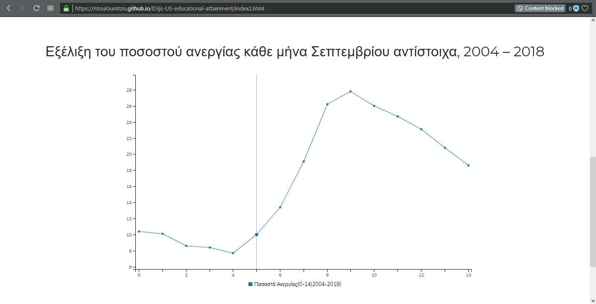

# Μάθημα: Επικοινωνία Ανθρώπου-Υπολογιστή

### Ονοματεπώνυμο: Τουλουμτζής Νικήτας
### Αριθμός Μητρώου: Π2015023


# Εργασία Ανάπτυξης

* [**εκτελέσιμο link**](https://ntouloumtzis.github.io/D3js-US-educational-attainment/)
* [**link αποθετηρίου(gh-pages branch)**](https://github.com/ntouloumtzis/D3js-US-educational-attainment/tree/gh-pages)

## Παραδοτέο 1

   - [x] **Αλλάξτε τα χρώματα στα 3 γραφήματα.**

   - Για την αλλαγή των χρωμάτων στα γραφήματα, τροποποιούμε τους κώδικες στα αντίστοιχα αρχεία των γραφημάτων.

        - Για το πρώτο γράφημα ( στο αρχείο: [**script_1.js**](https://github.com/ntouloumtzis/D3js-US-educational-attainment/blob/gh-pages/assets/scripts/script_1.js) )

          ```
          colour = d3.scaleOrdinal().range(["#90afc5", "#336b87", "#2a3132", "#763626", "#258039", "#f5be41", "#cf3721"])
          ```
        
       
        - Για το δεύτερο γράφημα ( στα αρχεία: [**script_2.js**](https://github.com/ntouloumtzis/D3js-US-educational-attainment/blob/gh-pages/assets/scripts/script_2.js) και [**style.css**](https://github.com/ntouloumtzis/D3js-US-educational-attainment/blob/gh-pages/assets/stylesheets/style.css) )

        1. Για το **button** του δεύτερου γραφήματος ( μικρές αλλαγές και στα δύο αρχεία ) 

              1.a) _Το default χρώμα του κουμπιού_ (**script_2.js**)


                   46   .attr("fill", '#009933');
                        ...
                   90   return '#009933'


              1.b)  _Όταν περνάει το ποντίκι πάνω απ'το κουμπί του γραφήματος_ (**style.css**)


    
                   .grandparent:hover rect {
	  	         fill: #006622;
	           }


        2. Στο ίδιο το δεύτερο **γράφημα** (**script_2.js**)


               var color = d3.scaleLinear().domain([0, 1/4*5000000, 2/4*5000000, 3/4*5000000, 5000000]).range(["#fb6542", "#ffbb00", "#375e97", "#3f681c"]);


               if (treeSumSortType == "number") {
                    color = d3.scaleLinear().domain([0, 1/4*5000000, 2/4*5000000, 3/4*5000000, 5000000]).range(["#fb6542", "#ffbb00", "#375e97", "#3f681c"]);
                    return d["Total College"];
                } else if (treeSumSortType == "percent") {
                    color = d3.scaleLinear().domain([0, 1/4*50, 2/4*50, 3/4*50, 50]).range(["#fb6542", "#ffbb00", "#375e97", "#3f681c"]);
                    return d["Percent College"];
                } else if (treeSumSortType == "male") {
                    color = d3.scaleLinear().domain([0, 1/4*50, 2/4*50, 3/4*50, 50]).range(["#fb6542", "#ffbb00", "#375e97", "#3f681c"]);
                    return d["Percent College - Male"];
                } else {
                    color = d3.scaleLinear().domain([0, 1/4*50, 2/4*50, 3/4*50, 50]).range(["#fb6542", "#ffbb00", "#375e97", "#3f681c"]);
                    return d["Percent College - Female"];
                }

        
        - Για το τρίτο γράφημα ( στο αρχείο: [**script_3.js**](https://github.com/ntouloumtzis/D3js-US-educational-attainment/blob/gh-pages/assets/scripts/script_3.js) )

           ```
           var colors = d3.scaleOrdinal()
           .range(["#98abc5", "#8a89a6", "#7b6888", "#6b486b", "#a05d56", "#d0743c", "#ff8c00"]); // Picked colors
           ```


   - [x] **Αντικαταστήστε τις διεπαφές στα "κουμπιά" του 2ου και 3ου γραφήματος με άλλες της επιλογής σας.**


   - Για την αλλαγή στις διεπαφές των buttons του 2ου και 3ου γραφήματος, πρόσθεσα στο αρχείο [**style.css**](https://github.com/ntouloumtzis/D3js-US-educational-attainment/blob/gh-pages/assets/stylesheets/style.css) τις παρακάτω 
     γραμμές κώδικα.
         
         .radio-toolbar label {
         background-color: white; 
         color: black; 
         border: 2px outset #304040;
         padding: 5px 10px;
         text-align: center;
         text-decoration: none;
         display: inline-block;
         font-size: 16px;
         margin: 6px 8px;
         -webkit-transition-duration: 0.2s;
         transition-duration: 0.2s;
         cursor: pointer;
         box-shadow: 0 9px #999;
         font-weight: bold;
         }
     
         .radio-toolbar label:hover {
         background-color: #304040;
         color: white; 
         }

         .radio-toolbar label:active {
         background-color: #304040;
         box-shadow: 0 5px #666;
         transform: translateY(4px);
         }

         .radio-toolbar input[type="radio"]:checked+label {
         background-color: #304040;
         color: white;
         }


   - [x] **Όταν το ποντίκι διέρχεται επάνω από κάθε επιλογή του menu στην κορυφή της σελίδας, να ακούγεται κάποιος ήχος της επιλογής                σας.**   


   - Για να ακούγεται ήχος κάθε φορά που διέρχεται το ποντίκι στο menu της σελίδας, αρκεί να διαλέξουμε ένα ηχητικό αρχείο(κλιπ).            Αρχικά, κατέβασα ένα mp3 αρχείο από το διαδίκτυο:

     

     Τέλος, ακολούθησα τα βήματα στην εικόνα της παρακάτω ιστοσελίδας

     

     Στην ουσία, ανέβασα δύο αρχεία του κλιπ, ένα [**.mp3**](https://github.com/ntouloumtzis/D3js-US-educational-attainment/blob/gh-pages/mousehover-sound.mp3) και ενα [**.ogg**](https://github.com/ntouloumtzis/D3js-US-educational-attainment/blob/gh-pages/mousehover-sound.ogg), για να υποστηρίζεται απ'όλους τους φυλλομετρητές.     
     Μετά, ανέβασα το [**mousehover-sound.js**](https://github.com/ntouloumtzis/D3js-US-educational-attainment/blob/gh-pages/mousehover-sound.js) αρχείο στο repository του κώδικά μου, για να υποστηρίζεται και απο τον IE φυλλομετρητή.
     Στη συνέχεια, τροποποίησα το αρχείο [**index.html**](https://github.com/ntouloumtzis/D3js-US-educational-attainment/blob/gh-pages/index.html), εισάγοντας ενα _script tag_: 
     
     ```
     <script type="text/javascript" src="mousehover-sound.js"></script>
     ```
     
     Ενα _audio tag_:

     ```
     <audio>
     <source src="mousehover-sound.mp3"></source>
     <source src="mousehover-sound.ogg"></source>
     </audio>
	  <div id="sounddiv"><bgsound id="sound"></div>
     ```

     καθώς και τον _κώδικα_ 
 
     ```
     onmouseover="playclip();"
     ```
     
     σε κάθε ένα από τα tags των επιλογών του **menu** μας

     ```
     <li><a href="#top" onmouseover="playclip();" >Top</a></li>
     <li><a href="#national" onmouseover="playclip();" >National</a></li>
     <li><a href="#regional" onmouseover="playclip();" >Regional</a></li>
     <li><a href="#state" onmouseover="playclip();" >State-Level</a></li>
     ```


   - [x] **Όταν το ποντίκι διέρχεται πάνω από κάποια πρόταση/κείμενο της σελίδας, να ακούγεται αυτόματα η αφήγηση του κειμένου (text-to-speech).**


   - Για να ακούγεται η αφήγηση του κάθε κειμένου, όταν θα διέρχεται το ποντίκι πάνω, χρησιμοποιούμε τη βιβλιοθήκη ResponsiveVoice,
     σε _script tag_ στο [**index.html**](https://github.com/ntouloumtzis/D3js-US-educational-attainment/blob/gh-pages/index.html):

     ```
     <script src="https://code.responsivevoice.org/responsivevoice.js"></script>
     ```

     και την παρακάτω συνάρτηση, μέσα σε _script tag_:

     ```
     <script>
     $(document).ready(function(){
     $("h1, h2, label").mouseenter(function(){
		responsiveVoice.cancel(); 
  		responsiveVoice.speak($(this).text(), 'UK English Male');
     });
     $("h1, h2, label").mouseleave(function(){
        responsiveVoice.cancel();
    	});
     });
     </script>
     ```

   - Μια ακόμη προσθήκη, η οποία έγινε έτσι ώστε να διευκολυθούν οι χρήστες αυτοί, είναι πως κάθε φορά που ο χρήστης κάνει hover πάνω από ένα στοιχείο του pie-chart, ακούγεται μέσω της **javascript class SpeechSynthesisUtterance**. Οι αλλαγές αυτές έγιναν στο αρχείο [**script_1.js**](https://github.com/ntouloumtzis/D3js-US-educational-attainment/blob/gh-pages/assets/scripts/script_1.js).

     ```
         Mέσα στο mouseenter: (Οι εντολές κώδικα που πρόσθεσα αρχίζουν απ'την γραμμή 155 και τελειώνουν στην 162.)
     var message = new SpeechSynthesisUtterance(toolTipHTML(data));
                     speechSynthesis.speak(message);

         Mέσα στο mouseout:
     speechSynthesis.cancel();
     ```


   - [x] **Εφαρμόστε responsive design στη σελίδα και κυρίως στο αρχικό menu έτσι ώστε να προσαρμόζεται σε οθόνες διαφορετικών                      διαστάσεων (π.χ. Bootstrap).**

   
   - Για να προσαρμόσουμε την ιστοσελίδα μας σε οθόνες διαφορετικών διαστάσεων, θα χρειαστεί να χρησιμοποιήσουμε χρήσιμες βιβλιοθήκες της Bootstrap.
     Αυτές που χρησιμοποίησα, είναι οι νεότερες εκδόσεις της css και js της bootstrap, της jquery και popper και εκτός απ'τις βιβλιοθήκες αυτές και ένα _meta tag_ για να έρχεται στις διαστάσεις της κάθε συσκευής.

      ```
      <meta name="viewport" content="width=device-width, initial-scale=1">
      <link rel="stylesheet" href="https://stackpath.bootstrapcdn.com/bootstrap/4.1.3/css/bootstrap.min.css" integrity="sha384-      MCw98/SFnGE8fJT3GXwEOngsV7Zt27NXFoaoApmYm81iuXoPkFOJwJ8ERdknLPMO" crossorigin="anonymous">
      <script src="https://stackpath.bootstrapcdn.com/bootstrap/4.1.3/js/bootstrap.min.js" integrity="sha384ChfqqxuZUCnJSK3+MXmPNIyE6ZbWh2IMqE241rYiqJxyMiZ6OW/JmZQ5stwEULTy" crossorigin="anonymous"></script>
      <script src="https://ajax.googleapis.com/ajax/libs/jquery/3.3.1/jquery.min.js"></script>
      <script src="https://cdnjs.cloudflare.com/ajax/libs/popper.js/1.14.3/umd/popper.min.js" integrity="sha384ZMP7rVo3mIykV+2+9J3UJ46jBk0WLaUAdn689aCwoqbBJiSnjAK/l8WvCWPIPm49" crossorigin="anonymous"></script>
      ```

      Στη συνέχεια, πρόσθεσα τον παρακάτω κώδικα στο αρχείο [**index.html**](https://github.com/ntouloumtzis/D3js-US-educational-attainment/blob/gh-pages/index.html), ώστε το **menu** της ιστοσελίδας να προσαρμόζεται σωστά σε μικρότερες συσκευές:
 
   ```
 <header>
	<nav class="navbar navbar-expand-md navbar-dark bg-dark">
		<div class="container-fluid">
			<button class="navbar-toggler" type="button" data-toggle="collapse" data-target="#navbarResponsive">
				<span class="navbar-toggler-icon"></span>
			</button>
			<div class="collapse navbar-collapse" id="navbarResponsive">
				<ul class="navbar-nav ml-auto">
<li class="nav-item active"><a class="nav-link" href="#top" onmouseover="playclip();" >Top</a></li>
<li class="nav-item active"><a class="nav-link" href="#national" onmouseover="playclip();" onclick="FunctionGraphOne()" >National</a></li>
<li class="nav-item active"><a class="nav-link" href="#regional" onmouseover="playclip();" onclick="FunctionGraphTwo()" >Regional</a></li>
<li class="nav-item active"><a class="nav-link" href="#state" onmouseover="playclip();" onclick="FunctionGraphThree()" >State-Level</a></li>
<li class="nav-item active"><a class="nav-link" href="index2.html" onmouseover="playclip();" >Additional-Charts</a></li>                                                 
				</ul>
			</div>
		</div>
	</nav>
</header>
  ```

   Τέλος, πρόσθεσα τις παρακάτω γραμμές κώδικα στο αρχείο [**style.css**](https://github.com/ntouloumtzis/D3js-US-educational-attainment/blob/gh-pages/assets/stylesheets/style.css) (αντικαθιστώντας τα με τα αντίστοιχα _nav tags_ που υπήρχαν πριν), δημιουργώντας μικρές αλλαγές, αλλά και για να δουλεύει σωστά 
το **menu** σε μικρότερες οθόνες.

  ```
  .navbar {
   padding: .8rem;
  }

  .navbar-nav li {
   padding-right: 20px;
  }

  .nav-link {
   font-size: 1.1em !important;
  }
  ```

  

## Παραδοτέο 2 


  - [x] **Τροποποιήστε τον κώδικα και το μενού της εφαρμογής έτσι ώστε κάθε στιγμή να είναι εμφανές μόνο ένα από τα 3 γραφήματα, παραμένοντας πάντα στη σελίδα index.html.**

  - Για να είναι εμφανές μόνο το ένα γράφημα που επιθυμούμε να διαλέξουμε, πρόσθεσα στο [**index.html**](https://github.com/ntouloumtzis/D3js-US-educational-attainment/blob/gh-pages/index.html) τις παρακάτω συναρτήσεις:

    ```
    <script>
    function FunctionGraphOne() {
    var x = document.getElementById("GraphOne");
    var y = document.getElementById("GraphTwo");
    var w = document.getElementById("GraphThree");
    if (x.style.display === "none") {
        x.style.display = "block";
	y.style.display = "none";
	w.style.display = "none";
    } else {
	x.style.display = "none";
    }
    }

    function FunctionGraphTwo() {
    var x = document.getElementById("GraphOne");
    var y = document.getElementById("GraphTwo");
    var w = document.getElementById("GraphThree");
    if (y.style.display === "none") {
        x.style.display = "none";
	y.style.display = "block";
	w.style.display = "none";
    } else {
        y.style.display = "none";
    }
    }

    function FunctionGraphThree() {
    var x = document.getElementById("GraphOne");
    var y = document.getElementById("GraphTwo");
    var w = document.getElementById("GraphThree");
    if (w.style.display === "none") {
        x.style.display = "none";
	y.style.display = "none";
	w.style.display = "block";
    } else {
        w.style.display = "none";
    }
    }
	
    FunctionGraphTwo();
    FunctionGraphThree();
    </script>
    ```
    
    Οι παραπάνω συναρτήσεις θα καλούνται κάθε φορά που ο χρήστης θα πατάει μία επιλογή στο menu, για το επιθυμητό γράφημα που θέλει να ελέγξει. Στην ουσία πρόσθεσα στο _header tag_ του ίδιου αρχείου τις εντολές,
    ```
    onclick="FunctionGraphOne()"
    onclick="FunctionGraphTwo()"
    onclick="FunctionGraphThree()"
    ```
    αντίστοιχα για κάθε γράφημα. Τέλος, τα συνδέω με _div tags για το κάθε γράφημα ξεχωριστά.
    ```
    <div id="GraphOne"> <!-- εντολές γραφήματος 1 --> </div>
    <div id="GraphTwo"> <!-- εντολές γραφήματος 2 --> </div>
    <div id="GraphThree"> <!-- εντολές γραφήματος 3 --> </div>
    ```

    Εδώ φαίνεται και το αποτέλεσμα του πρώτου ζητήματος:

    


  - [ ] Αντικαταστήστε το κάθε ένα από τα 3 γραφήματα με κάποιο άλλο διαδραστικό γράφημα της D3js.

	_**Δεν υλοποιήθηκε**_


   - [x] Σε μια καινούργια σελίδα, να τοποθετήστε αντίστοιχα 3 νέα διαδραστικά γραφήματα D3js της 
επιλογής σας, τα οποία θα οπτικοποιούν καινούργια στατιστικά δεδομένα που θα βρείτε από κάποια επίσημη 
στατιστική αρχή (π.χ. ΕΛΣΤΑΤ, Eurostat κ.λπ.)

    
   - **Πηγές Στατιστικών Δεδομένων:** ([ΕΛΣΤΑΤ](http://www.statistics.gr/))
        - [_Εξέλιξη του ποσοστού ανεργίας κάθε μήνα Σεπτεμβρίου, 2004 – 2018_](http://www.statistics.gr/el/statistics?p_p_id=documents_WAR_publicationsportlet_INSTANCE_qDQ8fBKKo4lN&p_p_lifecycle=2&p_p_state=normal&p_p_mode=view&p_p_cacheability=cacheLevelPage&p_p_col_id=column-2&p_p_col_count=4&p_p_col_pos=1&_documents_WAR_publicationsportlet_INSTANCE_qDQ8fBKKo4lN_javax.faces.resource=document&_documents_WAR_publicationsportlet_INSTANCE_qDQ8fBKKo4lN_ln=downloadResources&_documents_WAR_publicationsportlet_INSTANCE_qDQ8fBKKo4lN_documentID=345824&_documents_WAR_publicationsportlet_INSTANCE_qDQ8fBKKo4lN_locale=el) **Γράφημα 1**
        - [_Μόνιμος πληθυσμός των 10 μεγαλύτερων Δήμων της Φώρας κατά Σύνολο_](http://www.statistics.gr/el/statistics?p_p_id=documents_WAR_publicationsportlet_INSTANCE_qDQ8fBKKo4lN&p_p_lifecycle=2&p_p_state=normal&p_p_mode=view&p_p_cacheability=cacheLevelPage&p_p_col_id=column-2&p_p_col_count=4&p_p_col_pos=1&_documents_WAR_publicationsportlet_INSTANCE_qDQ8fBKKo4lN_javax.faces.resource=document&_documents_WAR_publicationsportlet_INSTANCE_qDQ8fBKKo4lN_ln=downloadResources&_documents_WAR_publicationsportlet_INSTANCE_qDQ8fBKKo4lN_documentID=310596&_documents_WAR_publicationsportlet_INSTANCE_qDQ8fBKKo4lN_locale=el) **Πίνακας 1**
        -  [_Ετήσια μεταβολή (%) Δεικτών Όγκου στο Λιανικό Εμπόριο Σεπτεμβρίου 2018/2017_](http://www.statistics.gr/el/statistics?p_p_id=documents_WAR_publicationsportlet_INSTANCE_qDQ8fBKKo4lN&p_p_lifecycle=2&p_p_state=normal&p_p_mode=view&p_p_cacheability=cacheLevelPage&p_p_col_id=column-2&p_p_col_count=4&p_p_col_pos=1&_documents_WAR_publicationsportlet_INSTANCE_qDQ8fBKKo4lN_javax.faces.resource=document&_documents_WAR_publicationsportlet_INSTANCE_qDQ8fBKKo4lN_ln=downloadResources&_documents_WAR_publicationsportlet_INSTANCE_qDQ8fBKKo4lN_documentID=344759&_documents_WAR_publicationsportlet_INSTANCE_qDQ8fBKKo4lN_locale=el) **Γράφημα 4**

     - Αρχικά, δημιουργήθηκαν 3 γραφήματα με τα αντίστοιχα στατιστικά δεδομένα τις ΕΛΣΤΑΤ, τα [**script_4.js**](https://github.com/ntouloumtzis/D3js-US-educational-attainment/blob/gh-pages/assets/scripts/script_4.js), [**script_5.js**](https://github.com/ntouloumtzis/D3js-US-educational-attainment/blob/gh-pages/assets/scripts/script_5.js) και [**script_6.js**](https://github.com/ntouloumtzis/D3js-US-educational-attainment/blob/gh-pages/assets/scripts/script_6.js)

       Τα δύο πρώτα τοποθετήθηκαν σε μια νέα σελίδα, την [**index2.html**](https://github.com/ntouloumtzis/D3js-US-educational-attainment/blob/gh-pages/index2.html), ενώ το τελευταίο γράφημα τοποθετήθηκε σε άλλη σελίδα, την [**index3.html**](https://github.com/ntouloumtzis/D3js-US-educational-attainment/blob/gh-pages/index3.html), γιατί δεν μου έβγαζε αλλιώς το αποτέλεσμα στην δεύτερη σελίδα.

     - Το αποτέλεσμα του **πρώτου** γραφήματος

     

     - Το αποτέλεσμα του **δεύτερου** γραφήματος

     

     - Το αποτέλεσμα του **τρίτου** γραφήματος

     

# Εργασία Περιεχομένου

* [**εκτελέσιμο link**](https://ntouloumtzis.github.io/gr/)
* [**link αποθετηρίου(gh-pages branch)**](https://github.com/ntouloumtzis/gr)

## Δραστηριότητα 1.Α

### _Ζητούμενα links εικόνων και αλλαγών στο αποθετήριο_

* **Αλλαγές στο _config.yml αρχείο: [εδώ](https://github.com/mibook/gr/commit/7c42da5cf65a543e65f59c7c10243641ae08f8b3)**

#### 1. Computer Terminal: [εδώ](https://ntouloumtzis.github.io/gr/gallery/computer-terminal/)

#### 2. Eniac: [εδώ](https://ntouloumtzis.github.io/gr/gallery/eniac/)

#### 3. First Modern Headphones: [εδώ](https://ntouloumtzis.github.io/gr/gallery/first-modern-headphones/)

#### 4. Ibm PC: [εδώ](https://ntouloumtzis.github.io/gr/gallery/ibm-pc/)

#### 5. Unix: [εδώ](https://ntouloumtzis.github.io/gr/gallery/unix/)


## Δραστηριότητα 1.Β

### _Ζητούμενα links διαδραστικών παραδειγμάτων_

#### 1. Task List: [εδώ](https://ntouloumtzis.github.io/gr/remix/task-list/)

#### 2. Menu Hover Effects: [εδώ](https://ntouloumtzis.github.io/gr/remix/menu-hover-effects/)


