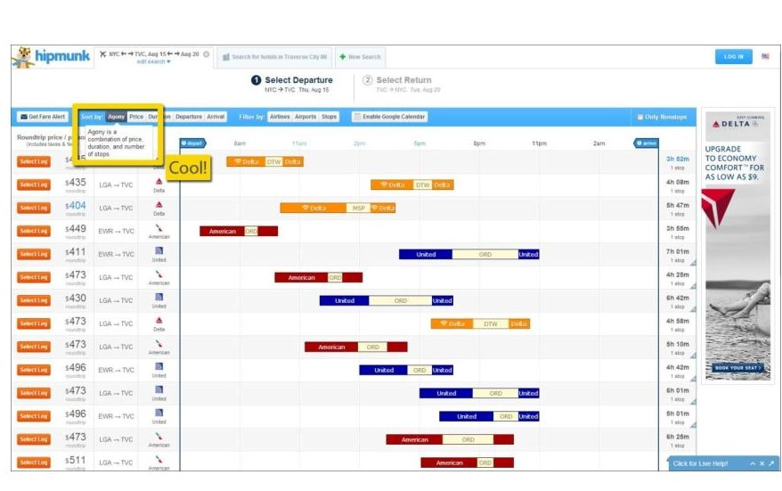

1)

author: p15gkar                                                                            

 title:github contribusion                                         
                                                     
 image_url: /image/githubprofile.ipg                                                             
                                                                 
caption : Η σημαντική συνεισφορά τουgithub σε ομαδικές δραστηριότητες,καταγράφοντας ακόμη και τις επιδόσεις των μελών της κάθε ομαδας

catecory: introduction

2)

author:p15gkar   

title : Math blaster 

image_url:    /image/mathblaster.ipg  

caption: Math Blaster,ένα παιχνίδι με εκπαιδευτικούς σκοπούς που διαφοροπείται στο ότι ο χρήστης  κάνει μαθηατικές πράξεις.Πετυχαίνει το στόχο   μόνο όταν οι πράξεις είναι σωστές.

category:   definition                                                           

3)

author:p15gkar                                                                                

title:    Aha mock-ups                     
                                                               
image_url: /image/Aha mock-ups.ipg                                                               
                                                                
 caption: Aha mock-ups,μια γρήγορη μέθοδος ανάπτυξης  πρωτοτύπου με την οποια οι σχεδιαστές διαδραστικών συστημάτων μεταφέρουν ιδέες που έχουν σχεδιάσει σε διαφάνειες στον τρισδιάστατο χώρο.Γι αυτό χρησιμοποιείται μια εκτενή βιβλιοθήκη χιλιάδων σχημάτων.                                                                                                                           
                                                                
catecory:   models                                                             

4)

author:   p15gkar                                                                            

                               
                                                              
                                                             
title: Hippung 

image_url: /image/Hippung.ipg 

caption: Το Hippung διευκολύνει το τελικό χρήστη με την ευχριστη διαδραστική επισκόπηση στην επιλογή αεροπορικών εισητηρίων.
  
  
catecory:  models
  
  
  
  
  
  
5)

author:  p15gkar                                                                               

                              
                                                          

  title:the memex 

 image_url:   /image/the memex.ipg

caption: Με την ανάκτηση πληρογορίας απο βιβλιοθήκεςπεριεχομένου ενος γραφείου σχεδιάζεται ενα θεωριτικό πλαίσιο μηχανιικου υπολογιστή
(Memex).Αυτό αποτέλεσαι και ενα  θεωριτικό πλαισιο για το διαδίκτυο. 

catecory: sythesis

# Παραδοτέο 2-Οπτικοποίηση

## Ζητούμενα Παραδοτέου2-Οπτικοποίση
1. Τροποποιήστε τον κώδικα και το μενού της εφαρμογής έτσι ώστε κάθε στιγμή να είναι εμφανές μόνο ένα από τα 3 γραφήματα, παραμένοντας πάντα στη σελίδα index.html.
2. Αντικαταστήστε το κάθε ένα από τα 3 γραφήματα με κάποιο άλλο διαδραστικό γράφημα της D3js.
3. Σε μια καινούργια σελίδα, να τοποθετήσετε αντίστοιχα 3 νέα διαδραστικά γραφήματα D3js της επιλογής σας, τα οποία θα οπτικοποιούν καινούργια στατιστικά δεδομένα που θα βρείτε από κάποια επίσημη στατιστική αρχή (π.χ. ΕΛΣΤΑΤ, Eurostat κ.λπ.).

## Αλλαγές που έγιναν
1.	Τροποποίησα το αρχείο index.html έτσι ώστε το κάθε γράφημα να περικλύεται μέσα σε ένα div στο οποίο αναθέτω τις κλάσεις hide και show αντίστοιχα. Επίσης, άλλαξα το navigation bar έτσι ώστε να μην έχει μέσα links αλλά buttons τα οποία ανάλογα με το ποιο θα πατηθεί καλεί την αντίστοιχει συνάρτηση σε javascript η οποία με την σειρά της θα προσθέσει και θα αφαιρέσει τις κατάλληλες κλάσεις. Τέλος, όταν ολοκληρωθεί το φόρτωμα της σελίδας τότε καλώ την συνάρτηση που θα εξαφανίσει τα 2 και 3 γραφήματα και θα μου εμφανίσει το γράφημα 1 έτσι ώστε να προλάβουν να αρχικοποιηθούν με τιμές.
2.	Δημιούργησα το αρχείο my_style.css όπου εκεί ορίζω δύο νέες κλάσεις, την show και την hide και οι οποίες θα χρησιμοποιηθούν έτσι ώστε να εξαφανίζω και να εμφανίζω κατάλληλα τα αντίστοιχα γραφήματα. Επίσης, όρισα το στύλ που θέλω τα κουμπιά να έχουν επάνω στο navigation bar.
3.	Δημιούργησα ένα αρχείο my_script.js μέσα στον φάκελο assets/scripts και εκεί όρισα 3 νέες συναρτήσεις σε javascript οι οποίες καλούνται ανάλογα με το πιο κουμπί έχει πατηθεί και η κάθε μια αντίστοιχα προσθέτει με χρήση jquery την κλάση show στο αντίστοιχο γράφημα και αφαιρεί την κλάση hide ενώ παράλληλα αφαιρεί την κλάση show από τα άλλα γραφήματα και τους προσθέτει την κλάση hide.
4.	Πρόσθεσα στο αρχείο index.html την γραμμή <link href="assets/stylesheets/my_style.css" rel="stylesheet"/> η οποία καλεί το νέο css αρχείο που έφτιαξα καθώς επίσης και την γραμμή  έτσι ώστε να μπορώ να χρησιμοποιήσω τις νέες συναρτήσεις που όρισα.
5.	Πρόσθεσα 3 νέα αρχεία, τα new_graph1.js, new_graph2.js και new_graph3.js στον φάκελο assets/scripts και κάλεσα αυτά τα τρία αρχεία στο τέλος του index.html. Αυτά τα τρία αρχεία αποτελούν και τα 3 νέα γραφήματα που ζητήθηκαν.

## Link κώδικα παραδοτεόυ 2,Οπτικοποίση: https://github.com/ioniodi/D3js-US-educational-attainment 
## Link ζητουμένων παραδοτέο2: https://github.com/ioniodi/D3js-US-educational-attainment/issues/2
## Link  αλλαγμένου κώδικα για το παραδοτέου2: https://github.com/p15gkar/D3js-US-educational-attainment/tree/2015075
## Link εκτελέσιμου: https://p15gkar.github.io/D3js-US-educational-attainment/

