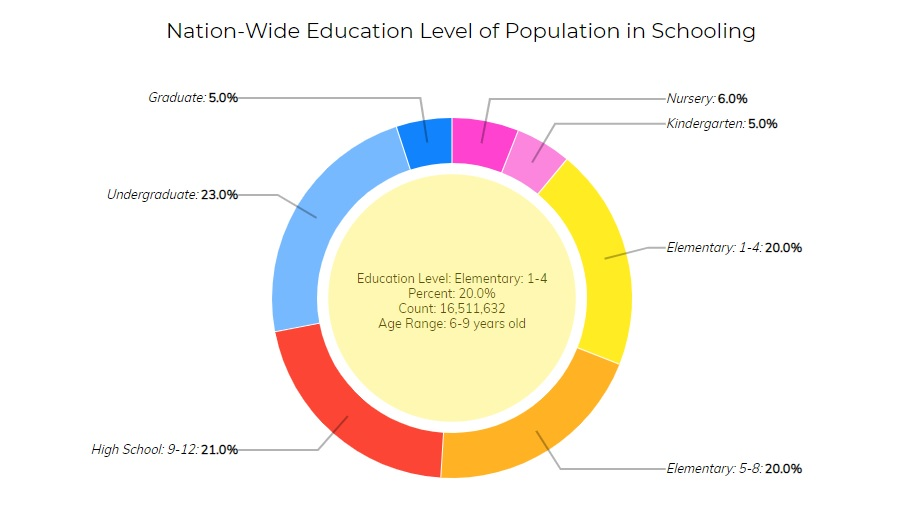
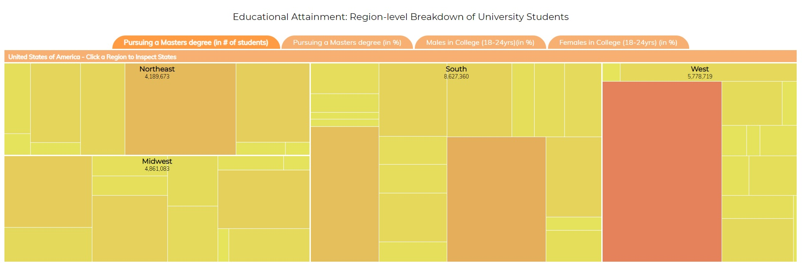
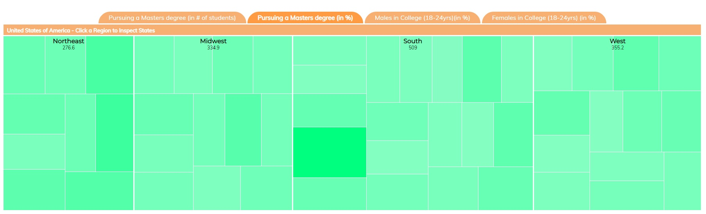
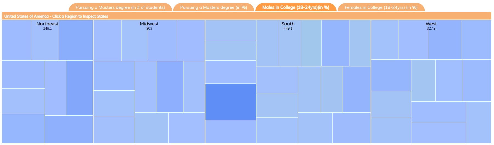
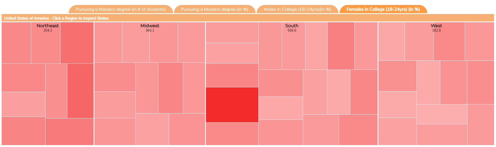
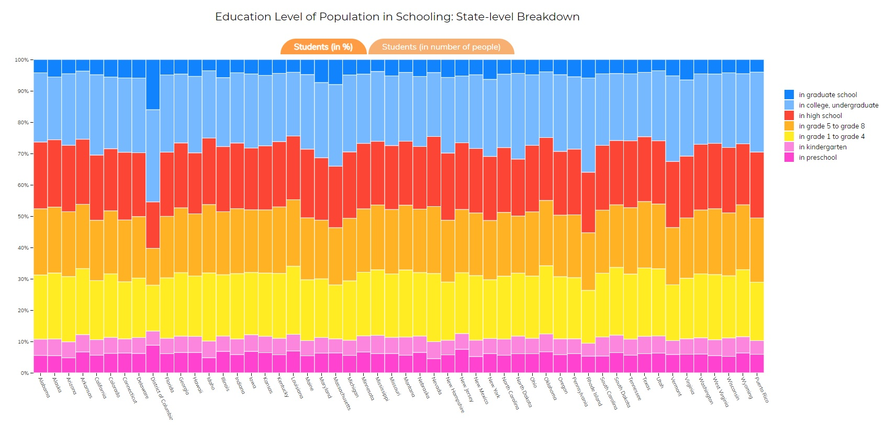

# Μάθημα: Επικοινωνία Ανθρώπου-Υπολογιστή
**Ονοματεπώνυμο:** Βασιλική Πολυχρόνη  
**ΑΜ:** Π2015084

[Προσωπικό αποθετήριο μαθήματος](https://github.com/p15poly/hci)  
## Εργασία Ανάπτυξης: Οπτικοποίηση δεδομένων εκπαιδευτικού συστήματος (USA)
Links:
* [Σελίδα εφαρμογής](https://p15poly.github.io/D3js-US-educational-attainment/)
* [Προσωπικό αποθετήριο κώδικα εργασίας](https://github.com/p15poly/D3js-US-educational-attainment)
### Παραδοτέο 1
Links για το πρώτο παραδοτέο:
* [Αλλαγές στον κώδικα](https://github.com/p15poly/D3js-US-educational-attainment/commits/paradoteo1)

**Ζητούμενα και αλλαγές αναλυτικά:**

* - [x] Αλλάξτε τα χρώματα στα 3 γραφήματα.

Άλλαξα τα χρώματα στα τρία γραφήματα της σελίδας με δικές μου επιλογές, με τροποποιήσεις στα αρχεία .js:

*Πρώτο γράφημα:*  
  
*Δεύτερο γράφημα:*  
  
  
  
  
*Τρίτο γράφημα:*  
  

* - [x]  Αντικαταστήστε τις διεπαφές στα "κουμπιά" του 2ου και 3ου γραφήματος με άλλες της επιλογής σας.

Αντικατέστησα τις διεπαφές στα κουμπιά του 2ου και 3ου γραφήματος, με αλλαγές στα αρχεία .html και .css:  

  

* - [x] Όταν το ποντίκι διέρχεται επάνω από κάθε επιλογή του menu στην κορυφή της σελίδας, να ακούγεται κάποιος ήχος της επιλογής σας.

Πρόσθεσα έναν ήχο στα κουμπιά του μενού (header) μέσω script, ο οποίος ακούγεται όταν ο χρήστης κάνει κλικ σε μια από τις επιλογές.

* - [x] Όταν το ποντίκι διέρχεται πάνω από κάποια πρόταση/κείμενο της σελίδας ή περιοχή που περιλαμβάνει γραπτή πληροφορία (π.χ. κάποιο τμήμα γραφήματος), να ακούγεται αυτόματα η αφήγηση του κειμένου (text-to-speech).

Πρόσθεσα αφήγηση κειμένου text-to-speech με χρήση της βιβλιοθήκης [ResponsiveVoiceJS](https://responsivevoice.org/) (μπορεί να χρειαστεί να κάνετε πρώτα κλίκ πάνω στη σελίδα για να δουλέψει).

Όλες οι αλλαγές έχουν δοκιμαστεί σε browser Google Chrome.
### Παραδοτέο 2
...
## Εργασία Περιεχομένου:
...
