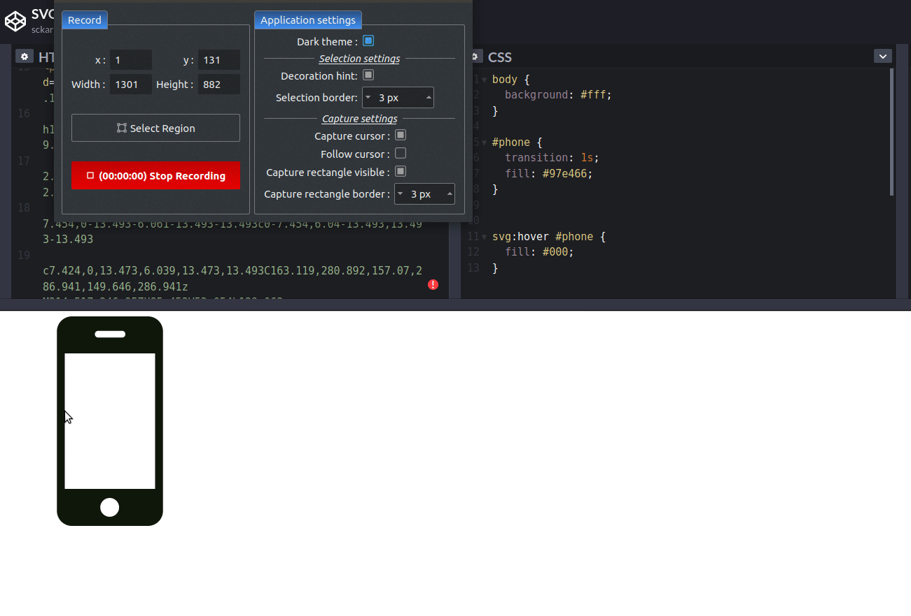
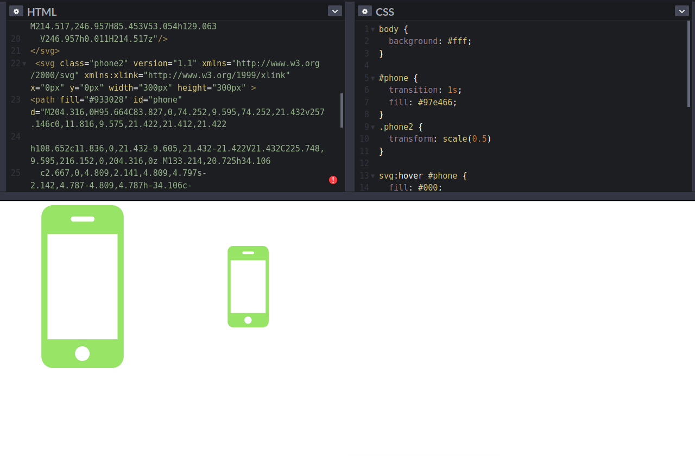
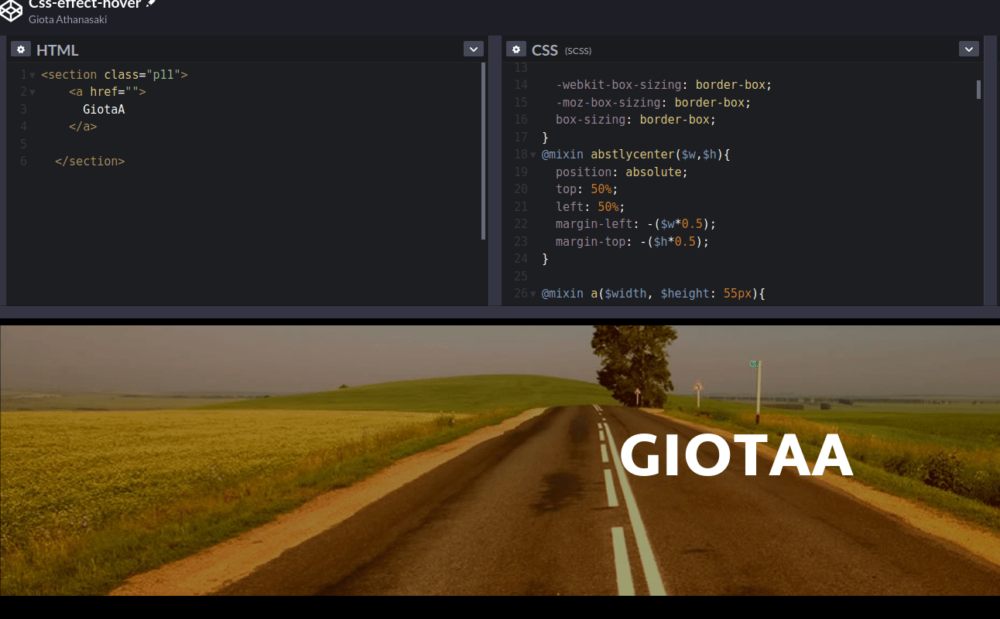

# ΙΟΝΙΟ ΠΑΝΕΠΙΣΤΗΜΙΟ-ΤΜΗΜΑ ΠΛΗΡΟΦΟΡΙΚΗΣ
# Μάθημα: Επικοινωνία Ανθρώπου-Υπολογιστή/HCI

**Επιβλέπων καθηγητής: Χωριανόπουλος Κωνσταντίνος**

**Ονοματεπώνυμο: Αθανασάκη Παναγιώτα**

**ΑΜ: Π2016003** 

**Σεμπτέμβριος 2020**

----------------------------------------------------------------

## Εργασία : Τελική Αναφορά Ασκήσεων και Συμμετοχικού Υλικού

***[Github Profile](https://github.com/GiotaAthanasaki)***

***[Fork of pibook/site in my profile](https://github.com/GiotaAthanasaki/site/tree/p2016003)***

***[Τελική Αναφορά repository](https://github.com/GiotaAthanasaki/hci/edit/2016003/projects/2016003)***

## Σύνοψη
 Στην παρούσα εργασία καλούμαστε να ασχοληθούμε με δύο ζητούμενα. Το πρώτο ***[Ασκήσεις terminal](#hci-terminal-assignments)*** είναι η περεταίρω εξοικείωση μας με την χρήση του τερματικού και του πληκτρολογίου, υλοποιώντας βασικές λειτουργίες σε ένα σύστημα linux χώρις την χρήση ουσιαστικά κάποιου GUI. Ενώ στο δεύτερο μέρος ***[Συμμετοχικό Υλικό](#hci-contribution)*** ζητείται η συνεισφορά μας για την τροποποίηση/βελτίωση του περιεχομένου του βιβλίου του μαθήματος [HCI pibook](https://github.com/pibook/site), προσθέτωντας εικόνες, ένα διαδραστικό παράδειγμα μεταξύ ενός χρήστη και του υπολογιστή καθώς επίσης την προσθήκη μίας βιογραφίας ενός σημαντικού προσώπου για τον τομέα της πληροφορικής γενικότερα. Τέλος, για την πραγματοποιήση αυτής της εργασίας έγινε εκτενής χρήση του Github, σε μία προσπάθεια για καλύτερη κατανόηση και αφομοίωση των εννοιών ενός git workflow εργαλείου· το οποίο είναι απαραίτητο για την δουλειά ενός προγραμματιστή.

## Εισαγωγή
 Για την υλοποίηση του μέρους των ασκήσεων χρησιμοποιήθηκε λειτουργικό σύστημα Ubuntu 18.04.5 LTS 64bit που έγινε install σε laptop,υλοποιήθηκαν συνολικά 7 ασκήσεις με διαφορετικά επίπεδα δυσκολίας, ενώ για το δεύτερο μέρος χρησιμοποιήθηκε η μηχανή αναζήτησης του [Google](https://www.google.com/search?q=%CE%B1%CE%BD%CE%B1%CE%B6%CE%B7%CF%84%CE%B7%CF%83%CE%B7%20%CE%B5%CE%B9%CE%BA%CE%BF%CE%BD%CF%89%CE%BD%20%CE%BC%CE%B5%20%CE%B4%CE%B9%CE%BA%CE%B1%CE%B9%CF%89%CE%BC%CE%B1%CF%84%CE%B1&tbm=isch&tbs=sur%3Afc&hl=el&sa=X&ved=0CAIQpwVqFwoTCOjng8KOxesCFQAAAAAdAAAAABAC&biw=1908&bih=951) για εύρεση εικονών με φίλτραρισμα για πνευματικά δικαιώματα και η online πλατφόρμα [GodePen](https://codepen.io/) για την αποθήκευση του κώδικα που χρειαζόταν για το διαδραστικό παράδειγμα. 

## Μέρος 1ο (Ασκήσεις): 
### HCI Terminal Assignments

**Άσκηση 1 :**
---------------------------------------------------------
***Αλλαγή ονόματος command prompt με το studentID, εμφάνιση πληροφοριών λογισμικού και υλικού (sw & hw),επεξεργασία ρυθμίσεων τερματικού (bash shell).***

  -  Ουσιαστικά επεξεργάστηκα κατάλληλα το αρχείο `~/.bashrc` ώστε να αντικαταστήσω την μεταβλητή `PS1` με τον αριθμό μητρώου χρησιμοποιώντας την εντολή
`nano ~/.bashrc` ή `vi ~/.bashrc` .
  - Εμφάνισα τις πληροφορίες του software του συστήματος μας με την εντολή `uname -a` η οποία δείχνει πληροφορίες για την έκδοση kernel, τύπος λειτουργικού κλπ και τα σύγκρινα με αυτά που εμφανίζει το πακέτο-εντολή `neofetch`  επείτα εμφάνισα της πληροφορίες του hardaware με την εντολή `lshw | less` με χρήση της `less` για να φορτώνει το περιεχόμενο λίγο λίγο πατώντας `enter`.
  - Εμφάνισα τα dot files ή αλλιώς hidden files με την εντολή `ls -la` και `ls -a`.
  - [x] (σημείωση έπρεπε να γίνει install με `sudo apt install neofetch`)
  
  Captures : [Asciinema link full steps](https://asciinema.org/a/356328), 
           [Asciinema without showing the first step of changing name](https://asciinema.org/a/356329)
__________________________________________________________________________________________________________________________________________________________________

**Άσκηση 2 :**
----------------

***Εξοικείωση με βασικές εντολές, αναζήτηση, περιήγηση, και επεξεργασία αρχείων με χρήση terminal***
 
  - Χρησιμοποίοηση  εντολής `man` για ανάγνωση documentation μιας εντολής.
  - Χρήση _vim.tiny version_ για άνοιγμα και επεξεργασία κειμένου και συγκεκριμένα του αρχείου `~/.bashrc`.
 
  - [x] Εγκατάσταση `thefuck` για βοήθεια/διόρθωση σε λάθος σύνταξη εντολής.
 
  - [x] Εγκατάσταση `ranger` για περιήγηση μέσα στο filesystem και επεξεργασία αρχείων.
  
  Captures: [Asciinema terminal session 2](https://asciinema.org/a/356336)
______________________________________________________________________________________________________________________________________________________________

**Άσκηση 3 :**
----------------

***Δημιουργία και επεξεργασία todo list***
  - [x] Εγκατάσταση `todo-txt-cli` με `sudo apt install todotxt-cli`
  - Εφαρμογή alias για την χρήση της εντολής με τροποποίηση πάλι του αρχείου `~/.bashrc`.
  - Δημιουργία todo list και προσθήκη task.
  - Εμφάνιση όλης της λίστας.
  - Αλλαγή προτεραιότητας task.
  - Διαγραφή task.
  
  Captures: [Asciinema terminal session 3](https://asciinema.org/a/356345)
  _____________________________________________________________________________________________________________________________________________________________
  
 **Άσκηση 4 :**
 ---------------
 
 ***Δημιουργία ενός ημερολογίου με χρήση του πακέτου jrnl***
  
  - [x] Εγκατάσταση `jrnl` με χρήση `pip install` και `python` για την εκτέλεση του προγράμματος.
  - Προσθήκη μερικών γεγονότων με χρήση timestamp εντολών του πακέτου όπως `yesterday at 3am`, `today at 2pm`, etc.
  
  Captures: [Asciinema terminal session 4](https://asciinema.org/a/356346)
  _____________________________________________________________________________________________________________________________________________________________
  
  **Άσκηση 5 :**
  ------------------
  
  ***Επεξεργασία και διαμόρφωση `vim` editor***

  - [x] Εγκατάσταση πλήρους πακέτου `vim` editor αντι για του `vim.tiny / vi` .
  - [x] Εγκατάσταση πακέτων `build-essential, cmake, python3-dev`.
  - [x] Χρήση πακέτου [Vundle](https://github.com/VundleVim/Vundle.vim) για την εγκατάσταση plugin στο vim.
  - [x] Χρήση plugin [YouCompleteMe](https://github.com/ycm-core/YouCompleteMe) με επιλογή για υποστήριξη γλώσσας C `--clangd-completer`
  - Επεξεργασία `~/.vimrc` για τον καθορισμό των πακέτων προς εγκατάταση στο vim και προσθήκη προεπιλογής `syntax on/off` για code highlighting.
  
  Captures: [Asciinema terminal session 5](https://asciinema.org/a/356503)
  _______________________________________________________________________________________________________________________________________________________________
  
  **Άσκηση 6 :**
  ---------------
  
  ***Πολλαπλά παράθυρα terminal session για παράλληλη διαχείρηση***
 
   - [x] Εγκατάσταση  πακέτου `tmux`.
   - Διαχωρισμός παραθύρου στα τρία οριζόντια και κάθετα.
   - Χρήση ενός παραθύρου για αναζήτηση/περιήγηση/επεξεργασία στο filesytem, ενα για αναζήτηση στο web, και ένα για την προβολή της κατανομής των πόρων του συστήματος `htop`.
    
   Captures: [Asciinema terminal session 6](https://asciinema.org/a/356508)
   _______________________________________________________________________________________________________________________________________________________________
   
   **Άσκηση 7 :**
   ---------------
   
   ***Χρήση `surfraw` περιήγηση και αναζήτηση περιεχομένου στο web***
   
   - [x] Εγκατάσταση πακέτου `surfraw` και προσθήκη `alias sr`.
   - Προβολή των διαθέσιμων επιλογών αναζήτησης `elvi`
   - Τροποποίηση του `conf` file για χρήση text web browser `w3m`
   - Δημιουργία και χρήση νέου `elvi`, για αναζήτηση στην σελίδα της βιβλιοθήκης του Ιόνιου Πανεπηστημίου.
   
   Captures: [Asciinema terminal session 7](https://asciinema.org/a/356537)
  _____________________________________________________________________________________________________________________________________________________________
   
## Μέρος 2ο - Συμμετοχικό Υλικό: 
### HCI Contribution:

**Ζητούμενο Α**

Σε αύτο το ζητούμενο αφού έκανα fork το αρχικό αποθετήριο στο λογαριασμό μας έφτιαξα νέο branch ***[p2016003](https://github.com/GiotaAthanasaki/site/tree/p2016003)*** στην συνέχεια έγινε fork και στα sumodule repos ***[\_gallery](https://github.com/GiotaAthanasaki/_gallery/tree/p2016003-gallery)*** και ***[images](https://github.com/GiotaAthanasaki/images/tree/p2016003-imgs)*** στα οποία δημιούργησα νέα branches (p2016003-imgs και p2016003-gallery αντίστοιχα) στα οποία μετά πρόσθεσα τις εικόνες στο φάκελο ***images*** με την μέθοδο upload (drag n'drop)  και στην συνέχεια δημιούργησα ένα νέα αρχείο **Miband5.md** , φάκελος ***\_gallery/*** στο οποίο επεξεργάστικα τις πληροφορίες της εικόνας χρησιμοποιώντας table-markdown-syntax. Να σημειωθεί ότι έγινε επεξεργασία και στο αρχείο ***[.gitmodules](https://github.com/GiotaAthanasaki/site/blob/p2016003/.gitmodules)**** ώστε να δείχνει στα forked repositories στο προφιλ μου. Τα links για τα παραπάνω αρχεία φαίνονται στον πίνακα που ακολουθεί:

|Name | Img_file_url | Img_Finfo|
|:-:|:--:|:--:|
|Miband5large| [Miband5-large.jpeg](https://github.com/GiotaAthanasaki/images/blob/p2016003-imgs/Miband5-large.jpeg) | [Miband5.md](https://github.com/GiotaAthanasaki/_gallery/blob/p2016003-gallery/Miband5.md) |
|Miband5small| [Miband5.jpg](https://github.com/GiotaAthanasaki/images/blob/p2016003-imgs/Miband5.jpg) | [Miband5.md](https://github.com/GiotaAthanasaki/_gallery/blob/p2016003-gallery/Miband5.md) #same_as_above |

Έπειτα επεξεργάστηκα το φάκελο slide/ στο branch ***p2016003*** όπου δημιούργησα το αρχείο [p2016-slide.md](https://github.com/GiotaAthanasaki/site/blob/p2016003/_slides/p2016003-slide.md) στο οποίο πρόσθεσα το info για την συσχέτιση των εικονών που ανεβάσαμε με άλλες προυπαρχοντες στο site:

__________________________________________________________________________________________________________________________________________________________________

**Ζητούμενο Β**

[B1] Επεξεργασία διαδραστικού παραδείγματος μεταξύ χρήστη και υπολογιστή, και συγκεκριμένα αφού κατανόησα πως λειτουργεί μία εικόνα τύπου SVG (Scalable Vector Graph) για τη δημιουργία σχημάτων με τη χρήση του tag <path> όπου με συγκεκριμένες εντολές ενώνει σημεία εντός του πίνακα/περιοχής (SVG). Και τέλος διαμόρφωσα κατάλληλα το αρχείο [image.md](https://github.com/GiotaAthanasaki/site/blob/p2016003/_remix/image.md) συμπεριλαμβάνοντας τον κώδικα από [CodePen]()https://codepen.io/giotaathanasaki/pen/yLOoooj.
 
 **Πριν την επεξεργασία**
 
 
 
 **Μετά την εφαρμογή scale στη δευτερη SVG εικόνα**
 
 

[B2] Χρησιμοποίησα ένα συγκεκριμένο text effect τροποποιώντας κατάλληλα το CSS αρχείο με επιλεγμένο τον preprocessor σε SCSS, για την εφαρμογή του εφε σε ένα νέο δικό μου κείμενο [κώδικας σε CodePen](https://codepen.io/giotaathanasaki/pen/KKzvvXQ). Τέλος έγιναν οι τελικές αλλαγές στο αρχείο [interactive-text.md](https://github.com/GiotaAthanasaki/site/blob/p2016003/_remix/interactive-text.md)

__________________________________________________________________________________________________________________________________________________________________
**Ζητούμενο Γ**

Επέλεξα να προσθέσω δύο νέες βιογραφίες, από το χώρο της πληροφορικής, στο site οι οποίες βρίσκονται στο φάκελο biography/ 

- [x] [Richard Stallman bio](https://github.com/GiotaAthanasaki/site/blob/p2016003/_biography/richard-stallman.md)

- [x] [George Hotz bio](https://github.com/GiotaAthanasaki/site/blob/p2016003/_biography/george-hotz.md)
__________________________________________________________________________________________________________________________________________________________________

## Συμπεράσματα 
Με την ολοκλήρωση της εργασίας, απέκτησα μεγαλύτερη ευχέρεια στη χρήση του command prompt αλλά και του συστήματος linux γενικότερα, ενώ κατανόησα περισσότερο τις έννοιες του git workflow όπως `push`,`commit`,`submodule add`,`branch` etc. Χρησιμοποίησα καινούρια για εμένα app και εφαρμογές, όπως το CodePen και το asciinema. Επίσης, έμαθα λειτουργίες του GitHub, τις οποίες δε γνώριζα και ενδεχομένως μου φανούν χρήσιμες στο μέλλον. Τέλος, είδα πώς λειτουργεί μία εικόνα τύπου SVG και έγραψα κώδικα σε web app HTML,CSS.
