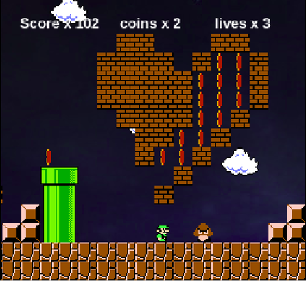

# Super Mario Project

Ως project επιλέχθηκε το Super Mario για να γίνουν παραλαγές και να προσθεθούν αντικείμενα και εχθροί.

## Στοιχεία φοιτητή :  

Ονοματεπώνυμο: Παπαναγιώτου Μαρία   ΑΜ: Π2016020  

[Game Depository](https://github.com/scarlettmiss/Super-Mario)

### 1o παραδοτέο :

 - [x] Έγινε επιλογή του θέματος της εργασίες και επιλέχθηκε το παιχνίδι Super-Mario 

 - [x] Έγιναν τα initial changes
 - [x] και προστέθηκε το link του παιχνιδιού στην αναφορά. 

### 2o παραδοτέο 

#### Έγιναν οι αρχικές αλλαγές στο παιχνίδι:

- [x] Έγινε αλλαγή της πίστας με την βοήθεια του εργαλείου tiled. 
- [x] Έγινε αλλαγή του χαρακτήρα που αντικατασταθηκε από τον Luigi 
του Super-Mario Bros 3. 
- [x] Έγινε αλλαγή στα νομίσματα με άλλα που περιστρέφονται. 
- [x] Προσθεθηκαν στο παιχνίδι ήχοι : 
  - background -> My name is human, 
  - Jump -> Mario jump, 
  - Goomba kill -> Stomp, 
  - Coin collect -> coin
- [x] Τέλος Προσθεθηκαν ζωές, score και bonus για τον παίκτη.
  -  Το [παιχνιδι](https://scarlettmiss.github.io/Super-Mario/) αρχίζει με 3 ζωές κάθε φορά που ο παίκτης χάνει 
     πηγαίνει πίσω στην αρχή.
  -  Αν χάσει όλες της ζωές εμφανίζεται ανάλογο μήνυμα (alert), το ίδιο και αν τελειώσει την πίστα και πατήσει το κάτω βελάκι. 
  -  Σαν μπόνους περνει μια επιπλέον ζωή κάθε φορά που μαζεύει 100 νομίσματα 
  -  Και τέλος το score αυξάνετε κατά 1 για κάθε νόμισμα και 100 για κάθε goomba που σκοτώνει. 

#### Χρησιμοποιήθηκαν

- To [Tiled](http://www.mapeditor.org) για την επεξεργασία του χάρτη 
- Οι ήχοι προέρχονται από το [YouTube](https://www.youtube.com/watch?v=l5-gja10qkw) και το [αποθετήριο](https://github.com/scarlettmiss/Super-Mario/tree/master/audio) 
- Οι εικόνες προέρχονται από την αναζήτηση εικόνων της Google. 
  - [Background](http://www.powerpointhintergrund.com/uploads/2017/06/--beautiful-wallpaper-backgrounds-and-background-hd-wallpaper-31.jpeg)
  - [Luigi](https://www.spriters-resource.com/nes/supermariobros3/sheet/4230/)
  - [Coins](https://pbs.twimg.com/media/CzByiwsXgAAUUiX.jpg)
  
  **[Link Παιχνιδιού](https://scarlettmiss.github.io/Super-Mario/)**
  
  
