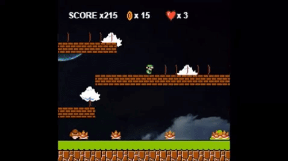
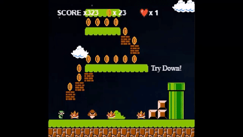

# Super Mario Project

Ως project επιλέχθηκε το Super Mario για να γίνουν παραλαγές και να προσθεθούν αντικείμενα και εχθροί.

## Στοιχεία φοιτητή :  

Ονοματεπώνυμο: Παπαναγιώτου Μαρία   ΑΜ: Π2016020  

[Game Depository](https://github.com/scarlettmiss/Super-Mario)

### Σύνοψη παιχνιδιού :

Το παιχνίδι είναι μια παραλλαγή του κλασικού παιχνιδιού Super Mario Bros που βγήκε για
κονσόλα nintendo nes.

- Σκοπός του παιχνιδιού :
Ο Luigi να μαζέψει όσα περισσότερα νομίσματα μπορεί ώστε να αποκτήσει επιπλέον Ζωή και να μαζέψει πόντους και σκοτώνοντας τους εχθρούς
του να φτάσει τελικά στο τέλος της πίστας ώστε να είναι μαζί με την πριγκίπισσα.
- [x] On Win: 
 Όταν η πίστα ολοκληρωθεί συνεχίζει στην δεύτερη και τελευταία πίστα του παιχνιδιού. Όταν την τελειώσει την πίστα  ή κερδίζει
 και τελειώνει το παιχνίδι.
 - [x] On Game Over: 
 Άμα χάσει όλες τις ζωές του εμφανίσετε οθόνη <Game Over> και το παιχνίδι τελειώνει

### 1o παραδοτέο :

 - [x] Έγινε επιλογή του θέματος της εργασίες και επιλέχθηκε το παιχνίδι Super-Mario 
 - [x] Έγιναν τα initial changes
 - [x] και προστέθηκε το link του παιχνιδιού στην αναφορά. 

### 2o παραδοτέο 

#### Έγιναν οι αρχικές αλλαγές στο παιχνίδι:

- [x] Έγινε αλλαγή της πίστας με την βοήθεια του εργαλείου tiled. 
- [x] Έγινε αλλαγή του χαρακτήρα που αντικατασταθηκε από τον Luigi 
του Super-Mario Bros 3. 
- [x] Έγινε αλλαγή στα νομίσματα με άλλα που περιστρέφονται. 
- [x] Προσθεθηκαν στο παιχνίδι ήχοι : 
  - background -> My name is human, 
  - Jump -> Mario jump, 
  - Goomba kill -> Stomp, 
  - Coin collect -> coin
- [x] Τέλος Προσθεθηκαν ζωές, score και bonus για τον παίκτη.
  - Το [παιχνιδι](https://scarlettmiss.github.io/Super-Mario/) αρχίζει με 3 ζωές κάθε φορά που ο παίκτης χάνει πηγαίνει πίσω στην αρχή.
  - Αν χάσει όλες της ζωές εμφανίζεται ανάλογο μήνυμα (alert), το ίδιο και αν τελειώσει την πίστα και πατήσει το κάτω βελάκι.
  -  Σαν μπόνους περνει μια επιπλέον ζωή κάθε φορά που μαζεύει 100 νομίσματα 
  -  Και τέλος το score αυξάνετε κατά 1 για κάθε νόμισμα και 100 για κάθε goomba που σκοτώνει. 
  
### 3o παραδοτέο 

- [x]  Πρσθήκη επιπλέον εχθρών τυπου turtle οπου δεν γίνετε να σκοτωθούν.
- [x]  Δυνατότητα teleport για τον πρωταγωνιστή σε συγκεκριμένα σημεία της πίστας,
με σχετικά μηνύματα.Πατώντας το κουμπί κάτω ο mario κάνει teleport συγκεκριμένους σωλήνες.
- [x] Προσθήκη Μenu στην αρχή για επιλογή πίστας και start of level.Με loading screen και 
επειτα 2 επιλογες για level 1 kai level 2.
- [x] Προσθήκη animation για το end of level. Όταν ο Mario φτάσει στο τέλος πατώντας το κουμπί
κάτω εμφανίζετε εικόνα με την πριγκίπισσα peach να τον αγκαλιάζει Έπειτα προχωράει στο level 2.
Μέτα το level 2 εμφανίζετε η εικόνα με μήνυμα “congratulations!” και το παιχνίδι τελειώνει. 
Όταν ο παίκτης χάνει όλες τις ζωές εμφανίζετε οθόνη game over.

### 4o παραδοτέο 

- [x]  Δημιουργία δυο συνεχόμενων levels. Οταν ολοκληρώνετε με επιτυχία το πρώτο level το παιχνίδι να συνεχίζει στο επόμενο. 
Όταν ο πρωταγωνιστής χάνει ζωή, το level ξεκινάει από την αρχή.
- [x]  Αποστόλη δεύτερης πίστας μέσω του gh-pages branch
- [x] Τελική αναφορά την εργασίας

#### Χρησιμοποιήθηκαν

- To [Tiled](http://www.mapeditor.org) για την επεξεργασία του χάρτη 
- Οι ήχοι προέρχονται από το [YouTube](https://www.youtube.com/watch?v=l5-gja10qkw) και το [αποθετήριο](https://github.com/scarlettmiss/Super-Mario/tree/master/audio) 
- Οι εικόνες προέρχονται από την αναζήτηση εικόνων της Google. 
  - [Background](http://www.powerpointhintergrund.com/uploads/2017/06/--beautiful-wallpaper-backgrounds-and-background-hd-wallpaper-31.jpeg)
  - [Luigi](https://www.spriters-resource.com/nes/supermariobros3/sheet/4230/)
  - [Coins](https://pbs.twimg.com/media/CzByiwsXgAAUUiX.jpg)
  - [turtle](https://www.spriters-resource.com/nes/supermariobros/sheet/52570/)
  - [Menu background](https://wall.alphacoders.com/big.php?i=490259)
  - [game over](https://cdn.voxcdn.com/thumbor/O11OJHp8WkD54IeNCPiDZDbU1M4=/0x0:1531x861/1200x800/filters:focal(644x309:888x553)/cdn.vox-cdn.com/uploads/chorus_image/image/55584747/maxresdefault.0.jpg)
  - [end of level](https://i.pinimg.com/originals/3f/ee/f2/3feef297db2e56baeacde08ae854819f.jpg)
  - [css background](https://wallpaper.wiki/super-mario-backgrounds.html/super-mario-backgrounds-pictures-images) 
  
  **[Link Παιχνιδιού](https://scarlettmiss.github.io/Super-Mario/)**
  
 
 
 
 
 ## Συμπεράσματα :
 
 Μια δημιουργική εργασία που σε παροτρύνει να ασχοληθείς μαζί της αφού είναι αρκετά διασκεδαστική  και δημιουργείς το δικό σου παιχνίδι,από παραλλαγές πολύ γνωστών παιχνιδιών όπως το Super Mario και το Pacman. Παράλληλα με την ευχαρίστηση που σου προσφέρει το να παίζεις κάποιο από αυτά τα παιχνίδια μαθαίνεις βασικά στοιχεία του αντικειμενοστραφούς προγραμματισμού καθώς χρησιμοποιείτε phaser που είναι βασισμένο σε  javascript,επίσης μαθαίνουμε πως να δημιουργούμε χάρτες με την εφαρμογή Tiled.
Το κομμάτι της εργασίας μου με δυσκόλεψε περισσότερο ήταν η προσθήκη menu με χρήση μεθόδων του phaser.

