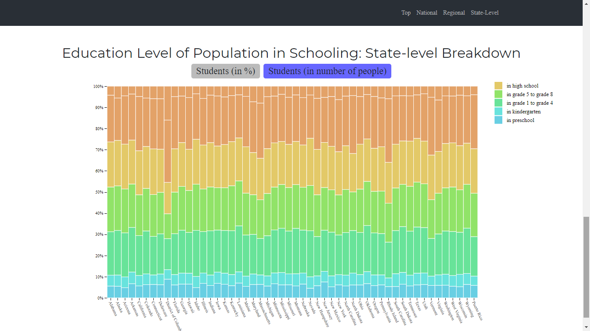
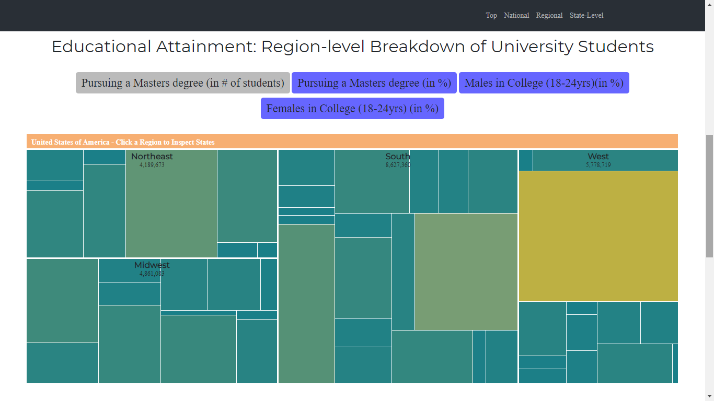
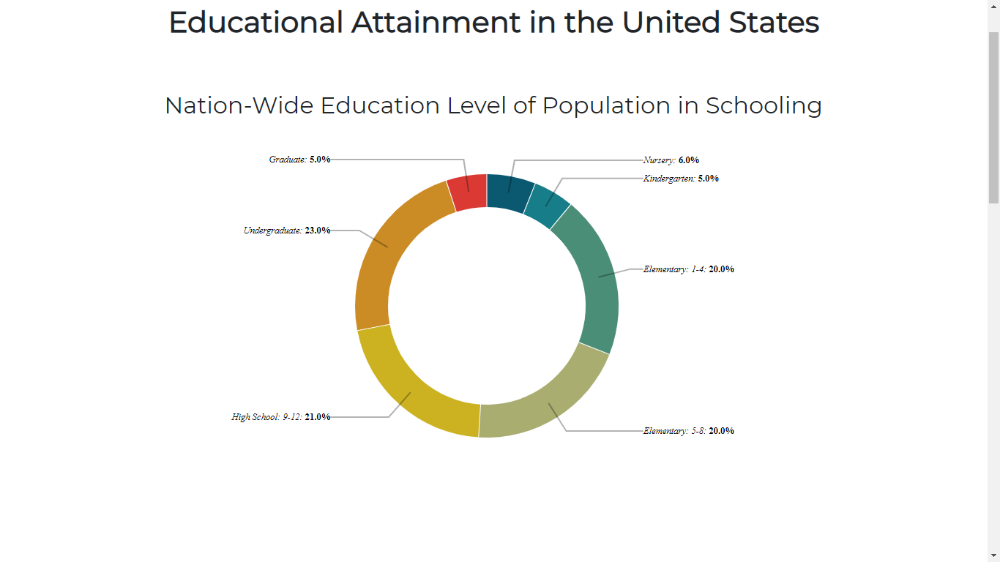

# Επικοινωνία Ανθρώπου-Υπολογιστή
## Εργασία Περιεχομένου 1
### Ονοματεπώνυμο: ΔΗΜΗΤΡΗΣ ΣΙΔΗΡΟΠΟΥΛΟΣ
### Αριθμός Μητρώου: Π2016147

**Σύνδεσμος ιστότοπου https://p16sidi.github.io/gr/**

**Σύνδεσμος αποθετηρίου https://github.com/p16sidi/gr**

## Σύνδεσμοι εικόνων

* smartphone

  * https://p16sidi.github.io/gr/gallery/smartphone/

* Elon_Musk

  * https://p16sidi.github.io/gr/gallery/Elon_Musk/

* Mark_Zuckerberg

  * https://p16sidi.github.io/gr/gallery/Mark_Zuckerberg/

* PentiumII

  * https://p16sidi.github.io/gr/gallery/PentiumII/

* Steve_Jobs

  * https://p16sidi.github.io/gr/gallery/Steve_Jobs/
  
  
  
  
#Εργασία Ανάπτυξης

#Παραδοτέο 1

[Link αποθετηρίου κώδικα]: https://github.com/p16sidi/D3js-US-educational-attainment
[Link στο εκτελέσιμο]: https://p16sidi.github.io/D3js-US-educational-attainment/

Εκπλήρωση ζητούμενων πρώτου παραδοτέου
 Άλλαξα τα χρώματα στα 3 γραφήματα.

 Αντικατέστησα τις διεπαφές στα "κουμπιά" του 2ου και 3ου γραφήματος.

 Όταν το ποντίκι διέρχεται επάνω από κάθε επιλογή του menu στην κορυφή της σελίδας, ακούγεται κάποιος ήχος.

 Όταν το ποντίκι διέρχεται πάνω από κάποια πρόταση/κείμενο της σελίδας ή περιοχή που περιλαμβάνει γραπτή πληροφορία (π.χ. κάποιο τμήμα γραφήματος), ακούγεται αυτόματα η αφήγηση του κειμένου (text-to-speech).

 Εφάρμοσα responsive design στη σελίδα (Bootstrap) και κυρίως στο αρχικό menu έτσι ώστε να προσαρμόζεται σε οθόνες διαφορετικών διαστάσεων.

### Τεκμηρίωση ζητουμένων πρώτου παραδοτέου

Α & B) Άλλαξα τα χρώματα στα 3 γραφήματα και αντικατέστησα τις διεπαφές στα "κουμπιά" του 2ου και 3ου γραφήματος.

Γ & Δ & Ε) Δείτε το εκτελέσιμο στο https://p16sidi.github.io/D3js-US-educational-attainment/

Για την μετατροπή text to speech χρησιμοποίησα το mouseover.js.
