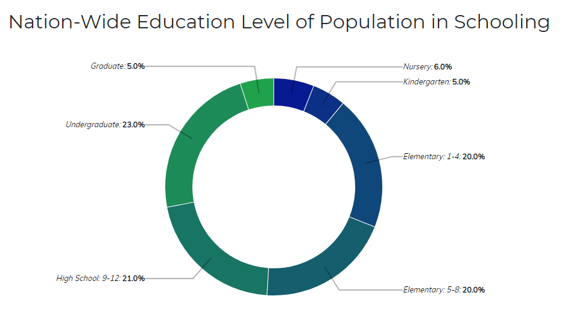
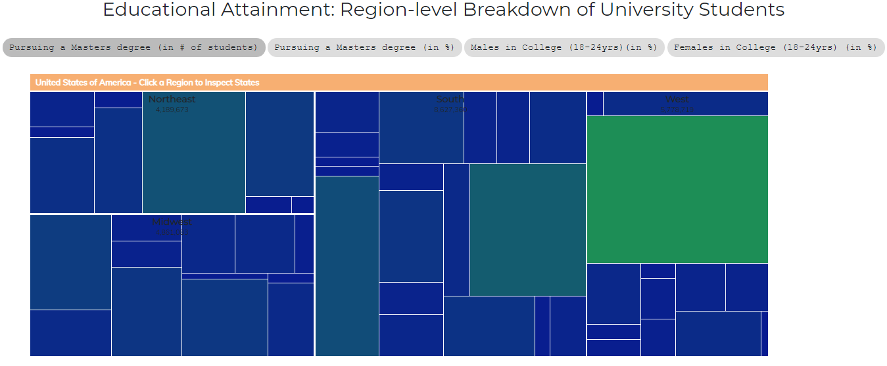
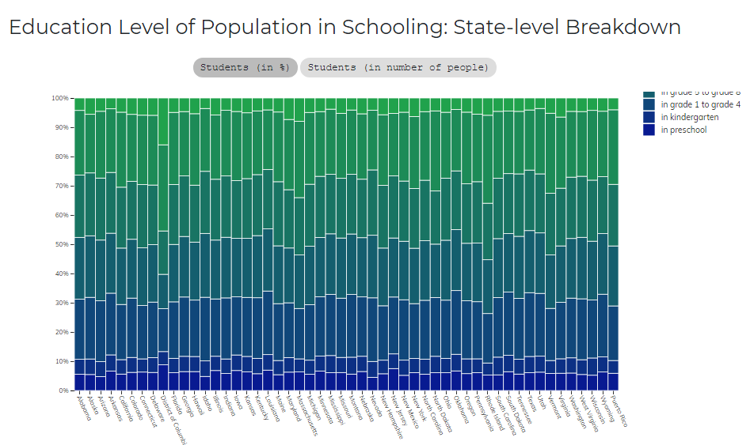

# Επικοινωνία Ανθρώπου-Υπολογιστή
* Ονοματεπώνυμο: Ελένη Μαρία Μητσοπούλου
* Αριθμός Μητρώου: Π2017018
## Εργασία Περιεχομένου 1Α (Εύρεση Εικόνων)

**Σύνδεσμος ιστότοπου https://mmits.github.io/gr/**
**Σύνδεσμος αποθετηρίου https://github.com/mmits/gr**

### Σύνδεσμοι εικόνων

* Apple II
  * https://mmits.github.io/gr/gallery/apple-ii/

* IBM Thinkpad
  * https://mmits.github.io/gr/gallery/ibm-thinkpad/

* Interactive Whiteboard
  * https://mmits.github.io/gr/gallery/interactive-whiteboard/

* Osborne 1
  * https://mmits.github.io/gr/gallery/osborne-1/

* Windows 3.0
  * https://mmits.github.io/gr/gallery/windows-3/

## Εργασία Ανάπτυξης (Οπτικοποίηση Δεδομένων): Παραδοτέο 1
* Link αποθετηρίου κώδικα: https://github.com/mmits/D3js-US-educational-attainment
* Link στο εκτελέσιμο: https://mmits.github.io/D3js-US-educational-attainment/

### Εκπλήρωση ζητούμενων πρώτου παραδοτέου
[x] Άλλαξα τα χρώματα στα 3 γραφήματα.
[x] Αντικατέστησα τις διεπαφές στα "κουμπιά" του 2ου και 3ου γραφήματος.
[x] Όταν το ποντίκι διέρχεται επάνω από κάθε επιλογή του menu στην κορυφή της σελίδας, ακούγεται κάποιος ήχος.
[x] Όταν το ποντίκι διέρχεται πάνω από κάποια πρόταση/κείμενο της σελίδας ή περιοχή που περιλαμβάνει γραπτή πληροφορία (π.χ. κάποιο τμήμα γραφήματος), ακούγεται αυτόματα η αφήγηση του κειμένου (text-to-speech).
[x] Εφάρμοσα responsive design στη σελίδα (Bootstrap) και κυρίως στο αρχικό menu έτσι ώστε να προσαρμόζεται σε οθόνες διαφορετικών διαστάσεων.

### Τεκμηρίωση ζητουμένων πρώτου παραδοτέου
* Αλλαγή στα χρώματα και τα κουμπιά του 2ου και 3ου γραφήματος
 
 
 
* Για την αφήγηση του κειμένου χρησιμποίησα το responsivespeech.js

## Εργασία Περιεχομένου 1Β (Διαδραστικά Παραδείγματα)

### Σύνδεσμοι παραδειγμάτων
* Counter
  * https://mmits.github.io/gr/remix/counter/
  
* Responsive Menu
  * https://mmits.github.io/gr/remix/menu-responsive/
  
## Εργασία Ανάπτυξης (Οπτικοίηση Δεδομένων): Παραδοτέο 2
* Link αποθετηρίου κώδικα: https://github.com/mmits/D3js-US-educational-attainment
* Link στο εκτελέσιμο: https://mmits.github.io/D3js-US-educational-attainment/

### Εκπλήρωση ζητούμενων δεύτερου παραδοτέου
[x] Τροποπίησα τον κώδικα και το μενού της εφαρμογής έτσι ώστε κάθε στιγμή να είναι εμφανές μόνο ένα από τα 3 γραφήματα, παραμένοντας πάντα στη σελίδα index.html. 
[ ] Αντικατέστησα το κάθε ένα από τα 3 γραφήματα με κάποιο άλλο διαδραστικό γράφημα της D3js.
[ ] Σε μια καινούργια σελίδα, τοποθέτησα αντίστοιχα 3 νέα διαδραστικά γραφήματα D3js, τα οποία θα οπτικοποιούν καινούργια στατιστικά δεδομένα που βρήκα από κάποια επίσημη στατιστική αρχή.

### Προσωρινές Σημειώσεις
* Για το πρώρο ζητούμενο, το δεύτερο γράφημα δεν εμφανίζεται και προσπαθώ να βρω το λόγο και να το διορθώσω.
* Έχω ξεκινήσει την εκπλήρωση των δύο τελευταίων ζητουμένων.
