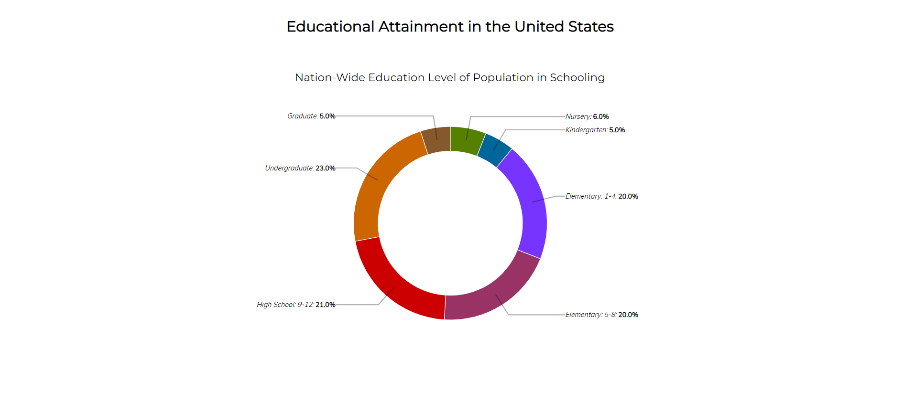
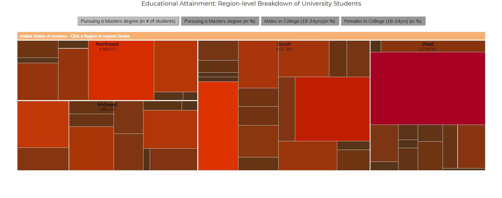
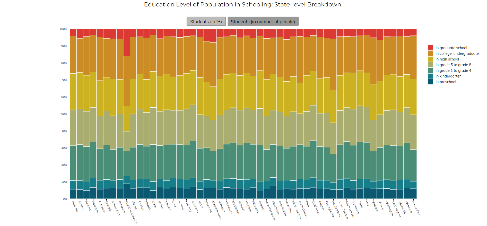

# Επικοινωνία Ανθρώπου Υπολογιστή

### Ονοματεπώνυμο: Μαθιουδάκης Εμμανουήλ

### ΑΜ: Π2017027

## Εργασία Περιεχομένου-Παραδοτέο Α

**Link σελίδας: https://p17math.github.io/gr**

**Link πρώτης φωτογραφίας: https://p17math.github.io/gr/gallery/router/**

**Link δεύτερης φωτογραφίας: https://p17math.github.io/gr/gallery/html/**

**Link τρίτης φωτογραφίας: https://p17math.github.io/gr/gallery/google-maps/**

**Link τέταρτης φωτογραφίας: https://p17math.github.io/gr/gallery/google-home-mini/**

**Link πέμπτης φωτογραφίας: https://p17math.github.io/gr/gallery/cpp/**

**Link από το fork μου στο gr repository: https://github.com/p17math/gr**

## Παραδοτέο Β

 **Link Α:https://p17math.github.io/gr/remix/interactive-pc/**
 
 **Link B:https://p17math.github.io/gr/remix/dvd-animation/**

## Εργασία Ανάπτυξης-Παραδοτέο Α

**Link αποθετηρίου κώδικα: https://github.com/p17math/D3js-US-educational-attainment**

**Εκτελέσιμο Link: https://p17math.github.io/D3js-US-educational-attainment/**

### Λίστα εκπλήρωσης ζητουμένων παραδοτέου:

[x] Αλλαγή χρωμάτων στα τρία γραφήματα

[x] Αντικατάσταση των διεπαφών στα "κουμπιά" του δεύτερου και τρίτου γραφήματος.

[x] Άκουσμα κάποιου ήχου όταν το ποντίκι διέρχεται επάνω από κάθε επιλογή του menu στην κορυφή της σελίδας.

[x] Όταν το ποντίκι διέρχεται πάνω από κάποια πρόταση/κείμενο της σελίδας ή περιοχή που περιλαμβάνει γραπτή πληροφορία ακούγεται αυτόματα η αφήγηση του κειμένου (text-to-speech).

[x] Εφαρμογή responsive design στη σελίδα και κυρίως στο αρχικό menu έτσι ώστε να προσαρμόζεται σε οθόνες διαφορετικών διαστάσεων.

### Τεκμηρίωση ζητουμένων:

**Η τεκμηρίωση του πρώτου και δεύτερου ζητουμένου γίνεται με τα παρακάτω screenshots:**

	

	

	

**Η τεκμηρίωση των υπόλοιπων ζητουμένων γίνεται με την επίσκεψη στο εκτελέσιμο link (https://p17math.github.io/D3js-US-educational-attainment/)**
