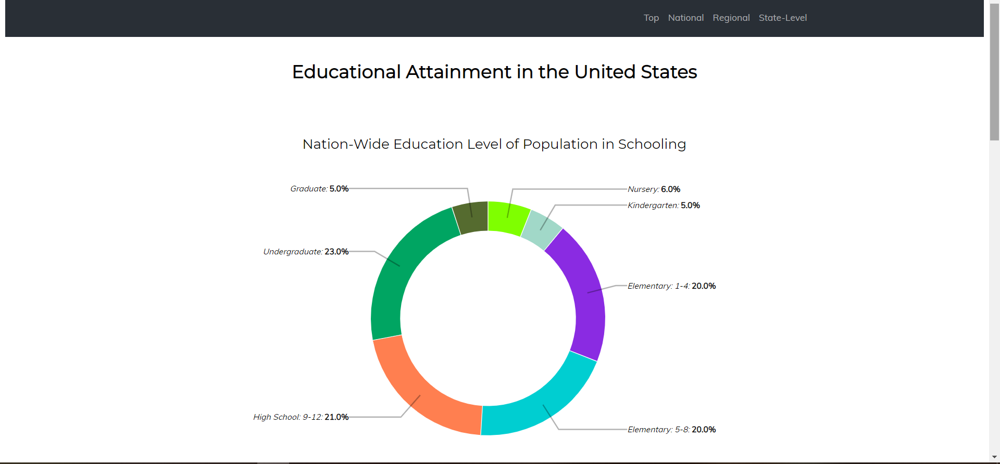
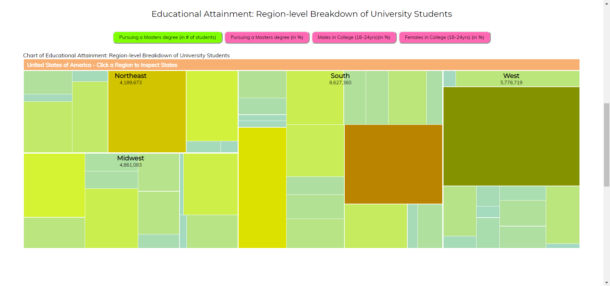
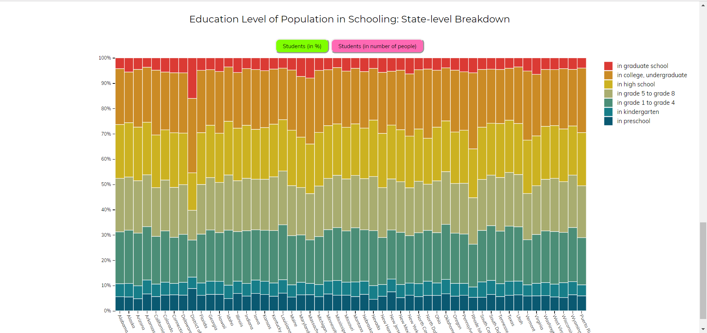

#Μάθημα: Επικοινωνία Ανθώπου-Υπολογιστή

Προσωπικά Στοιχεία

##Ονοματεπώνυμο: Σωκράτης Καραουστάς

##Αριθμός Μητρώου: Π2017033

#Link Αποθετηρίου: https://github.com/p17kara/gr

#Εκτελέσιμο link: https://p17kara.github.io/gr/

Link πρώτης εικόνας: https://p17kara.github.io/gr/gallery/messenger2/

Link δεύτερης εικόνας: https://p17kara.github.io/gr/gallery/software2/

Link τρίτης εικόνας: https://p17kara.github.io/gr/gallery/top_image_cad_cert/

Link τέταρτης εικόνας: https://p17kara.github.io/gr/gallery/windows-10/

Link πέμπτης εικόνας: https://p17kara.github.io/gr/gallery/wikipedia/

#Εργασία Ανάπτυξης

#Παραδοτέο Α

##Link αποθετηρίου: https://github.com/p17kara/D3js-US-educational-attainment

##Link στο εκτελέσιμο: https://p17kara.github.io/D3js-US-educational-attainment/

[x] Άλλαξα τα χρώματα στα 3 γραφήματα.

 [x] Αντικατέστησα τις διεπαφές στα "κουμπιά" του 2ου και 3ου γραφήματος.
 
 [x] Όταν το ποντίκι διέρχεται επάνω από κάθε επιλογή του menu στην κορυφή της σελίδας, ακούγεται κάποιος ήχος.
 
 [x] Όταν το ποντίκι διέρχεται πάνω από κάποια πρόταση/κείμενο της σελίδας ή περιοχή που περιλαμβάνει γραπτή πληροφορία (π.χ. κάποιο τμήμα γραφήματος), ακούγεται αυτόματα η αφήγηση του κειμένου (text-to-speech).
 
 [x] Εφάρμοσα responsive design στη σελίδα και κυρίως στο αρχικό menu έτσι ώστε να προσαρμόζεται σε οθόνες διαφορετικών διαστάσεων.
 
 ###Τεκμηρίωση ζητουμένων
 
 Α & Β) Άλλαξα τα χρώματα στα 3 γραφήματα και αντικατέστησα τις διεπαφές στα "κουμπιά" του 2ου και 3ου γραφήματος κάνοντας αλλαγές στα scripts καθώς και στο style.css
 
 

Γ, Δ & Ε) Δείτε το εκτελέσιμο στο https://p17kara.github.io/D3js-US-educational-attainment/
Για την μετατροπή text to speech χρησιμοποίησα το responsivevoice.js.

#Εργασία Περιεχομένου

#Παραδοτέο B

Interactive examples

Link διαδραστικού παραδείγματος 1: https://p17kara.github.io/gr/remix/tic-tac-toe/

Link διαδραστικού παραδείγματος 2: https://p17kara.github.io/gr/remix/change-image/

Link στο codepen 1: https://codepen.io/p17kara/pen/yQqezK

Link στο codepen 2: https://codepen.io/p17kara/pen/VVBvNR

#Εργασία Ανάπτυξης

#Παραδοτέο Β

##Link αποθετηρίου: https://github.com/p17kara/D3js-US-educational-attainment

##Link στο εκτελέσιμο: https://p17kara.github.io/D3js-US-educational-attainment/

##Link αποθετηρίου αναφοράς: https://github.com/p17kara/HCI-Final-Report

##Link στο εκτελέσιμο: https://p17kara.github.io/HCI-Final-Report/
