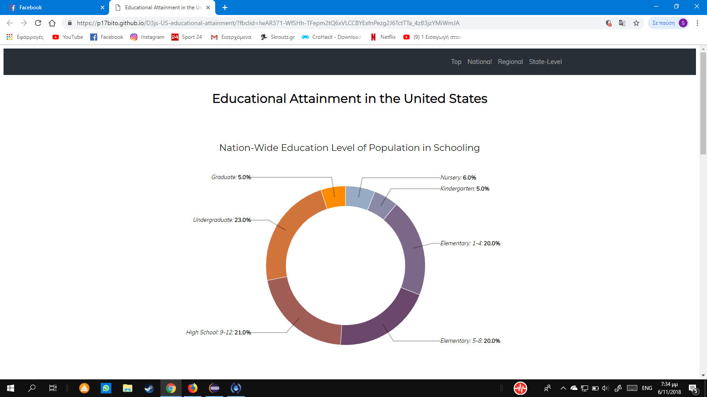
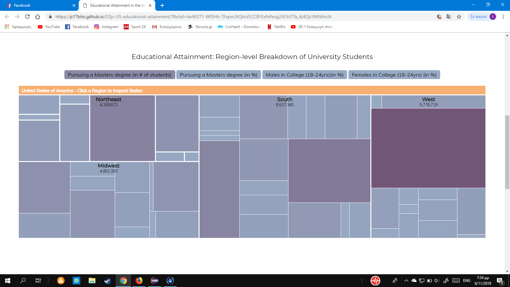
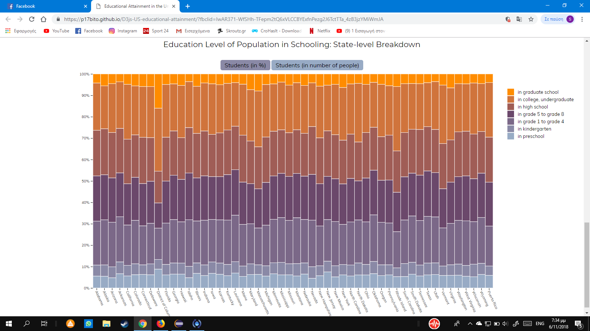

# Επικοινωνία Ανθρώπου-Υπολογιστή
## Εργασία Περιεχομένου 1
### Ονοματεπώνυμο: Σωτήρης Μπίτος 
### Αριθμός Μητρώου: Π2017050

**Σύνδεσμος ιστότοπου https://p17bito.github.io/gr/**

**Σύνδεσμος αποθετηρίου https://github.com/p17bito/gr**

## Σύνδεσμοι εικόνων

* Console

  * https://fp17bito.github.io/gr/gallery/Console/

* Nitendo

  * https://p17bito.github.io/gr/gallery/Nitendo/

* Nokia

  * https://p17bito.github.io/gr/gallery/Nokia/

* AppleWatch

  * https://p17bito.github.io/gr/gallery/AppleWatch/

* Intel-core

  * https://p17bito.github.io/gr/gallery/Intel-core/
  
  
# Εργασία Ανάπτυξης 
# Παραδοτέο 1 

#### [Link αποθετηρίου κώδικα]: https://github.com/p17bito/D3js-US-educational-attainment
#### [Link στο εκτελέσιμο]: https://p17bito.github.io/D3js-US-educational-attainment/

#### ZHTOYMENA

[x] Άλλαξα τα χρώματα στα 3 γραφήματα.

[x] Αντικατέστησα τις διεπαφές στα "κουμπιά" του 2ου και 3ου γραφήματος.

[x] Όταν το ποντίκι διέρχεται επάνω από κάθε επιλογή του menu στην κορυφή της σελίδας, ακούγεται κάποιος ήχος.

[x] Όταν το ποντίκι διέρχεται πάνω από κάποια πρόταση/κείμενο της σελίδας ή περιοχή που περιλαμβάνει γραπτή πληροφορία (π.χ. κάποιο τμήμα     γραφήματος), ακούγεται αυτόματα η αφήγηση του κειμένου (text-to-speech).

[x] Εφάρμοσα responsive design στη σελίδα (Bootstrap) και κυρίως στο αρχικό menu έτσι ώστε να προσαρμόζεται σε οθόνες διαφορετικών διαστάσεων.

#### Τεκμηρίωση ζητουμένων πρώτου παραδοτέου

Α)Αλλαγή τα χρώματα στα 3 γραφήματα 
B) Αντικατάσταση των διεπαφων στα "κουμπιά" του 2ου και 3ου γραφήματος:

