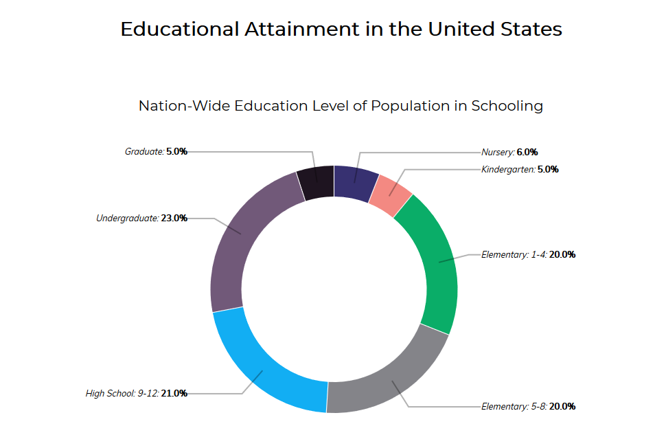
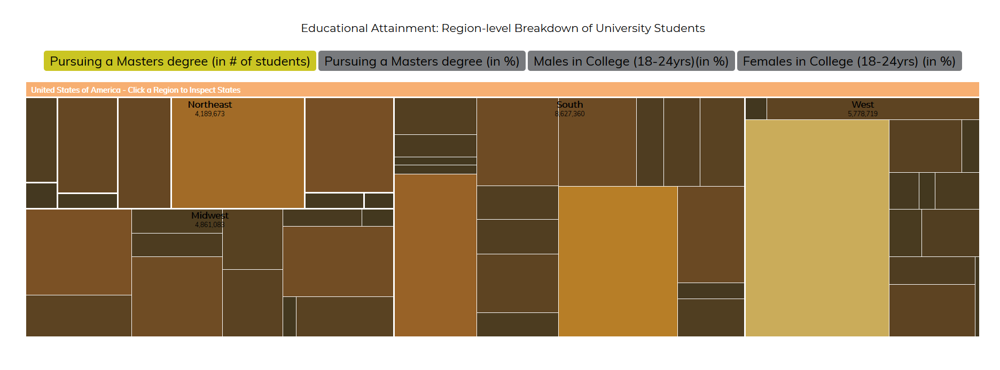
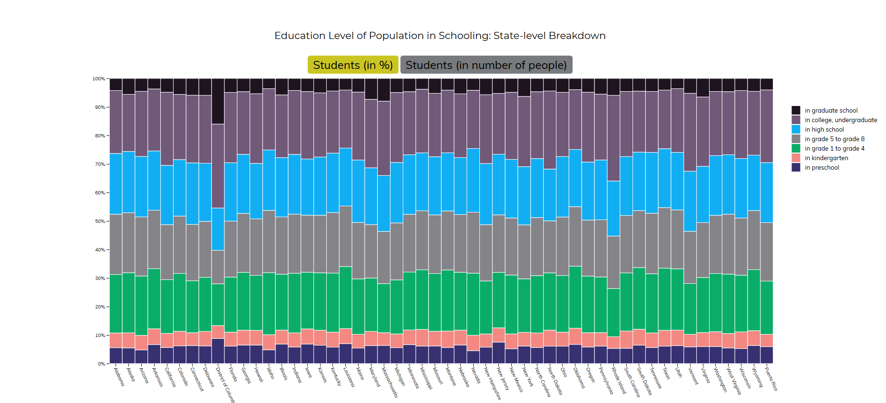

# Όνομα μαθήματος : Επικοινωνία Ανθρώπου-Υπολογιστή
## Όνομα εργασίας : Εργασία Περιεχομένου (προσθήκη 5 εικόνων)
### Όνομα : Αθανάσιος
### Επίθετο : Κακαρδάκος
### Αριθμός Μητρώου: Π2017055
 ## Eκτελέσιμο link : https://p17kaka.github.io/gr/
 ## link αποθετηρίου : https://github.com/p17kaka/gr
 ## Τα links των εικόνων
  ### Instagram : https://p17kaka.github.io/gr/gallery/instagram/
  ### Optical fiber : https://p17kaka.github.io/gr/gallery/optical-fiber/
  ### Monochrome monitor : https://p17kaka.github.io/gr/gallery/monochrome-monitor/
  ### Fingerprint scanner : https://p17kaka.github.io/gr/gallery/fingerprint-scanner/
  ### Chipset : https://p17kaka.github.io/gr/gallery/chipset/
  
  # Εργασία Ανάπτυξης 

  # Παραδοτέο 1 
  #
  #

#### [Link αποθετηρίου κώδικα]: https://github.com/p17kaka/D3js-US-educational-attainment
#### [Link στο εκτελέσιμο]: https://p17kaka.github.io/D3js-US-educational-attainment/
#
#

#### Εκπλήρωση ζητούμενων πρώτου παραδοτέου

[x] Άλλαξα τα χρώματα στα 3 γραφήματα.

[x] Αντικατέστησα τις διεπαφές στα "κουμπιά" του 2ου και 3ου γραφήματος.

[x] Όταν το ποντίκι διέρχεται επάνω από κάθε επιλογή του menu στην κορυφή της σελίδας, ακούγεται κάποιος ήχος.

[x] Όταν το ποντίκι διέρχεται πάνω από κάποια πρόταση/κείμενο της σελίδας ή περιοχή που περιλαμβάνει γραπτή πληροφορία (π.χ. κάποιο τμήμα     γραφήματος), ακούγεται αυτόματα η αφήγηση του κειμένου (text-to-speech).

[x] Εφάρμοσα responsive design στη σελίδα (Bootstrap) και κυρίως στο αρχικό menu έτσι ώστε να προσαρμόζεται σε οθόνες διαφορετικών διαστάσεων.

#### Τεκμηρίωση ζητουμένων πρώτου παραδοτέου

Α)  Αλλαγή στα χρώματα των 3 γραφημάτων
B) Αντικατάσταση των διεπαφών στα "κουμπιά" του 2ου και 3ου γραφήματος.

Γ, Δ , Ε) Δείτε το παρακάτω link: https://p17kaka.github.io/D3js-US-educational-attainment/

