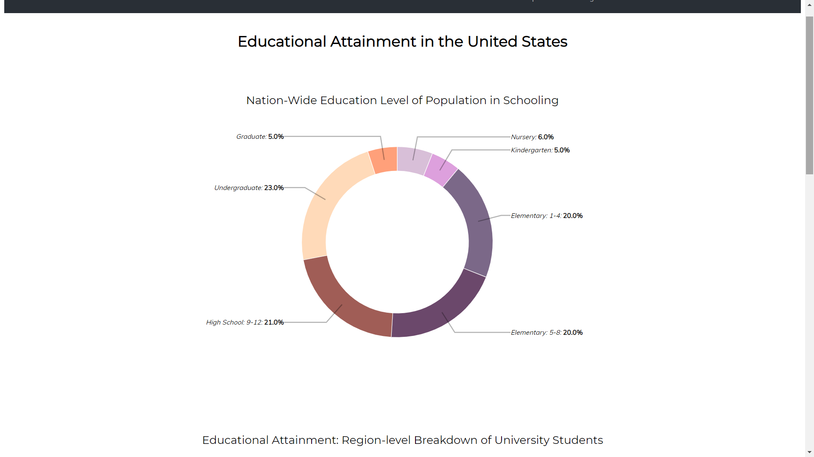
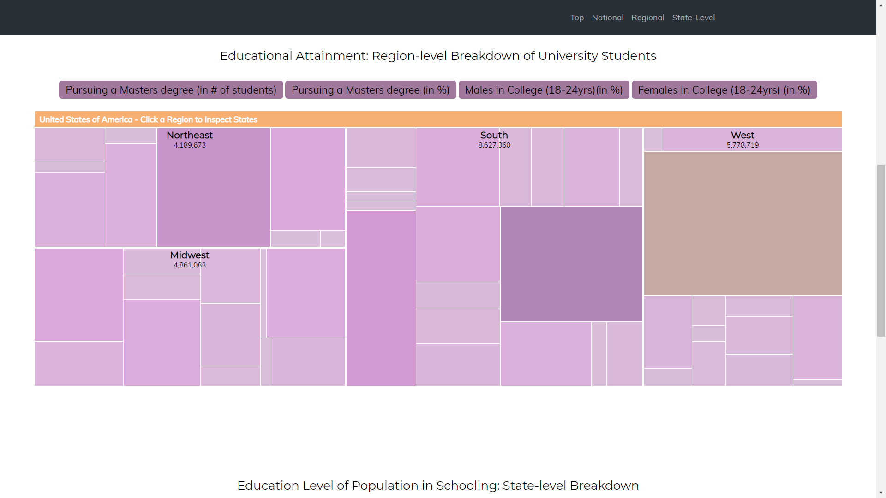
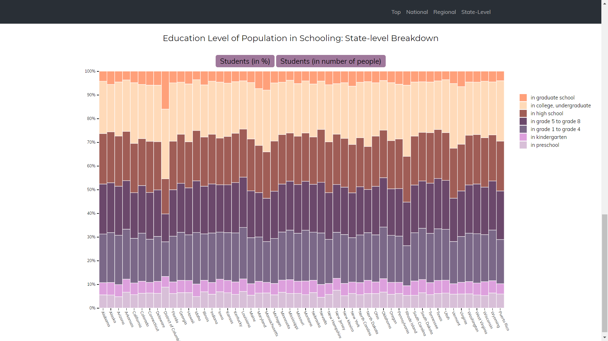
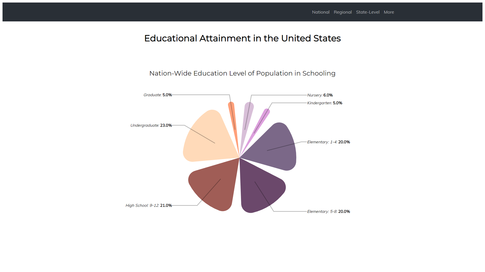
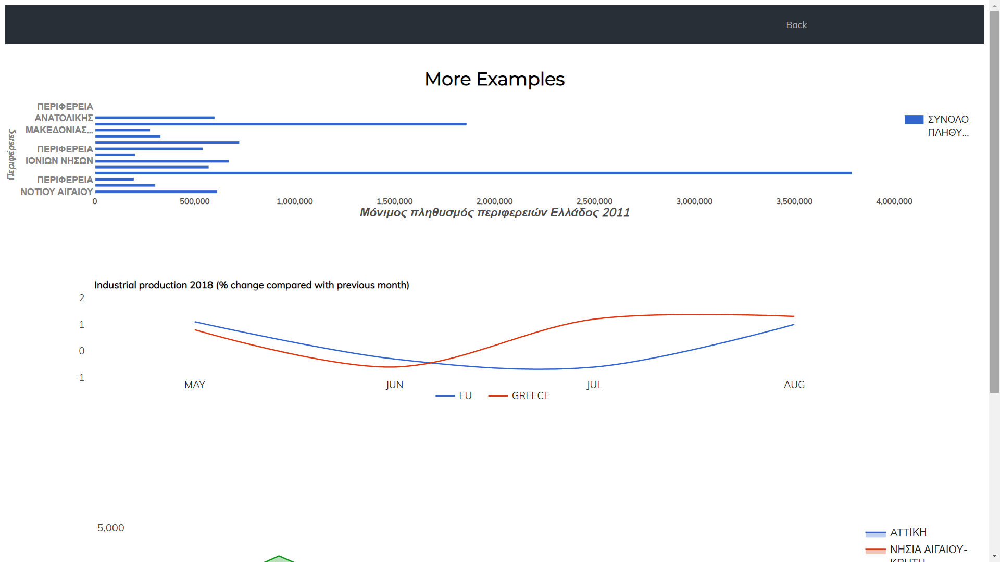
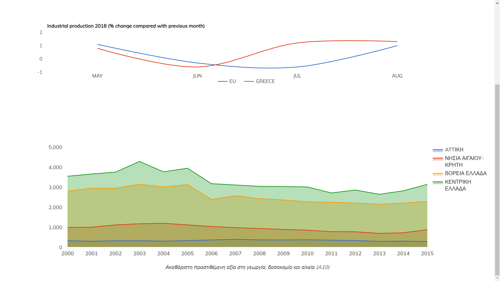

# Επικοινωνία Ανθρώπου-Υπολογιστή
### Ονοματεπώνυμο: Φουτσιτζή Σοφρονία
### Αριθμός Μητρώου: Π2017063

# Εργασία Περιεχομένου 

**Σύνδεσμος ιστότοπου https://fsofronia.github.io/gr/**

**Σύνδεσμος αποθετηρίου https://github.com/fsofronia/gr**

## Παραδοτέο 1
### Σύνδεσμοι εικόνων

* Photoshop

  * https://fsofronia.github.io/gr/gallery/photoshop/

* Smart Home

  * https://fsofronia.github.io/gr/gallery/smart-home/

* Fingerprint

  * https://fsofronia.github.io/gr/gallery/fingerprint/

* Search Voice

  * https://fsofronia.github.io/gr/gallery/search-voice/

* Macintosh

  * https://fsofronia.github.io/gr/gallery/Macintosh/
  
  
## Παραδοτέο 2
### Σύνδεσμοι διαδραστικών παραδειγμάτων

* Tic Tac Toe

 * https://fsofronia.github.io/gr/remix/tic-tac-toe/
 
* Purple Rain-ish (Mouse interactive)

 * https://fsofronia.github.io/gr/remix/purple-rain/

# Εργασία Ανάπτυξης 
## Παραδοτέο 1 

#### [Link αποθετηρίου κώδικα]: https://github.com/fsofronia/D3js-US-educational-attainment
#### [Link στο εκτελέσιμο]: https://fsofronia.github.io/D3js-US-educational-attainment/

### Εκπλήρωση ζητούμενων πρώτου παραδοτέου

[x] Άλλαξα τα χρώματα στα 3 γραφήματα.

[x] Αντικατέστησα τις διεπαφές στα "κουμπιά" του 2ου και 3ου γραφήματος.

[x] Όταν το ποντίκι διέρχεται επάνω από κάθε επιλογή του menu στην κορυφή της σελίδας, ακούγεται κάποιος ήχος.

[x] Όταν το ποντίκι διέρχεται πάνω από κάποια πρόταση/κείμενο της σελίδας ή περιοχή που περιλαμβάνει γραπτή πληροφορία (π.χ. κάποιο τμήμα     γραφήματος), ακούγεται αυτόματα η αφήγηση του κειμένου (text-to-speech).

[x] Εφάρμοσα responsive design στη σελίδα (Bootstrap) και κυρίως στο αρχικό menu έτσι ώστε να προσαρμόζεται σε οθόνες διαφορετικών διαστάσεων.

### Τεκμηρίωση ζητουμένων πρώτου παραδοτέου

Α & B) Άλλαξα τα χρώματα στα 3 γραφήματα και αντικατέστησα τις διεπαφές στα "κουμπιά" του 2ου και 3ου γραφήματος.

Γ & Δ & Ε) Δείτε το εκτελέσιμο στο https://fsofronia.github.io/D3js-US-educational-attainment/

Για την μετατροπή text to speech χρησιμοποίησα το responsivevoice.js.

## Παραδοτέο 2

### Εκπλήρωση ζητούμενων δεύτερου παραδοτέου

[x] Τροποποιήσα τον κώδικα και το μενού της εφαρμογής έτσι ώστε κάθε στιγμή να είναι εμφανές μόνο ένα από τα 3 γραφήματα, παραμένοντας πάντα στη σελίδα index.html.
[ ] Αντικατέστησα  το κάθε ένα από τα 3 γραφήματα με κάποιο άλλο διαδραστικό γράφημα της D3js.
[x] Σε μια καινούργια σελίδα, να τοποθέτησα αντίστοιχα 3 νέα διαδραστικά γραφήματα D3js της επιλογής σας, τα οποία θα οπτικοποιούν καινούργια στατιστικά δεδομένα που θα βρείτε από κάποια επίσημη στατιστική αρχή (π.χ. ΕΛΣΤΑΤ, Eurostat κ.λπ.).

### Τεκμηρίωση ζητουμένων δεύτερου παραδοτέου

Αρχικά τροποποίησα τον κώδικα, έτσι ώστε κάθε στιγμή να είναι εμφανές στο χρήστη μόνο ένα απο τα τρία γραφήματα. Παράλληλα, 
αντικατέστησα/ άλλαξα το πρώτο διάγραμμα, το οποίο, αρχικά, ήταν της μορφής "donut", μετατρέποντας το σε μορφή "πίτας". 

Στη συνέχεια, τροποποίησα κατάλληλα το menu προσθέτοντας την επιλογη "More". Πατώντας το κουμπί αυτο ο χρήστης "μεταβαίνει"
σε μία νέα σελίδα η οποία αποτελείται απο τρία νέα διαδραστικά παραδείγματα γραφημάτων. Τα δεδομένα των τριών αυτών γραφημάτων "πηγάζουν" απο επίσημη σταστιστική αρχή (ΕΛΣΤΑΤ, Eurostat).
Το πρώτο νέο διάγραμμα αναφέρεται στην απογραφή του πληθυσμού της Ελλάδας το 2011, και συγκεκριμένα πληροφορεί τον χρήστη για τον αριθμό μόνιμων κατοίκων των περιφερειών της Ελλάδας το αντίστοιχο έτος. Οι πληροφορίες για αυτό το διάγραμμα πάρθηκαν απο την ΕΛΣΤΑ.
Το δεύτερο διάγραμμα αναφέρεται στη Βιομηχανική παραγωγή 2018 στα πλαίσια της Ευρώπης και της Ελλάδας, το χρονικό διάστημα τεσσάρων μηνών ( Μαίου-Αυγούστου). Οι πληροφορίες έχουν παρθεί απο τη Eurostast.

Το τελευταίο διάγραμμα αναφέρεται στην ακαθάριστη προστηθέμενη αξία στη γεωργία, δασοκομία, αλιεία σε εκατομμύρια ευρώ, ανά γεωγραφικά διαμερίσματα της Ελλάδας σε χρονική διάρκεια δεκαπέντε ετών (2000-2015). Οι πληροφορίες για το συγκεκριμένο διάγραμμα "αντλήθηκαν" απο την Ελληνική Στατιστική Αρχή.

