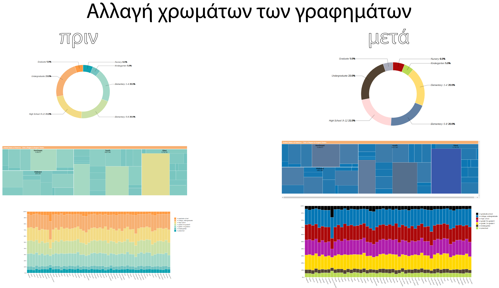
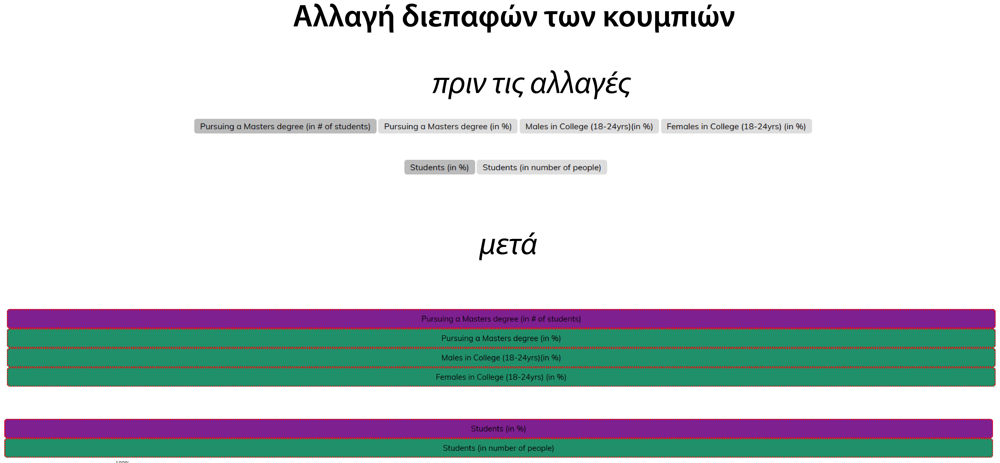
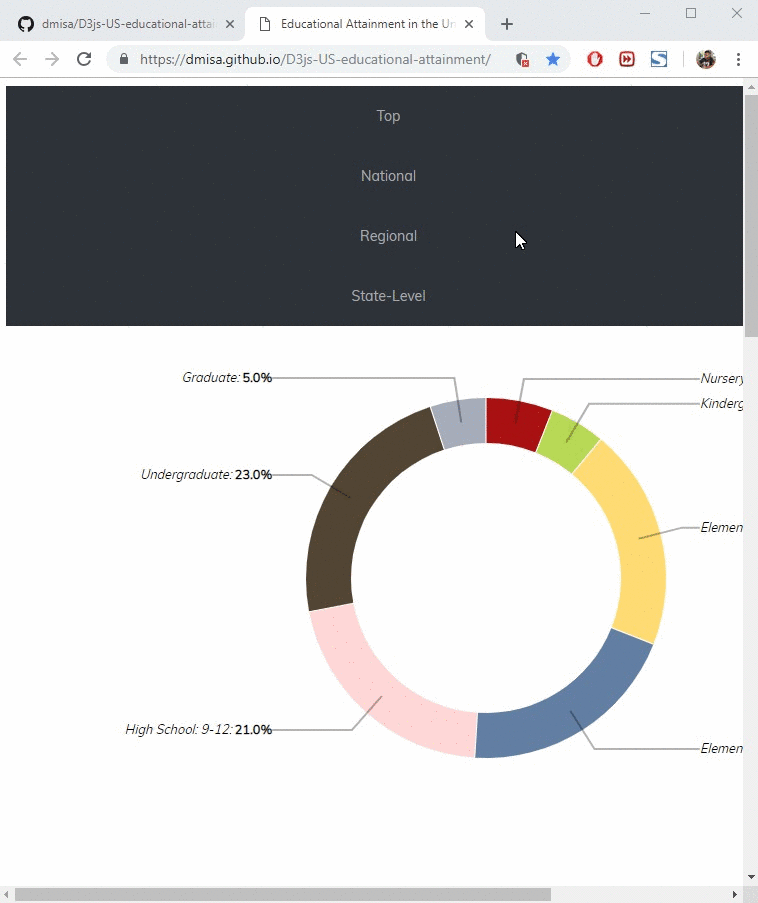
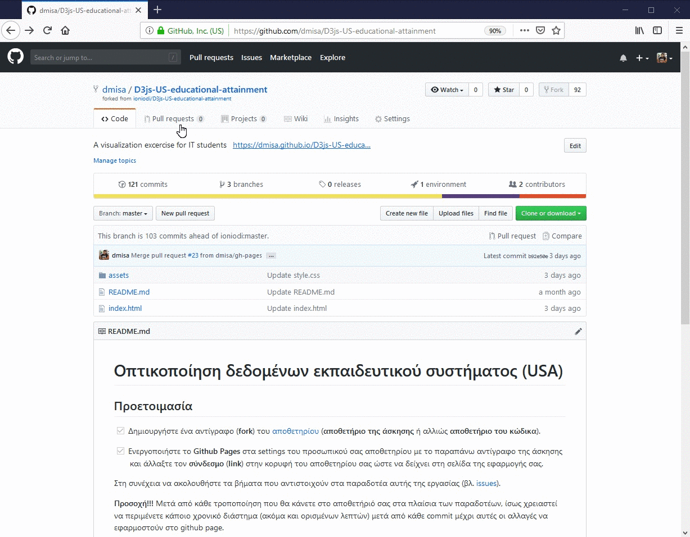

# Επικοινωνία Ανθρώπου-Υπολογιστή

### Ονοματεπώνυμο: Δημήτρης Μισαηλίδης
### Αριθμός Μητρώου: Π2017066
## Εργασία Ανάπτυξης: Οπτικοποίηση δεδομένων εκπαιδευτικού συστήματος (USA) (1o Παραδοτέο)
#### [Εκτελέσιμο link]( https://dmisa.github.io/D3js-US-educational-attainment/ '[Εκτελέσιμο link')
#### [Προφίλ στο github]( https://github.com/dmisa 'Προφίλ στο github')
## Παραδοτέο 1
#### Αποθετήριο κώδικα παραδοτέου 1:  https://github.com/dmisa/D3js-US-educational-attainment/tree/gh-pages
### Εκπλήρωση ζητούμενων πρώτου παραδοτέου στο προσωπικό αποθετήριο του κωδικά μας
* Αλλαγή χρωμάτων και στα τρία γραφήματα της σελίδας (Αλλαγές στα αρχεία script js για το καθένα)

* Αλλαγή διεπαφών των κουμπιών (Αλλαγές στο style.css αρχείο)

* Όταν το ποντίκι διέρχεται επάνω από κάθε επιλογή του menu στην κορυφή της σελίδας, ακούγεται ο ήχος του κλικ. (ανέβασμα αρχείων στο
asset/sound και χρήση κατάλληλων tag στο html αρχείο.)
* Όταν το ποντίκι διέρχεται πάνω από κάποια πρόταση/κείμενο της σελίδας ή περιοχή που περιλαμβάνει γραπτή πληροφορία (π.χ. κάποιο τμήμα γραφήματος), ακούγεται αυτόματα η αφήγηση του κειμένου (text-to-speech). Έγινε με χρήση της βιβλιοθήκης Responsive Voice της javascript(https://responsivevoice.org/). 
* Εφαρμόστε responsive design στη σελίδα και κυρίως στο αρχικό menu έτσι ώστε να προσαρμόζεται σε οθόνες διαφορετικών διαστάσεων. (Έχει γίνει μόνο για τα κείμενα και το μενού, όχι για τα γραφήματα.)(Οι αλλαγές έγιναν στο html και css αρχείο)

# Πρόβλημα στην εργασία
* Σε κάθε browser η ασφαλής σύνδεση πρέπει να απενεργοποιηθεί για να λειτουργήσει σωστά η απόκρυψη του menu και το text-to-speech(όπως φαίνεται στο gif παρακάτω για chrome και firefox)

## Εργασία Περιεχομένου 1Α(Εύρεση εικόνων)
**εκτελέσιμο link https://dmisa.github.io/gr/**

**link αποθετηρίου https://github.com/dmisa/gr**

## links εικόνων

* Android

  * https://dmisa.github.io/gr/gallery/android/

* Bluetooth

  * https://dmisa.github.io/gr/gallery/bluetooth/

* Ενιαίος Σειριακός Δίαυλος (usb)

  * https://dmisa.github.io/gr/gallery/usb/

* Wi-Fi

  * https://dmisa.github.io/gr/gallery/wifi/

* Μηχανή Turing (Turing Machine)

  * https://dmisa.github.io/gr/gallery/turingmachine/
