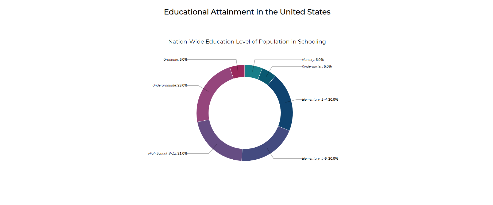

# Ονοματεπώνυμο: Καπετάνιου Ανθή

# ΑΜ: Π2017067

# Όνομα μαθήματος: Επικοινωνία Ανθρώπου Υπολογιστή

# Εργασία Περιεχομένου

## Α παραδοτεο

### Link σελίδας: https://anthikape.github.io/gr

### Link πρώτης φωτογραφίας: https://anthikape.github.io/gr/gallery/USB-hub/

### Link δεύτερης φωτογραφίας: https://anthikape.github.io/gr/gallery/Windows-Vista/

### Link τρίτης φωτογραφίας: https://anthikape.github.io/gr/gallery/Smalltalk/

### Link τέταρτης φωτογραφίας: https://anthikape.github.io/gr/gallery/Hard-disk/

### Link πέμπτης φωτογραφίας: https://anthikape.github.io/gr/gallery/Mark-Zuckerberg/

### Link από το  αποθετηριο : https://github.com/anthikape/gr

## Β παραδοτεο

### Link 1ου διαδραστικού παραδείγματος: https://anthikape.github.io/gr/remix/Particles-Random-Animation-in-Canvas/

### Link 2ου διαδραστικού παραδείγματος: https://anthikape.github.io/gr/remix/snake/

# Εργασία Ανάπτυξης 

# Παραδοτέο 1 

#### [Link αποθετηρίου κώδικα]: https://github.com/anthikape/D3js-US-educational-attainment
#### [Link στο εκτελέσιμο]: https://anthikape.github.io/D3js-US-educational-attainment/

###  Zητούμενα πρώτου παραδοτέου

[x] Άλλαξα τα χρώματα στα 3 γραφήματα.

[x] Αντικατέστησα τις διεπαφές στα "κουμπιά" του 2ου και 3ου γραφήματος.

[x] Όταν το ποντίκι διέρχεται επάνω από κάθε επιλογή του menu στην κορυφή της σελίδας, ακούγεται κάποιος ήχος.

[x] Όταν το ποντίκι διέρχεται πάνω από κάποια πρόταση/κείμενο της σελίδας ή περιοχή που περιλαμβάνει γραπτή πληροφορία (π.χ. κάποιο τμήμα     γραφήματος), ακούγεται αυτόματα η αφήγηση του κειμένου (text-to-speech).

[x] Εφάρμοσα responsive design στη σελίδα (Bootstrap) και κυρίως στο αρχικό menu έτσι ώστε να προσαρμόζεται σε οθόνες διαφορετικών διαστάσεων.

### Τεκμηρίωση ζητουμένων πρώτου παραδοτέου

Α & B) Άλλαξα τα χρώματα στα 3 γραφήματα και αντικατέστησα τις διεπαφές στα "κουμπιά" του 2ου και 3ου γραφήματος.

# Παραδοτέο 2

###Ζητούμενα δεύτερου παραδοτέου

[x] Τροποποιήσα τον κώδικα και το μενού της εφαρμογής έτσι ώστε κάθε στιγμή να είναι εμφανές μόνο ένα από τα 3 γραφήματα, παραμένοντας πάντα στη σελίδα index.html.
[ ] Αντικαταστήστε το κάθε ένα από τα 3 γραφήματα με κάποιο άλλο διαδραστικό γράφημα της D3js.
[ ] Σε μια καινούργια σελίδα, να τοποθετήσετε αντίστοιχα 3 νέα διαδραστικά γραφήματα D3js της επιλογής σας, τα οποία θα οπτικοποιούν καινούργια στατιστικά δεδομένα που θα βρείτε από κάποια επίσημη στατιστική αρχή (π.χ. ΕΛΣΤΑΤ, Eurostat κ.λπ.).

### Τεκμηρίωση ζητουμένων δεύτερου παραδοτέου

Τροποποίησα τον κώδικα, έτσι ώστε κάθε στιγμή να είναι εμφανές στο χρήστη μόνο ένα απο τα τρία γραφήματα.

