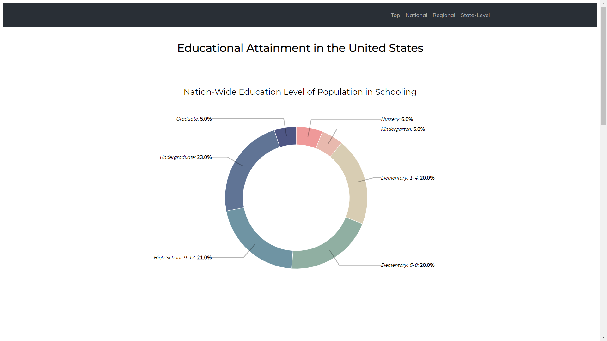
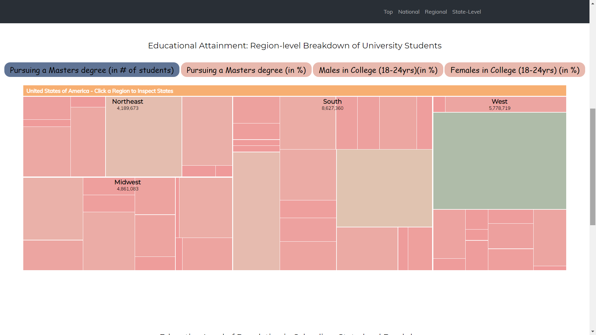
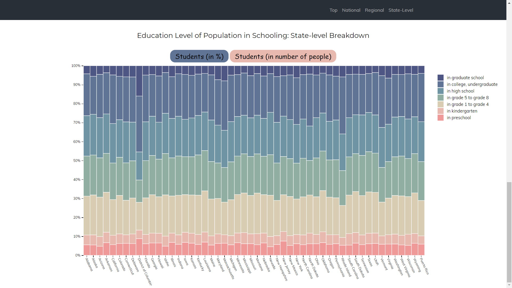
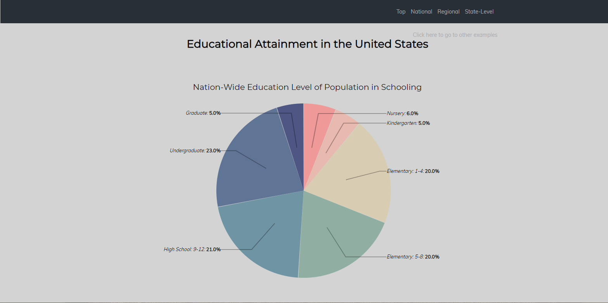
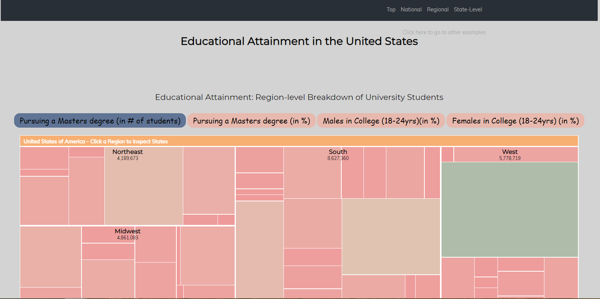
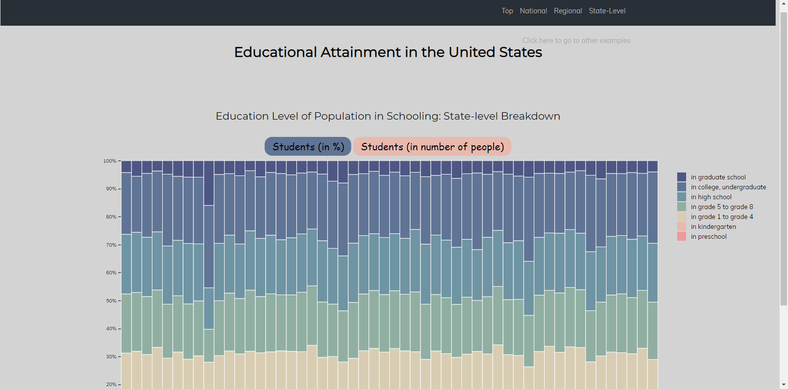
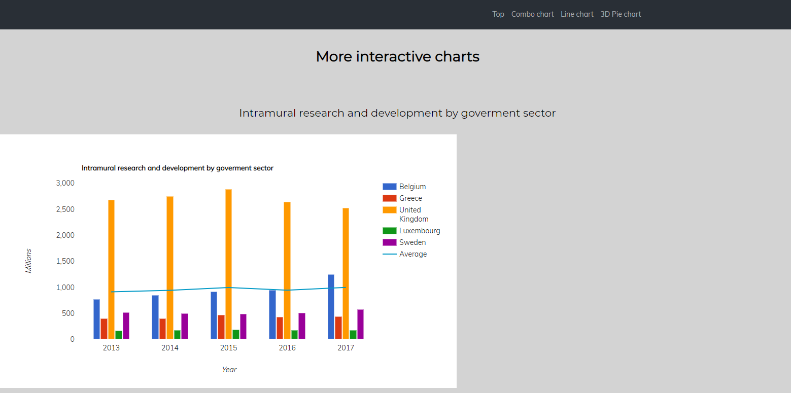
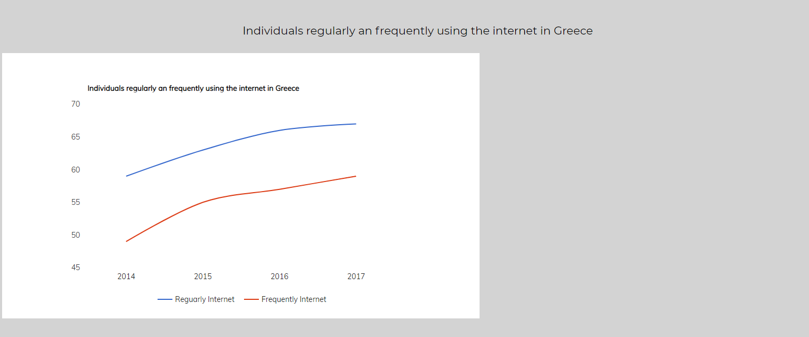
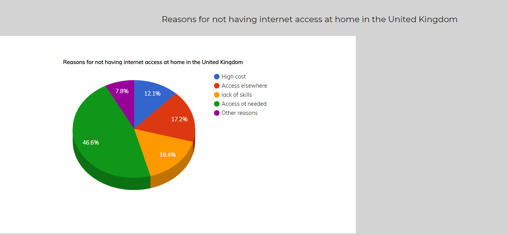

# Επικοινωνία Ανθρώπου-Υπολογιστή

### Ονοματεπώνυμο: Ευτυχία Δήμητρα Μαρία Φαρμάκη
### Αριθμός Μητρώου: Π2017070

## Εργασία Περιεχομένου 

###Links

**Σύνδεσμος ιστότοπου https://eftichiafarmaki.github.io/gr/**

**Σύνδεσμος αποθετηρίου https://github.com/eftichiafarmaki/gr**

### A ΠΑΡΑΔΟΤΕΟ
### Σύνδεσμοι εικόνων

* Virtual Reality

  * https://eftichiafarmaki.github.io/gr/gallery/virtual-reality/

* Apple Lisa

  * https://eftichiafarmaki.github.io/gr/gallery/Apple-Lisa/

* Interactive Whiteboard

  * https://eftichiafarmaki.github.io/gr/gallery/Interactive-whiteboard/

* Ricochetbox

  * https://eftichiafarmaki.github.io/gr/gallery/Ricochetbox/

* Used Punchcard

  * https://eftichiafarmaki.github.io/gr/gallery/Used-Punchcard/
  
  ## Β ΠΑΡΑΔΟΤΕΟ
  
  * 3D keyboard and mouse
  
    * https://eftichiafarmaki.github.io/gr/remix/3D_keyboard_mouse/
  
  * Super Mario
  
    * https://eftichiafarmaki.github.io/gr/remix/SuperMario/
   
  
  
# Εργασία Ανάπτυξης 

  # Παραδοτέο 1 
  #
  #

#### [Link αποθετηρίου κώδικα]: https://github.com/eftichiafarmaki/D3js-US-educational-attainment
#### [Link στο εκτελέσιμο]: https://eftichiafarmaki.github.io/D3js-US-educational-attainment/
#
#

#### Εκπλήρωση ζητούμενων πρώτου παραδοτέου

[x] Αλλάξτε τα χρώματα στα 3 γραφήματα.

[x] Αντικαταστήστε τις διεπαφές στα "κουμπιά" του 2ου και 3ου γραφήματος με άλλες της επιλογής σας.

[x] Όταν το ποντίκι διέρχεται επάνω από κάθε επιλογή του menu στην κορυφή της σελίδας, να ακούγεται κάποιος ήχος της επιλογής σας.

[x] Όταν το ποντίκι διέρχεται πάνω από κάποια πρόταση/κείμενο της σελίδας ή περιοχή που περιλαμβάνει γραπτή πληροφορία (π.χ. κάποιο τμήμα γραφήματος), να ακούγεται αυτόματα η αφήγηση του κειμένου (text-to-speech).

[x] Εφαρμόστε responsive design στη σελίδα και κυρίως στο αρχικό menu έτσι ώστε να προσαρμόζεται σε οθόνες διαφορετικών διαστάσεων (π.χ. Bootstrap).

#### Τεκμηρίωση ζητουμένων πρώτου παραδοτέου

Α)  Αλλαγή στα χρώματα των 3 γραφημάτων
B)  Αντικατάσταση των διεπαφών στα "κουμπιά" του 2ου και 3ου γραφήματος.

Γ, Δ , Ε) Δείτε το παρακάτω link: https://eftichiafarmaki.github.io/D3js-US-educational-attainment/

# Παραδοτέο 2

#### [Link αποθετηρίου κώδικα]: https://github.com/eftichiafarmaki/D3js-US-educational-attainment/tree/gh-pages
#### [Link στο εκτελέσιμο]: https://eftichiafarmaki.github.io/D3js-US-educational-attainment/

[x] Τροποποιήστε τον κώδικα και το μενού της εφαρμογής έτσι ώστε κάθε στιγμή να είναι εμφανές μόνο ένα από τα 3 γραφήματα, παραμένοντας πάντα στη σελίδα index.html. (Για την εμφάνιση-απόκρυψη του κάθε γραφήματος έγινε χρήση μιας συνάρτησης javascript η οποία εντάχθηκε στο html αρχείο) 

[x] Αντικαταστήστε το κάθε ένα από τα 3 γραφήματα με κάποιο άλλο διαδραστικό γράφημα της D3js.

[x] Σε μια καινούργια σελίδα, να τοποθετήσετε αντίστοιχα 3 νέα διαδραστικά γραφήματα D3js της επιλογής σας, τα οποία θα οπτικοποιούν καινούργια στατιστικά δεδομένα που θα βρείτε από κάποια επίσημη στατιστική αρχή (π.χ. ΕΛΣΤΑΤ, Eurostat κ.λπ.).

