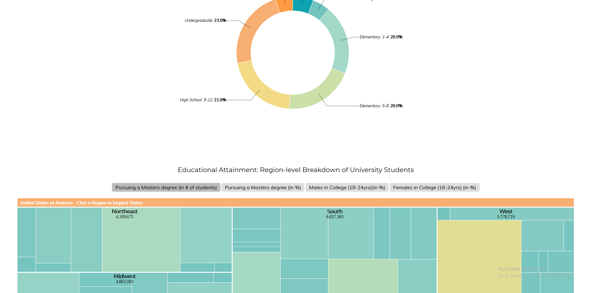
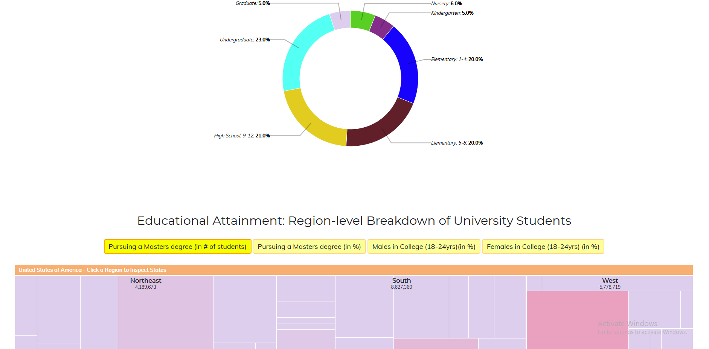
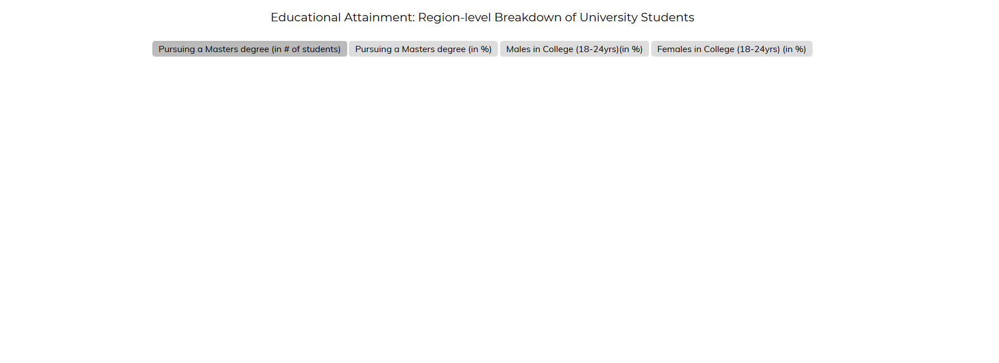
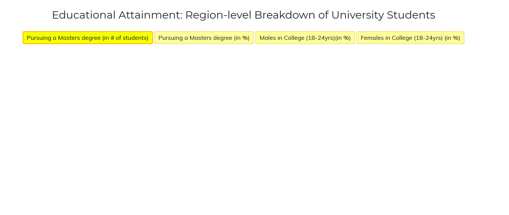

# Μάθημα: Επικοινωνία Ανθρώπου-Υπολογιστή

### Ονοματεπώνυμο:Γρίβας Αθανάσιος

### Αριθμός Μητρώου: Π2017093

## Εργασία: Οπτικοποίηση δεδομένων

#### [Εκτελέσιμο link](https://athangriv.github.io/D3js-US-educational-attainment/ '[Εκτελέσιμο link')
#### [Προφίλ στο github](https://github.com/AthanGriv/D3js-US-educational-attainment 'Προφίλ στο github')

## Παραδοτέο 1

#### Αποθετήριο κώδικα παραδοτέου 1 : https://github.com/AthanGriv/D3js-US-educational-attainment/tree/develop

### Εκπλήρωση ζητούμενων πρώτου παραδοτέου

#### Ζητούμενο 1 : Αλλάξτε τα χρώματα στα 3 γραφήματα.

              Σύκγριση
  
Αρχικό : 

Αλλαγή : 

#### Ζητούμενο 2 : Αντικαταστήστε τις διεπαφές στα "κουμπιά" του 2ου και 3ου γραφήματος με άλλες της επιλογής σας.

Αρχικό : 

Αλλαγή : 

#### Ζητούμενο 3 : Όταν το ποντίκι διέρχεται επάνω από κάθε επιλογή του menu στην κορυφή της σελίδας, να ακούγεται κάποιος ήχος της επιλογής σας.

Στις 4 επιλογές του μενού (Top, National, Regional, State-Level) ακούγεται ενα χαρακτηριστικό "κλίκ" όταν το ποντίκι περνά απο πάνω. 
Στο Google Chrome λειτουργεί ο ήχος μόνο εάν έχει επιλεχθεί πρώτα ένα απο τα κουμπιά στο μενού.

#### Ζητούμενο 4 : Όταν το ποντίκι διέρχεται πάνω από κάποια πρόταση/κείμενο της σελίδας ή περιοχή που περιλαμβάνει γραπτή πληροφορία (π.χ. κάποιο τμήμα γραφήματος), να ακούγεται αυτόματα η αφήγηση του κειμένου (text-to-speech).

Το text-to-speech λειτουργεί για κάθε κείμενο στην σελίδα,εκτός των επιλογών του μενού(για να αποφευχθεί η σύγκρουση με τον ήχο που παιζει όταν περνά το ποντίκι απο επάνω,
και εκτός των κειμένων συμπεριλαμβανομένων στα διαγράμματα.

#### Ζητούμενο 5 : Εφαρμόστε responsive design στη σελίδα και κυρίως στο αρχικό menu έτσι ώστε να προσαρμόζεται σε οθόνες διαφορετικών διαστάσεων (π.χ. Bootstrap).

Εφαρμόστηκε το Bootstrap και λειτουργεί κανονικά,όμως σε πολύ μικρές οθόνες τα διαγράμματα,και κυρίως το pie chart ξεπερνά τα διαστηματα της οθόνης.

## Παραδοτέο 2

#### Ζητούμενο 1 : Τροποποιήστε τον κώδικα και το μενού της εφαρμογής έτσι ώστε κάθε στιγμή να είναι εμφανές μόνο ένα από τα 3 γραφήματα, παραμένοντας πάντα στη σελίδα index.html.

Στην σελίδα τα 2 απο τα 3 γραφήματα είναι συνεχώς κρυμμένα,ανάλογα με την επιλογή του χρήστη στο βασικό μενού.

### Τελική Αναφορά : https://athangriv.github.io/hci-Final-Report/

## Εργασία Περιεχομένου

#### Παραδοτέο Β

1ο διαδραστικό παράδειγμα : https://athangriv.github.io/gr/remix/progress-bar/

2ο διαδραστικό παράδειγμα : https://athangriv.github.io/gr/remix/flip-card/

Σελίδα github pages : https://athangriv.github.io/gr/

Αποθετήριο : https://github.com/AthanGriv/gr
