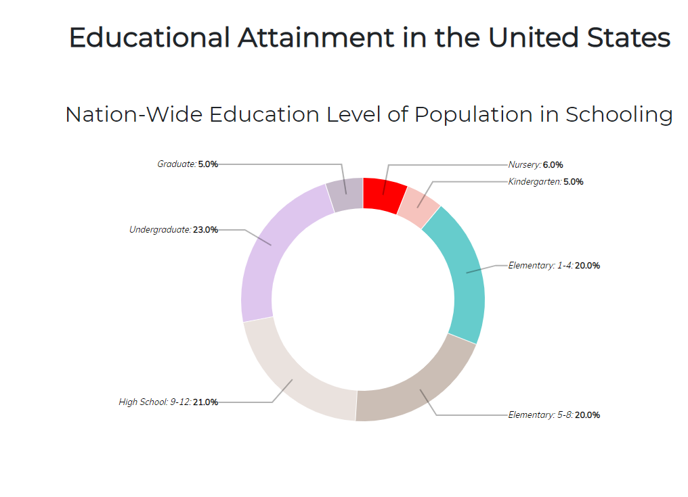
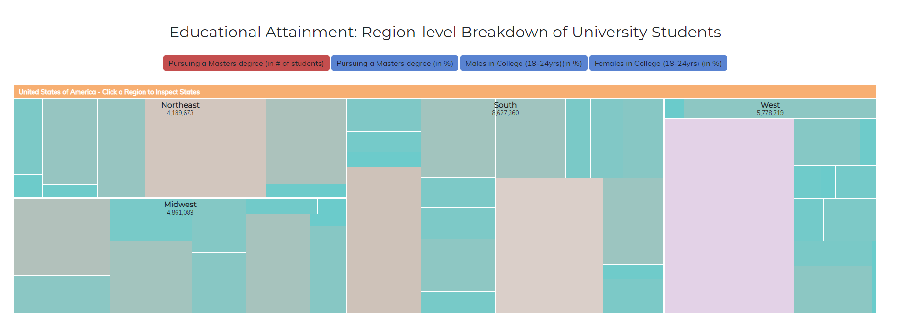
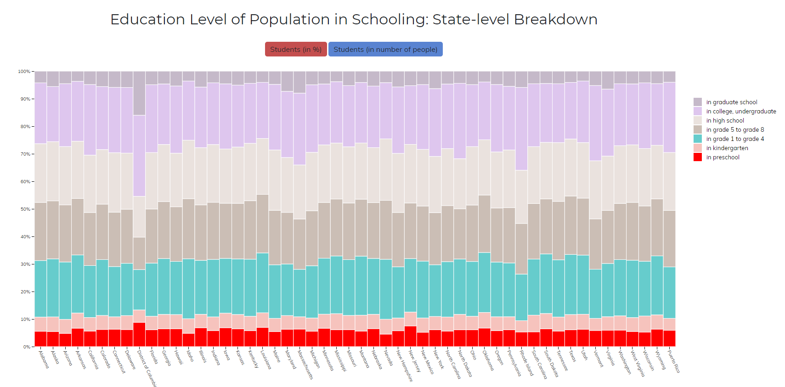

# Επικοινωνία Ανθρώπου-Υπολογιστή

## Εργασία Περιεχομένου 1Α(Εύρεση εικόνων)

### Ονοματεπώνυμο: Ζέρβας Διονυσιος Θεωνάς

### Αριθμός Μητρώου: Π2017105

Εκτελέσιμο link https://dionisiszervas.github.io/gr/

link αποθετηρίου https://github.com/DionisisZervas/gr

##links εικόνων:

Δυαδικό Σύστημα:
https://dionisiszervas.github.io/gr/gallery/image%2001100/

Πληκτρολόγιο:
https://dionisiszervas.github.io/gr/gallery/image%20keyboard/

Pc Build:
https://dionisiszervas.github.io/gr/gallery/image%20pc%20build/

Pc Setup:
https://dionisiszervas.github.io/gr/gallery/image%20pc%20setup/

Server:
https://dionisiszervas.github.io/gr/gallery/image%20server/
## Παραδοτέο 1

#### [Link αποθετηρίου κώδικα]: https://https://github.com/DionisisZervas/D3js-US-educational-attainment
#### [Link στο εκτελέσιμο]: https://DionisisZervas.github.io/D3js-US-educational-attainment/

### Εκπλήρωση ζητούμενων πρώτου παραδοτέου

[x] Άλλαξα τα χρώματα στα 3 γραφήματα.

[x] Αντικατέστησα τις διεπαφές στα "κουμπιά" του 2ου και 3ου γραφήματος.

[x] Όταν το ποντίκι διέρχεται επάνω από κάθε επιλογή του menu στην κορυφή της σελίδας, ακούγεται κάποιος ήχος.

[x] Όταν το ποντίκι διέρχεται πάνω από κάποια πρόταση/κείμενο της σελίδας ή περιοχή που περιλαμβάνει γραπτή πληροφορία (π.χ. κάποιο τμήμα     γραφήματος), ακούγεται αυτόματα η αφήγηση του κειμένου (text-to-speech).

[x] Εφάρμοσα responsive design στη σελίδα (Bootstrap) και κυρίως στο αρχικό menu έτσι ώστε να προσαρμόζεται σε οθόνες διαφορετικών διαστάσεων.

### Τεκμηρίωση ζητουμένων πρώτου παραδοτέου

Α & B) Άλλαξα τα χρώματα στα 3 γραφήματα και αντικατέστησα τις διεπαφές στα "κουμπιά" του 2ου και 3ου γραφήματος.

Γ & Δ & Ε) Δείτε το εκτελέσιμο στο https://DionisisZervas.github.io/D3js-US-educational-attainment/

Για την μετατροπή text to speech χρησιμοποίησα το responsivevoice.js.
