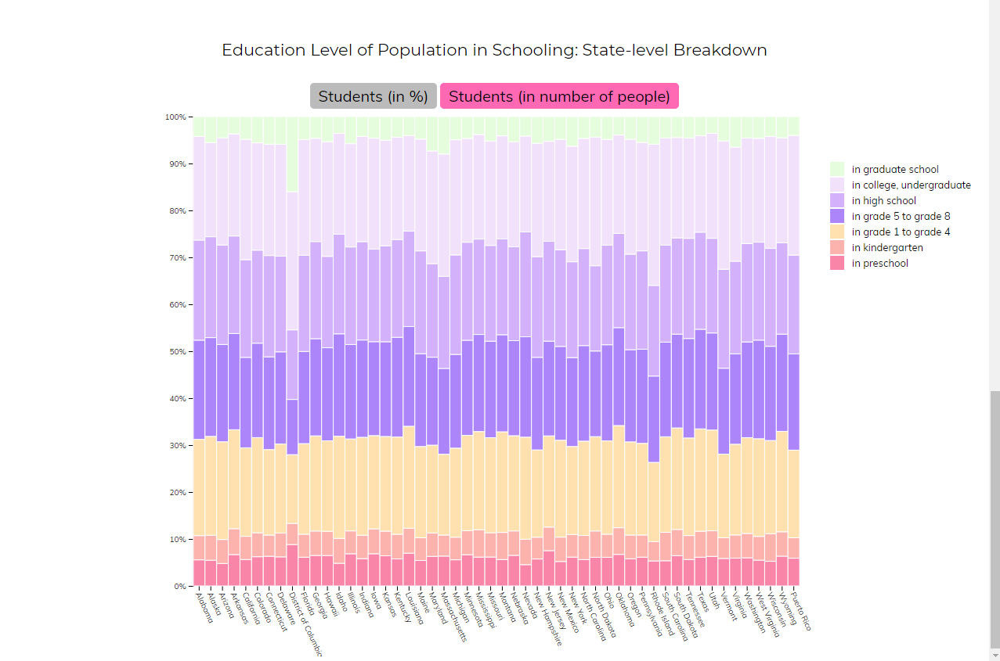

# Μάθημα: Επικοινωνία Ανθρώπου - Υπολογιστή

### Ονοματεπώνυμο: Γιώργος Χαράλαμπος Καλούδης
### Αριθμός Μητρώου: Π2017115

## Εργασία Περιεχομένου: Συμμετοχική μελέτη και προσθήκη εκπαιδευτικού υλικού

## Παραδοτέο Α

#### link αποθετηρίου κώδικα: https://github.com/p17kalo1/gr
#### link στο εκτελέσιμο: https://p17kalo1.github.io/gr

### Εκπλήρωση ζητούμενων πρώτου παραδοτέου

#### link  αρχείου config.yml https://github.com/p17kalo1/gr/blob/gh-pages/_config.yml

#### link 1ης εικόνας https://p17kalo1.github.io/gr/gallery/apple-ii-computer/

#### link 2ης εικόνας https://p17kalo1.github.io/gr/gallery/arpanet/

#### link 3ης εικόνας https://p17kalo1.github.io/gr/gallery/eniac/

#### link 4ης εικόνας https://p17kalo1.github.io/gr/gallery/enigma-machine/

#### link 5ης εικόνας https://p17kalo1.github.io/gr/gallery/simon/

# Εργασία Ανάπτυξης 
# Παραδοτέο 1 
 #### [Link αποθετηρίου κώδικα]: https://github.com/p17kalo1/D3js-US-educational-attainment
#### [Link στο εκτελέσιμο]: https://p17kalo1.github.io/D3js-US-educational-attainment/
 ### Εκπλήρωση ζητούμενων πρώτου παραδοτέου
 [x] Άλλαξα τα χρώματα στα 3 γραφήματα.
 
 [x] Αντικατέστησα τις διεπαφές στα "κουμπιά" του 2ου και 3ου γραφήματος.
 
 [x] Όταν το ποντίκι διέρχεται επάνω από κάθε επιλογή του menu στην κορυφή της σελίδας, ακούγεται κάποιος ήχος.
 
 [x] Όταν το ποντίκι διέρχεται πάνω από κάποια πρόταση/κείμενο της σελίδας ή περιοχή που περιλαμβάνει γραπτή πληροφορία (π.χ. κάποιο τμήμα     γραφήματος), ακούγεται αυτόματα η αφήγηση του κειμένου (text-to-speech).
 
 [x] Εφάρμοσα responsive design στη σελίδα (Bootstrap) και κυρίως στο αρχικό menu έτσι ώστε να προσαρμόζεται σε οθόνες διαφορετικών διαστάσεων.
 
 ### Τεκμηρίωση ζητουμένων πρώτου παραδοτέου
 Α & B) Άλλαξα τα χρώματα στα 3 γραφήματα και αντικατέστησα τις διεπαφές στα "κουμπιά" του 2ου και 3ου γραφήματος.

Γ & Δ & Ε) Δείτε το εκτελέσιμο στο https://p17kalo1.github.io/D3js-US-educational-attainment/
 Για την μετατροπή text to speech χρησιμοποίησα το responsivevoice.js.
