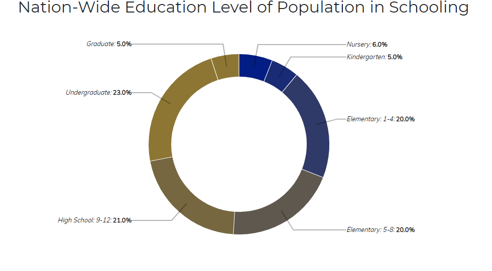
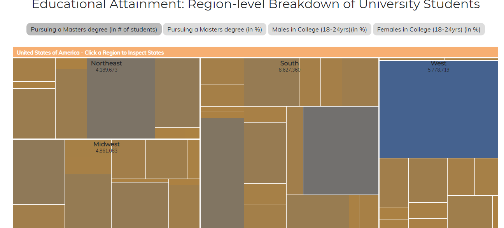
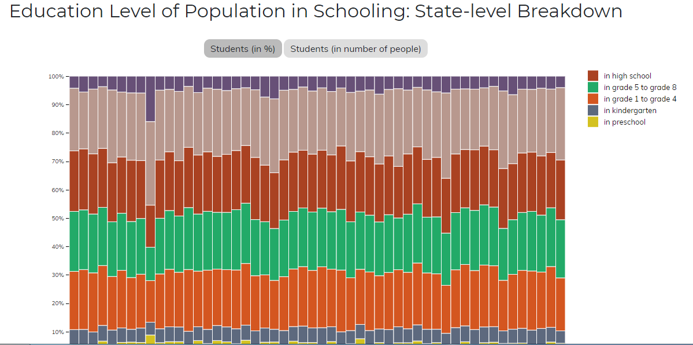

# Επικοινωνία Ανθρώπου-Υπολογιστή
## Εργασία Περιεχομένου 1Α(Εύρεση Εικόνων)
### Ονοματεπώνυμο: Ανδρέα Μαρία Ράντου
### Αριθμός Μητρώου: Π 2017127

**Σύνδεσμος ιστότοπου https://p17rant.github.io/gr/**

**Σύνδεσμος αποθετηρίου https://github.com/P17rant/gr**

## Σύνδεσμοι εικόνων

* Ancient PC

  * https://p17rant.github.io/gr/gallery/Ancient-PC/

* IBM Pc

  * https://p17rant.github.io/gr/gallery/IBM-Pc/

* IBM PC Second

  * https://p17rant.github.io/gr/gallery/IBM-PC-Second/

* Intel CPU Old

  * https://p17rant.github.io/gr/gallery/Intel-CPU-Old/

* TV Tuner

  * https://p17rant.github.io/gr/gallery/TV-Tuner/

## Παραδοτέο 1

#### [Link αποθετηρίου κώδικα]: https://https://github.com/P17rant/D3js-US-educational-attainment
#### [Link στο εκτελέσιμο]: https://P17rant.github.io/D3js-US-educational-attainment/

### Εκπλήρωση ζητούμενων πρώτου παραδοτέου

[x] Άλλαξα τα χρώματα στα 3 γραφήματα.

[x] Αντικατέστησα τις διεπαφές στα "κουμπιά" του 2ου και 3ου γραφήματος.

[x] Όταν το ποντίκι διέρχεται επάνω από κάθε επιλογή του menu στην κορυφή της σελίδας, ακούγεται κάποιος ήχος.

[x] Όταν το ποντίκι διέρχεται πάνω από κάποια πρόταση/κείμενο της σελίδας ή περιοχή που περιλαμβάνει γραπτή πληροφορία (π.χ. κάποιο τμήμα     γραφήματος), ακούγεται αυτόματα η αφήγηση του κειμένου (text-to-speech).

[x] Εφάρμοσα responsive design στη σελίδα (Bootstrap) και κυρίως στο αρχικό menu έτσι ώστε να προσαρμόζεται σε οθόνες διαφορετικών διαστάσεων.

### Τεκμηρίωση ζητουμένων πρώτου παραδοτέου

Α & B) Άλλαξα τα χρώματα στα 3 γραφήματα και αντικατέστησα τις διεπαφές στα "κουμπιά" του 2ου και 3ου γραφήματος.

Γ & Δ & Ε) Δείτε το εκτελέσιμο στο https://P17rant.github.io/D3js-US-educational-attainment/

Για την μετατροπή text to speech χρησιμοποίησα το responsivevoice.js.

## Παραδοτέο 2 Εργασία Περιεχομένου 

A) Διαδραστικό παράδειγμα Tic Tac Toe : https://p17rant.github.io/gr/remix/TicTacToe/

Β) Διαδραστικό Παράδειγμα Tearable Cloth : https://p17rant.github.io/gr/remix/TearableCloth

## Τελική Αναφορά

*Σύνδεσμος  README
    *https://github.com/P17rant/hci-Final-Report/blob/master/README.md
*Συνδεσμός site 
    *https://p13xant.github.io/final-report/
