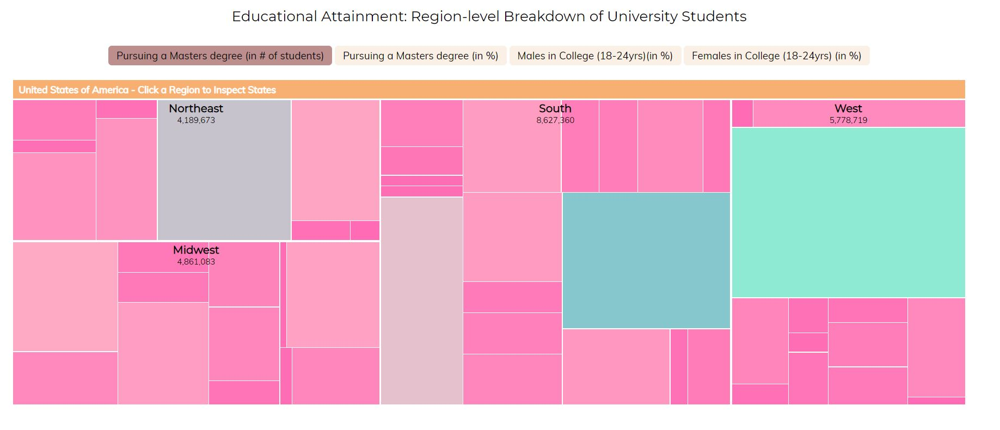
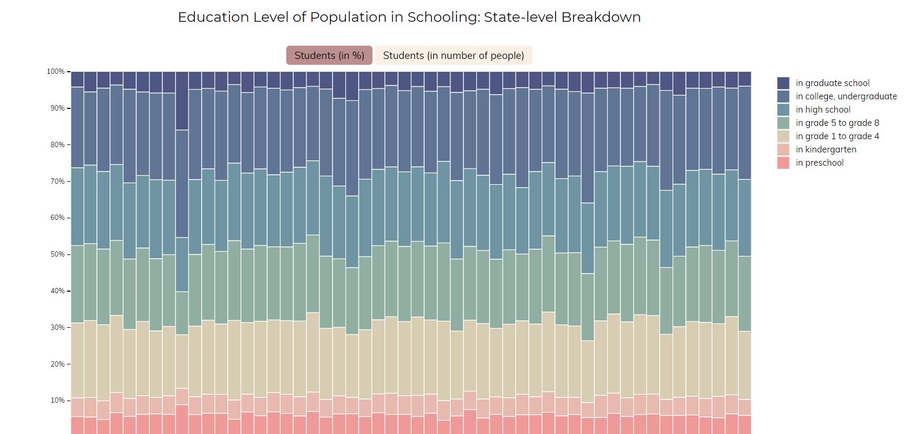

# Όνομα μαθήματος : Επικοινωνία Ανθρώπου-Υπολογιστή
## Όνομα : Αντωνία Σμυρλιάδη
## Αριθμός Μητρώου: Π2017130

 # Όνομα εργασίας : Εργασία Περιεχομένου
 ### Eκτελέσιμο link : https://p17smyr.github.io/gr/
 ### Link αποθετηρίου : https://github.com/p17smyr/gr
 
 ### A: Τα links των εικόνων
  atari : https://p17smyr.github.io/gr/gallery/atari/
  
  multi_tuch : https://p17smyr.github.io/gr/gallery/multi_touch/
  
  lego_turing_mashine : https://p17smyr.github.io/gr/gallery/lego_turing_mashine/
  
  fingerprint_reader : https://p17smyr.github.io/gr/gallery/fingerprint_reader/
  
  turing_test : https://p17smyr.github.io/gr/gallery/turing_test/
  
  ### Β: Τα links των διαδραστικών παραδειγμάτων
  Button Design: https://p17smyr.github.io/gr/remix/button-design-years/
  
  Timer: https://p17smyr.github.io/gr/remix/timer/
  

# Όνομα εργασίας : Εργασία Ανάπτυξης  
 ### Eκτελέσιμο link : https://p17smyr.github.io/D3js-US-educational-attainment/
 ### Link αποθετηρίου : https://github.com/p17smyr/D3js-US-educational-attainment
 
 ### Ζητούμενα - Παραδοτέο 1
 - [x] Άλλαξα τα χρώματα στα 3 γραφήματα.
 - [x] Αντικατέστησα τις διεπαφές στα "κουμπιά" του 2ου και 3ου γραφήματος.
 - [x] Όταν το ποντίκι διέρχεται επάνω από κάθε επιλογή του menu στην κορυφή της σελίδας, ακούγεται κάποιος ήχος.
 - [x] Όταν το ποντίκι διέρχεται πάνω από κάποια πρόταση/κείμενο της σελίδας ή περιοχή που περιλαμβάνει γραπτή πληροφορία (π.χ. κάποιο τμήμα γραφήματος), ακούγεται αυτόματα η αφήγηση του κειμένου (text-to-speech).
 - [x] Εφάρμοσα responsive design στη σελίδα (Bootstrap) και κυρίως στο αρχικό menu έτσι ώστε να προσαρμόζεται σε οθόνες διαφορετικών διαστάσεων.

1. Η αλλαγή των χρωμάτων (σε δεκαεξαδική μορφή) αλλάχθηκε από το αντίστοιχο αρχείο script.js.

Γράφημα 1: ...var colour = d3.scaleOrdinal().range...

Γράφημα 2: ...var color = d3.scaleLinear().domain...

Γράφημα 3: ...var colors = d3.scaleOrdinal() .range...

2. Η αλλαγή των ετικετών στα κουμπιά διεπαφής πραγματοποιήθηκε από το αρχείο style.css.

....radio-toolbar label { ...

....radio-toolbar input[type="radio"]:checked+label { ...

3. Για τον ήχο που κάνει το ποντίκι όταν διέρχεται πάνω από το μενού αρχικά κατέβασα ένα αρχείο .mp3 από το http://soundbible.com/tags-click.html κι έπειτα το έκανα online convert σε .ogg. Στη συνέχεια έκανα upload στο αποθετήριο της εργασίας όπως και το αρχείο sound-mouseover.js κι έκανα τις απαραίτητες αλλαγές στο αρχείο index.

...href="#top" onmouseover="playclip();" >Top</a></li> ...

Επιπλέον πρόσθεσα και το </script> <audio>

...source src="Click.mp3">...

4. Το 4ο ζητούμενο πραγματοποιήθηκε με τη βοήθεια του onmouseover="responsiveVoice.speak και onmouseleave="responsiveVoice.cancel() σε κάθε σημείο του αρχείου που θέλαμε να ακολουθεί την οδηγία text-to-speech.

5. Για το 5ο ζητούμενο έγιναν οι απαραίτητες αλλαγές στο index αρχείο ώστα να προσαρμόζεται το εκτελέσιμο αρχείο στα διάφορα μεγέθη οθονών.

...<script src="https://stackpath.bootstrapcdn.com/bootstrap...

