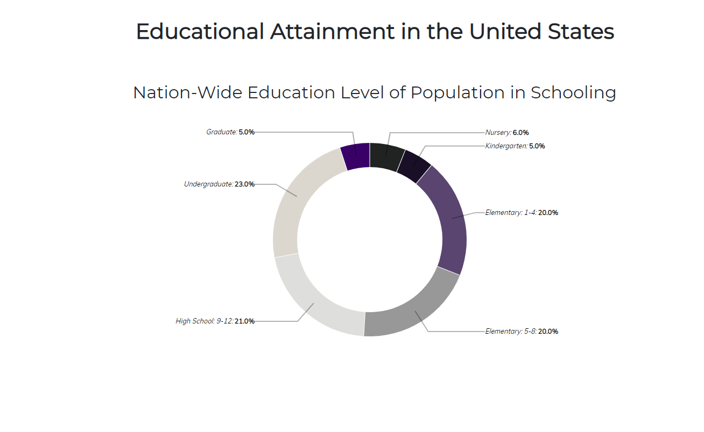
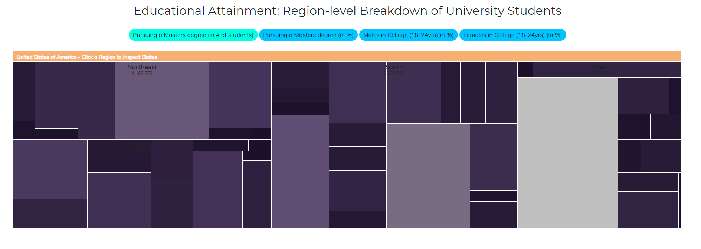
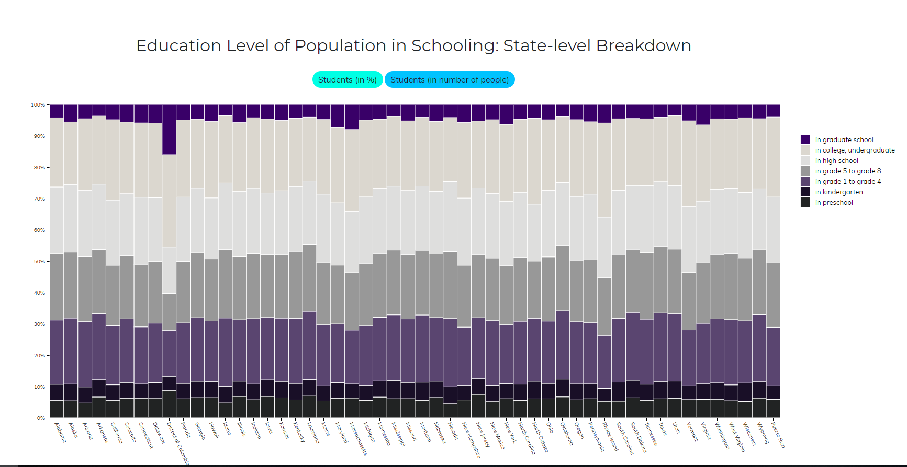

# Επικοινωνία Ανθρώπου-Υπολογιστή
## Εργασία Περιεχομένου 1η (Εύρεση εικόνωv)
### Ονοματεπώνυμο: Σωτήρης Παναγιωτόπουλος
### Αριθμός Μητρώου: Π2017132

### Εκτελέσιμο Link https://sotiris132.github.io/gr/

### Link αποθετηρίου https://github.com/Sotiris132/gr

Links εικόνων Mobiles:

multiple-mobile-platforms-supported
https://sotiris132.github.io/gr/gallery/multiple-mobile-platforms-supported/

smartphones-2017
https://sotiris132.github.io/gr/gallery/smartphones-2017/

mobile-app
https://sotiris132.github.io/gr/gallery/mobile-app/

mobiles
https://sotiris132.github.io/gr/gallery/mobiles/

hero-img-windows-devices
https://sotiris132.github.io/gr/gallery/hero-img-windows-devices/

# Επικοινωνία Ανθρώπου-Υπολογιστή
## Εργασία Ανάπτυξης 1ο παραδοτέο
### Ονοματεπώνυμο: Σωτήρης Παναγιωτόπουλος
### Αριθμός Μητρώου: Π2017132

#### [Link αποθετηρίου κώδικα]: https://github.com/Sotiris132/D3js-US-educational-attainment
#### [Link στο εκτελέσιμο]: https://Sotiris132.github.io/D3js-US-educational-attainment/

### Εκπλήρωση ζητούμενων πρώτου παραδοτέου

[x] Άλλαξα τα χρώματα στα 3 γραφήματα.

[x] Αντικατέστησα τις διεπαφές στα "κουμπιά" του 2ου και 3ου γραφήματος.

[x] Όταν το ποντίκι διέρχεται επάνω από κάθε επιλογή του menu στην κορυφή της σελίδας, ακούγεται κάποιος ήχος.

[x] Όταν το ποντίκι διέρχεται πάνω από κάποια πρόταση/κείμενο της σελίδας ή περιοχή που περιλαμβάνει γραπτή πληροφορία (π.χ. κάποιο τμήμα     γραφήματος), ακούγεται αυτόματα η αφήγηση του κειμένου (text-to-speech).

[x] Εφάρμοσα responsive design στη σελίδα (Bootstrap) και κυρίως στο αρχικό menu έτσι ώστε να προσαρμόζεται σε οθόνες διαφορετικών διαστάσεων.

### Τεκμηρίωση ζητουμένων πρώτου παραδοτέου

Α & B) Άλλαξα τα χρώματα στα 3 γραφήματα και αντικατέστησα τις διεπαφές στα "κουμπιά" του 2ου και 3ου γραφήματος.

Γ & Δ & Ε) Δείτε το εκτελέσιμο στο https://Sotiris132.github.io/D3js-US-educational-attainment/

Για την μετατροπή text to speech χρησιμοποίησα το responsivevoice.js.

