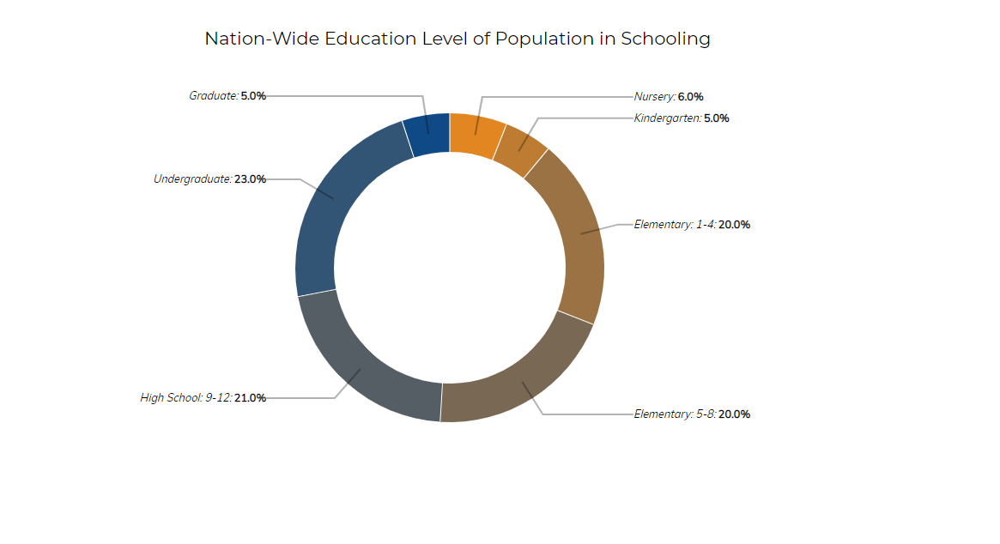
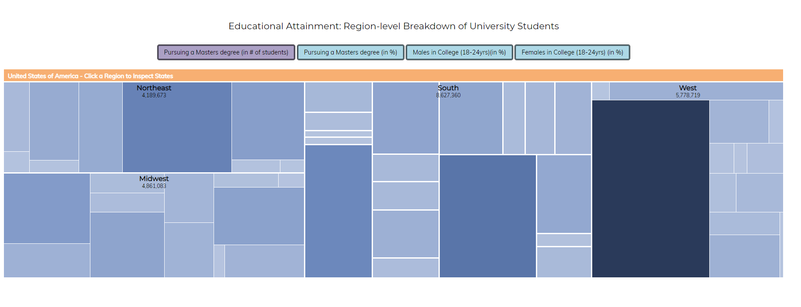
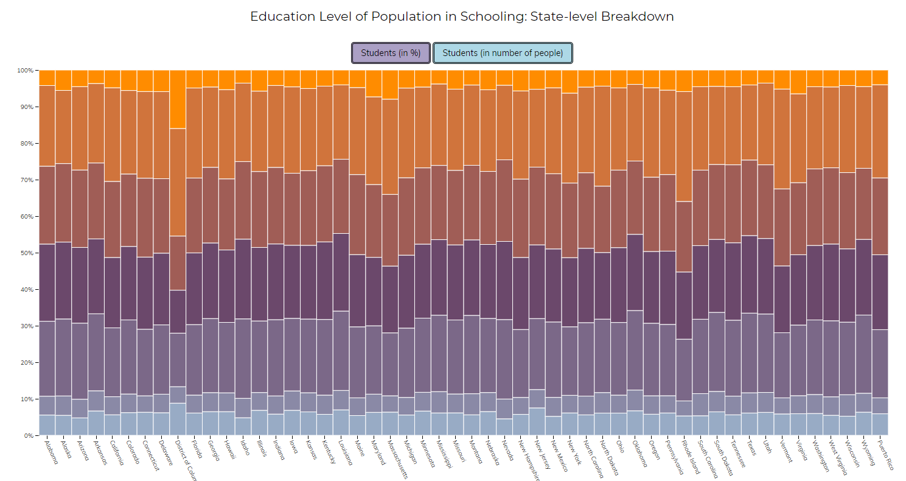
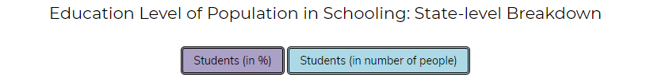

# Επικοινωνία Ανθρώπου-Υπολογιστή
## Εργασία Περιεχομένου 1Α(Εύρεση Εικόνων)
### Ονοματεπώνυμο: Αριστείδης Κοντίνης
### Αριθμός Μητρώου: Π2017144
 
**Σύνδεσμος ιστότοπου https://akontinis.github.io/gr/**
 
**Σύνδεσμος αποθετηρίου https://github.com/akontinis/gr**
 
 
## Σύνδεσμοι εικόνων
 
* Android
 
  * https://akontinis.github.io/gr/gallery/android/
 
* Netbeans
 
  * https://akontinis.github.io/gr/gallery/netbeans/
 
* Oculus
 
  * https://akontinis.github.io/gr/gallery/oculus/
 
* Raspbian
 
  * https://akontinis.github.io/gr/gallery/raspbian/
 
* Spotify
 
  * https://akontinis.github.io/gr/gallery/spotify/

# Όνομα εργασίας : Εργασία Ανάπτυξης  
### Eκτελέσιμο link : https://akontinis.github.io/D3js-US-educational-attainment/
### link αποθετηρίου : https://github.com/akontinis/D3js-US-educational-attainment
### Ζητούμενα - Παραδοτέο 1
 - [x] Άλλαξα τα χρώματα στα 3 γραφήματα.
 - [x] Αντικατέστησα τις διεπαφές στα "κουμπιά" του 2ου και 3ου γραφήματος.
 - [x] Όταν το ποντίκι διέρχεται επάνω από κάθε επιλογή του menu στην κορυφή της σελίδας, ακούγεται κάποιος ήχος.
 - [x] Όταν το ποντίκι διέρχεται πάνω από κάποια πρόταση/κείμενο της σελίδας ή περιοχή που περιλαμβάνει γραπτή πληροφορία (π.χ. κάποιο τμήμα γραφήματος), ακούγεται αυτόματα η αφήγηση του κειμένου (text-to-speech).
 - [x] Εφάρμοσα responsive design στη σελίδα (Bootstrap) και κυρίως στο αρχικό menu έτσι ώστε να προσαρμόζεται σε οθόνες διαφορετικών διαστάσεων.

i)Η αλλαγή των χρωμάτων αλλάχθηκε σε κάθε διάγραμμα από το αντίστοιχο αρχείο script.js.

ii)Οι διεπαφές στα κουμπιά του 2ου και 3ου γραφήματος αλλάχτηκαν από το style.css.

iii)Όταν το ποντίκι διέρχεται επάνω από κάθε επιλογή του menu στην κορυφή της σελίδας, ακούγεται ο ήχος sound (drums) ο οποίος η λήψη του έγινε από το www.myinstants.com ο οποίος μετατράπηκε σε κατάληξη .mp3 και ύστερα σε .ogg με τη χρήση του Audacity.

iv)Η αφήγηση πραγματοποιήθηκε με τη βοήθεια της συνάρτησης onmouseover="responsiveVoice.speak σε κάθε σημείο του αρχείου που θέλαμε να ακολουθεί την οδηγία text-to-speech.

v)Η βιβλιοθήκη του Bootstrap με σκοπό η σελίδα να γίνει πιο "responive" και σε άλλες όθονες έγινε με την χρήση του script:

