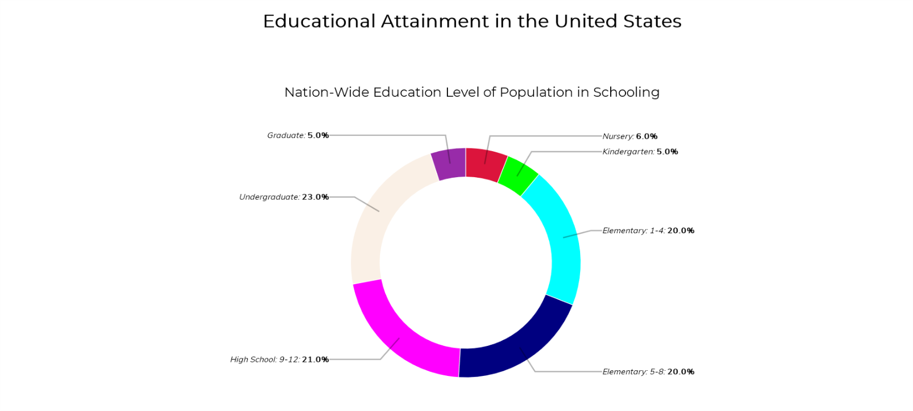
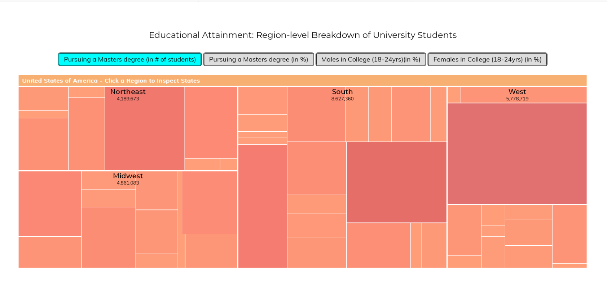

#Μάθημα: Επικοινωνία Ανθώπου-Υπολογιστή

#Ονοματεπώνυμο: Αθανάσης Παπαπέτρου

#Αριθμός Μητρώου: Π2017149

#Link Αποθετηρίου: https://github.com/p17papa5/gr

#Εκτελέσιμο link: https://p17papa5.github.io/gr

link πρώτης εικόνας: https://p17papa5.github.io/gr/gallery/dronepexflyjiz/
link δεύτερης εικόνας: https://p17papa5.github.io/gr/gallery/hightintelligentetech/
link τρίτης εικόνας: https://p17papa5.github.io/gr/gallery/teenmediaclrobotparts/
link τέταρτης εικόνας: https://p17papa5.github.io/gr/gallery/veidoversmarth/
link πέμπτης εικόνας: https://p17papa5.github.io/gr/gallery/vrplaystationvr/

link config.yml: https://github.com/p17papa5/gr/blob/gh-pages/_config.yml

## Παρδοτέο Β:
Interactive examples

link: https://p17papa5.github.io/gr/remix/black-hole/

link: https://p17papa5.github.io/gr/remix/tictactoe/

## Παραδοτέο 1

[Link αποθετηρίου κώδικα]: https://github.com/p17papa5/D3js-US-educational-attainment

[Link στο εκτελέσιμο]: https://p17papa5.github.io/D3js-US-educational-attainment/

Εκπλήρωση ζητούμενων πρώτου παραδοτέου

[x] Άλλαξα τα χρώματα στα 3 γραφήματα.

[x] Αντικατέστησα τις διεπαφές στα "κουμπιά" του 2ου και 3ου γραφήματος.

[x] Όταν το ποντίκι διέρχεται επάνω από κάθε επιλογή του menu στην κορυφή της σελίδας, ακούγεται κάποιος ήχος.

[x] Όταν το ποντίκι διέρχεται πάνω από κάποια πρόταση/κείμενο της σελίδας ή περιοχή που περιλαμβάνει γραπτή πληροφορία (π.χ. κάποιο τμήμα γραφήματος), ακούγεται αυτόματα η αφήγηση του κειμένου (text-to-speech).

[x] Εφάρμοσα responsive design στη σελίδα (Bootstrap) και κυρίως στο αρχικό menu έτσι ώστε να προσαρμόζεται σε οθόνες διαφορετικών διαστάσεων.
Τεκμηρίωση ζητουμένων πρώτου παραδοτέου

### Τεκμηρίωση ζητουμένων πρώτου παραδοτέου
Α & B) Άλλαξα τα χρώματα στα 3 γραφήματα και αντικατέστησα τις διεπαφές στα "κουμπιά" του 2ου και 3ου γραφήματος. 

Γ) Δ) Ε) Δείτε το εκτελέσιμο στο https://p17papa5.github.io/D3js-US-educational-attainment/
Για την μετατροπή text to speech χρησιμοποίησα το responsivevoice.js.
