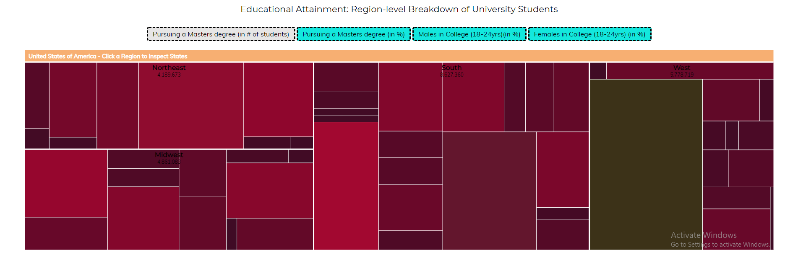

# Επικοινωνία Ανθρώπου-Υπολογιστή

### Ονοματεπώνυμο: ΓΙΩΡΓΟΣ ΦΟΥΡΝΑΡΗΣ

### Αριθμός Μητρώου: Π2017158

## Εργασία Περιεχομένου 1Α(Εύρεση Εικόνων)
**Link σελίδας: https://p17four.github.io/gr/**

https://p17four.github.io/gr/gallery/alan_turing/

https://p17four.github.io/gr/gallery/arpanet_map/

https://p17four.github.io/gr/gallery/charles_babbage/

https://p17four.github.io/gr/gallery/intel_d4004/

https://p17four.github.io/gr/gallery/smartphone/

**Link fork: https://github.com/p17four/gr**

## Εργασία Ανάπτυξης: Οπτικοποίηση δεδομένων εκπαιδευτικού συστήματος (USA) (1o Παραδοτέο)
#### [Εκτελέσιμο link] (https://p17four.github.io/D3js-US-educational-attainment/)

# Παραδοτέο 1
#### Αποθετήριο κώδικα παραδοτέου 1:  https://github.com/p17four/D3js-US-educational-attainment
### Εκπλήρωση ζητούμενων πρώτου παραδοτέου στο προσωπικό αποθετήριο του κωδικά μας
[x] Αλλαγή χρωμάτων και στα τρία γραφήματα της σελίδας (Αλλαγές στα αρχεία script js για το καθένα)

	

	

	

[x] Αντικατέστησα τις διεπαφές στα "κουμπιά" του 2ου και 3ου γραφήματος.
 
 [x] Όταν το ποντίκι διέρχεται επάνω από κάθε επιλογή του menu στην κορυφή της σελίδας, ακούγεται κάποιος ήχος.
 
 [x] Όταν το ποντίκι διέρχεται πάνω από κάποια πρόταση/κείμενο της σελίδας ή περιοχή που περιλαμβάνει γραπτή πληροφορία, ακούγεται αυτόματα η αφήγηση του κειμένου (text-to-speech).
 
 [x] Εφάρμοσα responsive design στη σελίδα και κυρίως στο αρχικό menu έτσι ώστε να προσαρμόζεται σε οθόνες διαφορετικών διαστάσεων.
