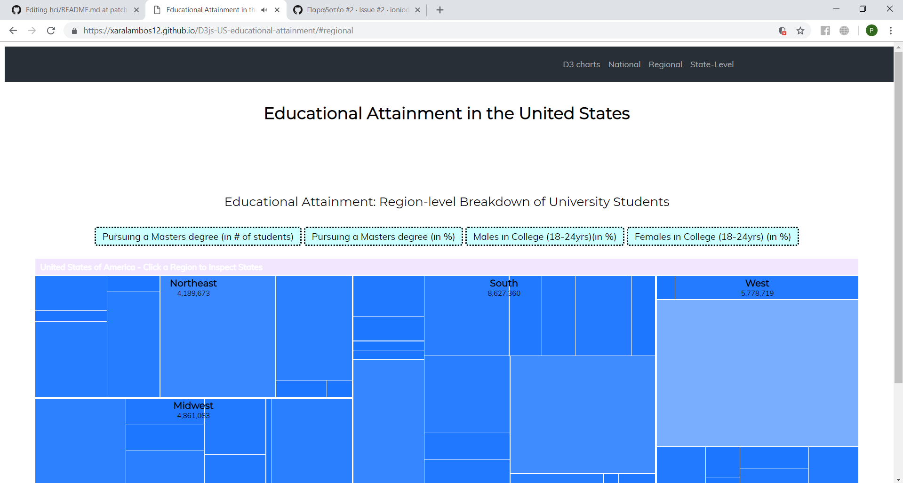
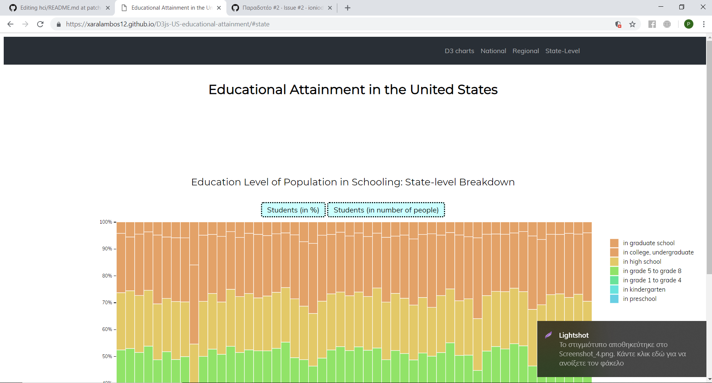
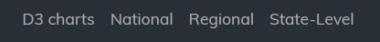
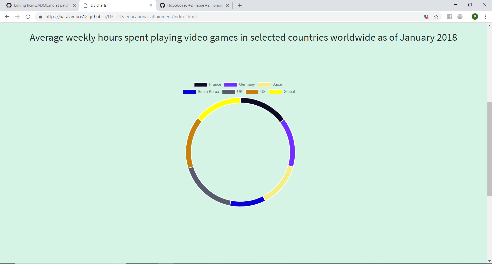
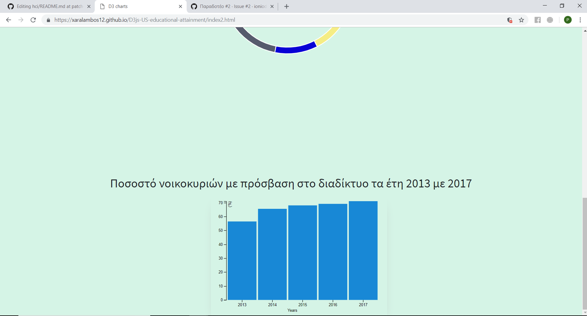

# Επικοινωνία Ανθρώπου-Υπολογιστή

### Εργασία Περιεχομένου

Ονοματεπώνυμο : Χαράλαμπος Στυλιανού

Αριθμός Μητρώου: Π2017173

Link Ιστοσελίδας : https://Xaralambos12.github.io/gr

Αποθετήριο : https://github.com/Xaralambos12/gr

### Τα links των εικόνων :

https://xaralambos12.github.io/gr/gallery/business/

https://xaralambos12.github.io/gr/gallery/computers/

https://xaralambos12.github.io/gr/gallery/gaming/

https://xaralambos12.github.io/gr/gallery/mechanical_keyboard/

https://xaralambos12.github.io/gr/gallery/teamwork/ 

### Παραδοτέο 2

## Διαδραστικά παραδείγματα 

#### Tα links απο τα md files:

1. https://github.com/Xaralambos12/gr/blob/gh-pages/_remix/webgl2-particles.md
2. https://github.com/Xaralambos12/gr/blob/gh-pages/_remix/easysnakegame.md

#### Τα links απο την ιστοσελίδα: 

1. https://xaralambos12.github.io/gr/remix/webgl2-particles/
2. https://xaralambos12.github.io/gr/remix/easysnakegame/

## Εργασία Aνάπτυξης

### Παραδοτέο 1

#### [Link αποθετηρίου κώδικα]: https://github.com/Xaralambos12/D3js-US-educational-attainment/

#### [Link στο εκτελέσιμο]: https://Xaralambos12.github.io/D3js-US-educational-attainment/

### Εκπλήρωση ζητούμενων πρώτου παραδοτέου

[x] Άλλαξα τα χρώματα στα 3 γραφήματα.

[x] Αντικατέστησα τις διεπαφές στα "κουμπιά" του 2ου και 3ου γραφήματος.

[x] Όταν το ποντίκι διέρχεται επάνω από κάθε επιλογή του menu στην κορυφή της σελίδας, ακούγεται κάποιος ήχος.

[x] Όταν το ποντίκι διέρχεται πάνω από κάποια πρόταση/κείμενο της σελίδας ή περιοχή που περιλαμβάνει γραπτή πληροφορία (π.χ. κάποιο τμήμα γραφήματος), ακούγεται αυτόματα η αφήγηση του κειμένου (text-to-speech).

[x] Εφάρμοσα responsive design στη σελίδα (Bootstrap) και κυρίως στο αρχικό menu έτσι ώστε να προσαρμόζεται σε οθόνες διαφορετικών διαστάσεων.

### Τεκμηρίωση ζητουμένων πρώτου παραδοτέου
Α & B) Άλλαξα τα χρώματα στα 3 γραφήματα και αντικατέστησα τις διεπαφές στα "κουμπιά" του 2ου και 3ου γραφήματος. 

Γ) Δ) Ε) Δείτε το εκτελέσιμο στο https://Xaralambos12.github.io/D3js-US-educational-attainment/

Για την μετατροπή text to speech χρησιμοποίησα το responsivevoice.js.

### Παραδοτέο 2

#### [Link αποθετηρίου κώδικα]: https://github.com/Xaralambos12/D3js-US-educational-attainment/

#### [Link στο εκτελέσιμο]: https://xaralambos12.github.io/D3js-US-educational-attainment/index2.html

### Εκπλήρωση ζητούμενων 2ου παραδοτέου
 
[x] Τροποποιήστε τον κώδικα και το μενού της εφαρμογής έτσι ώστε κάθε στιγμή να είναι εμφανές μόνο ένα από τα 3 γραφήματα, παραμένοντας πάντα στη σελίδα index.html.
 
[] Αντικαταστήστε το κάθε ένα από τα 3 γραφήματα με κάποιο άλλο διαδραστικό γράφημα της D3js.
  
[x]  Σε μια καινούργια σελίδα, να τοποθετήσετε αντίστοιχα 3 νέα διαδραστικά γραφήματα D3js της επιλογής σας, τα οποία θα οπτικοποιούν καινούργια στατιστικά δεδομένα που θα βρείτε από κάποια επίσημη στατιστική αρχή (π.χ. ΕΛΣΤΑΤ, Eurostat κ.λπ.).

### Τεκμηρίωση ζητουμένων πρώτου παραδοτέου
Α) Τροποποιήστε τον κώδικα και το μενού της εφαρμογής έτσι ώστε κάθε στιγμή να είναι εμφανές μόνο ένα από τα 3 γραφήματα, παραμένοντας πάντα στη σελίδα index.html.

Γ) Δείτε το εκτελέσιμο στο https://xaralambos12.github.io/D3js-US-educational-attainment/index2.html

## ΤΕΛΙΚΗ ΑΝΑΦΟΡΑ

Link : https://xaralambos12.github.io/SW_REPORT/

Αποθετήριο : https://github.com/Xaralambos12/SW_REPORT

