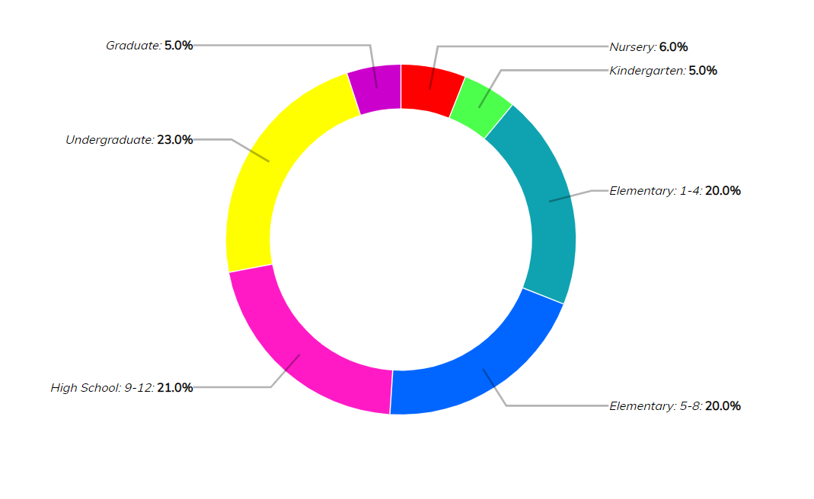

# Επικοινωνία Ανθρώπου-Υπολογιστή

### Εργασία Περιεχομένου

Ονοματεπώνυμο : Χαράλαμπος Στυλιανού

Αριθμός Μητρώου: Π2017173

Link Ιστοσελίδας : https://Xaralambos12.github.io/gr

Αποθετήριο : https://github.com/Xaralambos12/gr

### Τα links των εικόνων :

https://xaralambos12.github.io/gr/gallery/business/

https://xaralambos12.github.io/gr/gallery/computers/

https://xaralambos12.github.io/gr/gallery/gaming/

https://xaralambos12.github.io/gr/gallery/mechanical_keyboard/

https://xaralambos12.github.io/gr/gallery/teamwork/ 

### Παραδοτέο 2

## Διαδραστικά παραδείγματα 

#### Tα links απο τα md files:

1. https://github.com/Xaralambos12/gr/blob/gh-pages/_remix/webgl2-particles.md
2. https://github.com/Xaralambos12/gr/blob/gh-pages/_remix/easysnakegame.md

#### Τα links απο την ιστοσελίδα: 

1. https://xaralambos12.github.io/gr/remix/webgl2-particles/
2. https://xaralambos12.github.io/gr/remix/easysnakegame/

## Εργασία Aνάπτυξης

### Παραδοτέο 1

#### [Link αποθετηρίου κώδικα]: https://github.com/Xaralambos12/D3js-US-educational-attainment/

#### [Link στο εκτελέσιμο]: https://Xaralambos12.github.io/D3js-US-educational-attainment/

### Εκπλήρωση ζητούμενων πρώτου παραδοτέου

[x] Άλλαξα τα χρώματα στα 3 γραφήματα.

[x] Αντικατέστησα τις διεπαφές στα "κουμπιά" του 2ου και 3ου γραφήματος.

[x] Όταν το ποντίκι διέρχεται επάνω από κάθε επιλογή του menu στην κορυφή της σελίδας, ακούγεται κάποιος ήχος.

[x] Όταν το ποντίκι διέρχεται πάνω από κάποια πρόταση/κείμενο της σελίδας ή περιοχή που περιλαμβάνει γραπτή πληροφορία (π.χ. κάποιο τμήμα γραφήματος), ακούγεται αυτόματα η αφήγηση του κειμένου (text-to-speech).

[x] Εφάρμοσα responsive design στη σελίδα (Bootstrap) και κυρίως στο αρχικό menu έτσι ώστε να προσαρμόζεται σε οθόνες διαφορετικών διαστάσεων.

### Τεκμηρίωση ζητουμένων πρώτου παραδοτέου
Α & B) Άλλαξα τα χρώματα στα 3 γραφήματα και αντικατέστησα τις διεπαφές στα "κουμπιά" του 2ου και 3ου γραφήματος. 

Γ) Δ) Ε) Δείτε το εκτελέσιμο στο https://Xaralambos12.github.io/D3js-US-educational-attainment/

Για την μετατροπή text to speech χρησιμοποίησα το responsivevoice.js.

### Παραδοτέο 2

#### [Link αποθετηρίου κώδικα]: https://github.com/Xaralambos12/D3js-US-educational-attainment/

#### [Link στο εκτελέσιμο]: https://xaralambos12.github.io/D3js-US-educational-attainment/index2.html

### Εκπλήρωση ζητούμενων 2ου παραδοτέου
 
[x] Τροποποιήστε τον κώδικα και το μενού της εφαρμογής έτσι ώστε κάθε στιγμή να είναι εμφανές μόνο ένα από τα 3 γραφήματα, παραμένοντας πάντα στη σελίδα index.html.
 
[] Αντικαταστήστε το κάθε ένα από τα 3 γραφήματα με κάποιο άλλο διαδραστικό γράφημα της D3js.
  
[x]  Σε μια καινούργια σελίδα, να τοποθετήσετε αντίστοιχα 3 νέα διαδραστικά γραφήματα D3js της επιλογής σας, τα οποία θα οπτικοποιούν καινούργια στατιστικά δεδομένα που θα βρείτε από κάποια επίσημη στατιστική αρχή (π.χ. ΕΛΣΤΑΤ, Eurostat κ.λπ.).

### Τεκμηρίωση ζητουμένων πρώτου παραδοτέου
Α) Τροποποιήστε τον κώδικα και το μενού της εφαρμογής έτσι ώστε κάθε στιγμή να είναι εμφανές μόνο ένα από τα 3 γραφήματα, παραμένοντας πάντα στη σελίδα index.html.

Γ) Δείτε το εκτελέσιμο στο https://xaralambos12.github.io/D3js-US-educational-attainment/index2.html

# Τίτλος εργασίας: Τελική αναφορά

### Ονοματεπώνυμο: Χαράλαμπος Στυλιανού
### Αριθμός Μητρώου: Π2017173

## Εισαγωγή
 Στα πλαίσια του μαθήματος Επικοινωνία ανθρώπου-υπολογιστή  του Γ εξαμήνου είχαμε την εργασία οπτικοποίηση δεδομένων.

## Σύνοψη
Υλοποίησα τα ζητούμενα του πρώτου παραδοτέου και από το δεύτερο παραδοτέο το ζητούμενο 1 και 3.  Το  πρώτο παραδοτέο ήταν σχετικά απλό, το μόνο πρόβλημα που αντιμετώπισα ήταν το responsive το όποιο είχε πολλούς τρόπους τους οποίους βρήκα και από ότι φαίνεται το github δεν τα αναγνωρίζει όλα. Το δεύτερο παραδοτέο ήταν αρκετά πολύπλοκο γιατί το έκανα με στο desktop και δούλευε μια χαρά ο κώδικας και τα εμφάνιζε όλα σωστά και όταν τα ανέβασα στο github τα μισά δουλεύανε και δεν μπορούσα να καταλάβω το γιατί. 

## Διαδικασία Ανάπτυξης
 Για την συγγραφή και την εκτέλεση του κώδικα έγινε χρήση του Sublime text αντί της διαδικτυακής  πλατφόρμας του github. Στην συνέχεια , προσπαθησα να υλοποιήσω τον κωδικα έτσι ώστε να βγουν τα ζητούμενα σωστά . Όσο αφορά το προγραμματιστικό κομμάτι πολλές φορές αντιμετώπισα προβλήματα με τη σειρά που πρέπει να ήταν γραμμένος ο κώδικας γιατί παίζει μεγάλο ρολό. Έψαξα να βρω πώς να λύσω κάποια προβλήματα που πρόεκυψαν στη πορεία.
1.	https://www.google.com/
2.	https://stackoverflow.com/
3.	https://codepen.io/
4.	https://www.w3schools.com/

## Ανάλυση σχετικών έργων και εργαλείων
* [Sublime Text](https://www.sublimetext.com// 'Sublime Text')
* Code Pen [D3]( https://codepen.io/'D3') 

Αναλυτικές αλλαγές:
*	Άλλαξα τα χρώματα στα ήδη υπαρκτά γραφήματα.
*	Αντικατάστησα τις διεπαφές στα κουμπιά του 2ου και 3ου γραφήματος με άλλες της επιλογής μου.
*	Προσθήκη ήχου κάθε φορά που ο χρήστης διέρχεται με το ποντίκι πάνω σε ένα κουμπί
*	Όταν το ποντίκι διέρχεται πάνω από κάποια πρόταση της σελίδας ή περιοχή που περιλαμβάνει γραπτή πληροφορία το έκανα να ακούγεται αυτόματα η αφήγηση του κειμένου.
* Εφάρμοσα responsive design στη σελίδα και κυρίως στο αρχικό menu έτσι ώστε να προσαρμόζεται σε οθόνες διαφορετικών διαστάσεων .
*	Τροποποίησα τον κώδικα και το μενού της εφαρμογής έτσι ώστε κάθε στιγμή να είναι εμφανές μόνο ένα από τα 3 γραφήματα εκτός από την αρχή όταν μπαίνεις στη ιστοσελίδα για πρώτη φορά, παραμένοντας πάντα στη σελίδα index.html.
*	Σε μια καινούργια σελίδα, τοποθέτησα αντίστοιχα 3 νέα διακρατικά γραφήματα D3js της επιλογής μου, τα οποία αστικοποιούν καινούργια στατιστικά δεδομένα που βρήκα στο ΕΛΣΤΑΤ και στο wikipedia.
*	Τις αλλαγές πρώτα της έκανα στο desktop με τη χρήση sublime γιατί προσωπικά μου φάνηκε πιο εύκολο και πιο συμμαζεμένα παρά στο github και επίσης εμφανίζονταν πιο γρήγορα οι αλλαγές και ήξερα αμέσως που βρισκόμουν.

## Αναφορές
κομμάτια κώδικα ή tutorials που βασίστηκα για την άσκηση.

* https://github.com/NorthwoodsSoftware/GoJS
* https://www.sublimetext.com
* https://codepen.io/
* https://www.w3schools.com/
* https://javascript.info/
* https://www.tutorialspoint.com/d3js/

