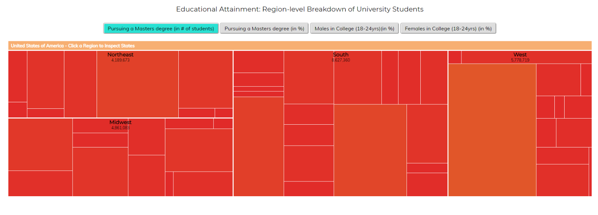

## Μάθημα: Επικοινωνία Ανθρώπου-Υπολογιστή
## Έργασία : Περιεχομένου 
## Όνομα : Χρίστος
## Επίθετο : Δημοσθένους
## ΑΜ: Π2017175
## link : https://christosdemosthenous.github.io/gr
 ## link αποθετηρίου : https://github.com/christosdemosthenous/gr
 ## Οι εικόνες μου :
  ## drone : https://christosdemosthenous.github.io/gr/gallery/drone/
  ## ecard : https://christosdemosthenous.github.io/gr/gallery/ecard/
  ## maps : https://christosdemosthenous.github.io/gr/gallery/maps/
  ## mouse : https://christosdemosthenous.github.io/gr/gallery/mouse/
  ## virtual : https://christosdemosthenous.github.io/gr/gallery/virtual/
## Παραδοτέο Β:
 ## Δυο διαδραστικά παραδείγματα
 1) link: https://christosdemosthenous.github.io/gr/remix/blob/
 2) link: https://christosdemosthenous.github.io/gr/remix/ranger-slider/
 
 Το link: απο το πρώτο md file https://github.com/christosdemosthenous/gr/blob/gh-pages/_remix/blob.md
 Το link: απο το δεύτερο md file https://github.com/christosdemosthenous/gr/blob/gh-pages/_remix/ranger-slider.md

## Εργασία Aνάπτυξης

### Παραδοτέο 1

#### [Link αποθετηρίου κώδικα]:   https://github.com/christosdemosthenous/D3js-US-educational-attainment/

#### [Link στο εκτελέσιμο]: https://christosdemosthenous.github.io/D3js-US-educational-attainment/

### Εκπλήρωση ζητούμενων πρώτου παραδοτέου

[x] Άλλαξα τα χρώματα στα 3 γραφήματα.

[x] Αντικατέστησα τις διεπαφές στα "κουμπιά" του 2ου και 3ου γραφήματος.

[x] Όταν το ποντίκι διέρχεται επάνω από κάθε επιλογή του menu στην κορυφή της σελίδας, ακούγεται κάποιος ήχος.

[x] Όταν το ποντίκι διέρχεται πάνω από κάποια πρόταση/κείμενο της σελίδας ή περιοχή που περιλαμβάνει γραπτή πληροφορία (π.χ. κάποιο τμήμα γραφήματος), ακούγεται αυτόματα η αφήγηση του κειμένου (text-to-speech).

[x] Εφάρμοσα responsive design στη σελίδα (Bootstrap) και κυρίως στο αρχικό menu έτσι ώστε να προσαρμόζεται σε οθόνες διαφορετικών διαστάσεων.

### Τεκμηρίωση ζητουμένων πρώτου παραδοτέου
Α & B) Άλλαξα τα χρώματα στα 3 γραφήματα και αντικατέστησα τις διεπαφές στα "κουμπιά" του 2ου και 3ου γραφήματος. 

Γ) Δ) Ε) Δείτε το εκτελέσιμο στο https://christosdemosthenous.github.io/D3js-US-educational-attainment/

Για την μετατροπή text to speech χρησιμοποίησα το responsivevoice.js.
