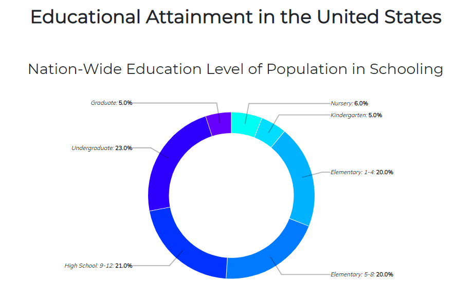
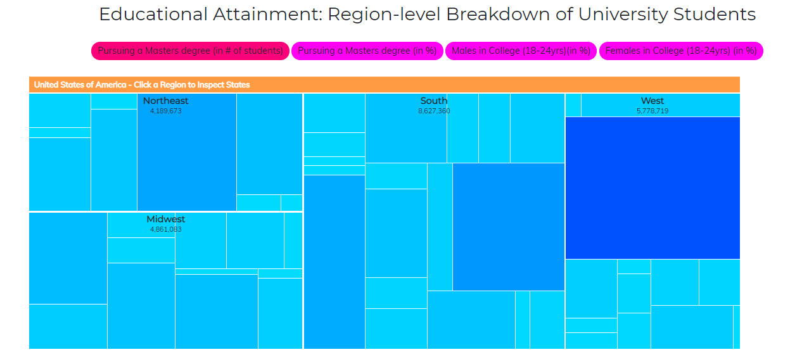
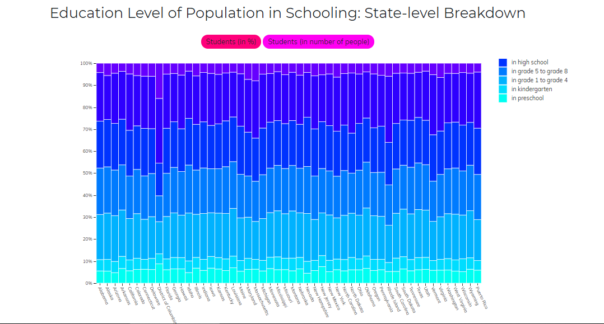

# Επικοινωνία Ανθρώπου-Υπολογιστή
## Εργασία Περιεχομένου 1ο Παραδοτέο (Εύρεση εικόνωv)
### Ονοματεπώνυμο: Αθανάσιος Μπαμπάς
### Αριθμός Μητρώου: Π2017184

### Εκτελέσιμο Link https://thanasis184.github.io/gr/

### Link αποθετηρίου https://github.com/Thanasis184/gr

Links εικόνων Minecraft:

minecraft1
https://thanasis184.github.io/gr/gallery/minecraft1/

minecraft2
https://thanasis184.github.io/gr/gallery/minecraft2/

minecraft3
https://thanasis184.github.io/gr/gallery/minecraft3/

minecraft4
https://thanasis184.github.io/gr/gallery/minecraft4/

minecraft5
https://thanasis184.github.io/gr/gallery/minecraft5/

# Επικοινωνία Ανθρώπου-Υπολογιστή
## Εργασία Ανάπτυξης 1η
### Ονοματεπώνυμο: Αθανάσιος Μπαμπάς
### Αριθμός Μητρώου: Π2017184

#### [Link αποθετηρίου κώδικα]: https://github.com/Thanasis184/D3js-US-educational-attainment
#### [Link στο εκτελέσιμο]: https://Thanasis184.github.io/D3js-US-educational-attainment/

### Εκπλήρωση ζητούμενων πρώτου παραδοτέου

[x] Άλλαξα τα χρώματα στα 3 γραφήματα.

[x] Αντικατέστησα τις διεπαφές στα "κουμπιά" του 2ου και 3ου γραφήματος.

[x] Όταν το ποντίκι διέρχεται επάνω από κάθε επιλογή του menu στην κορυφή της σελίδας, ακούγεται κάποιος ήχος.

[x] Όταν το ποντίκι διέρχεται πάνω από κάποια πρόταση/κείμενο της σελίδας ή περιοχή που περιλαμβάνει γραπτή πληροφορία (π.χ. κάποιο τμήμα     γραφήματος), ακούγεται αυτόματα η αφήγηση του κειμένου (text-to-speech).

[x] Εφάρμοσα responsive design στη σελίδα (Bootstrap) και κυρίως στο αρχικό menu έτσι ώστε να προσαρμόζεται σε οθόνες διαφορετικών διαστάσεων.

### Τεκμηρίωση ζητουμένων πρώτου παραδοτέου

Α & B) Άλλαξα τα χρώματα στα 3 γραφήματα και αντικατέστησα τις διεπαφές στα "κουμπιά" του 2ου και 3ου γραφήματος.

Γ & Δ & Ε) Δείτε το εκτελέσιμο στο https://thanasis184.github.io/D3js-US-educational-attainment/

Για την μετατροπή text to speech χρησιμοποίησα το responsivevoice.js.

# Επικοινωνία Ανθρώπου-Υπολογιστή
## Εργασία Περιεχομένου 2o Παραδοτέο (Διαδραστικά Παραδείγματα)
### Ονοματεπώνυμο: Αθανάσιος Μπαμπάς
### Αριθμός Μητρώου: Π2017184

### Εκτελέσιμο Link https://thanasis184.github.io/gr/

### Link αποθετηρίου https://github.com/Thanasis184/gr

Links Διαδραστικών Παραδειγμάτων:

### Daily Pen: https://thanasis184.github.io/gr/remix/daily-pen/
### Desk Light: https://thanasis184.github.io/gr/remix/desk-light/
