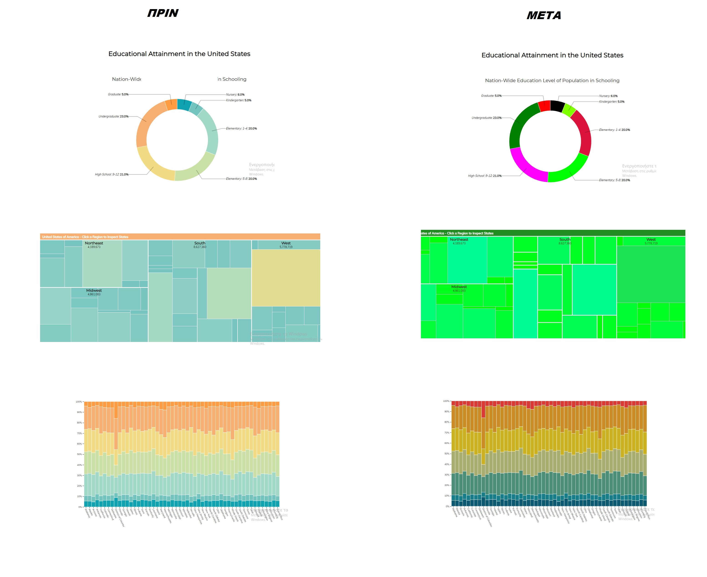
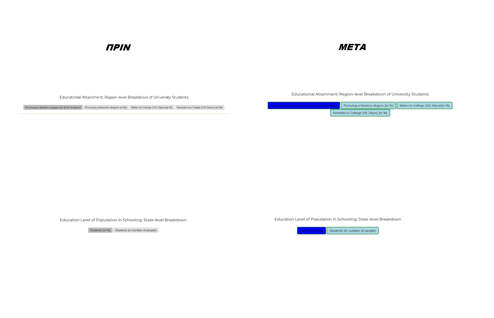

# Επικοινωνία Ανθρώπου-Υπολογιστή
## Εργασία Ανάπτυξης Παραδοτέο 1
### Ονοματεπώνυμο: Κοτσαγιαννίδης Πέτρος
### Αριθμός Μητρώου: Π2017189

**Σύνδεσμος αποθετηρίου https://github.com/p17kots/D3js-US-educational-attainment

**Σύνδεσμος εκτελέσιμου https://p17kots.github.io/D3js-US-educational-attainment/

**Σύνδεσμος στο κλαδί του παραδοτέου https://github.com/p17kots/D3js-US-educational-attainment/tree/gh-pages

#### ΖΗΤΟΥΜΕΝΑ

* Αλλαγή χρωμάτων στα 3 γραφήματα

* Αλλαγή διεπαφών

[x] Άλλαξα τα χρώματα στα 3 γραφήματα.

[x] Αντικατέστησα τις διεπαφές στα κουμπιά του 2ου και 3ου γραφήματος.

[x] Όταν το ποντίκι διέρχεται επάνω από κάθε επιλογή του menu στην κορυφή της σελίδας, ακούγεται ήχος.

[x] Όταν το ποντίκι διέρχεται πάνω από κάποια πρόταση/κείμενο της σελίδας ακούγεται αυτόματα η αφήγηση του κειμένου (text-to-speech)

## Εργασία Ανάπτυξης Παραδοτέο 2

 
 
**Σύνδεσμος αποθετηρίου 1 https://github.com/p17kots/D3js-US-educational-attainment

**Σύνδεσμος εκτελέσιμου 1 https://p17kots.github.io/D3js-US-educational-attainment/

**Σύνδεσμος στο κλαδί του παραδοτέου 1 https://github.com/p17kots/D3js-US-educational-attainment/tree/gh-page

**Σύνδεσμος αποθετηρίου 2 https://github.com/p17kots/d3js

**Σύνδεσμος εκτελέσιμου 2 https://p17kots.github.io/d3js/

Όπου (1) απευθύνεται στο αποθετήριο που έχει γίνει fork στο πρώτο παραδοτέο

 Όπου (2) απευθύνεται σε νέο αποθετήριο που δημιούργησα για το δεύτερο παραδοτέο 
 
 
[x]   Τροποποιήστε τον κώδικα και το μενού της εφαρμογής έτσι ώστε κάθε στιγμή να είναι εμφανές μόνο ένα από τα 3 γραφήματα, παραμένοντας πάντα στη σελίδα index.html.

[]  Αντικαταστήστε το κάθε ένα από τα 3 γραφήματα με κάποιο άλλο διαδραστικό γράφημα της D3js.

[x]  Σε μια καινούργια σελίδα, να τοποθετήσετε αντίστοιχα 3 νέα διαδραστικά γραφήματα D3js της επιλογής σας, τα οποία θα οπτικοποιούν καινούργια στατιστικά δεδομένα που θα βρείτε από κάποια επίσημη στατιστική αρχή (π.χ. ΕΛΣΤΑΤ, Eurostat κ.λπ.).
 
# Εργασία περιεχομένου

## Παραδοτέο 2: Εισαγωγή διαδραστικών παραδειγμάτων

**Σύνδεσμος αποθετηρίου: https://github.com/p17kots/gr

**Σύνδεσμος εκτελέσιμου: https://p17kots.github.io/gr/

### ΔΙΑΔΡΑΣΤΙΚΑ ΠΑΡΑΔΕΙΓΜΑΤΑ:

(1) Login Button: https://p17kots.github.io/gr/remix/Touch-ID/

(2) Website-list: https://p17kots.github.io/gr/remix/website-list/
