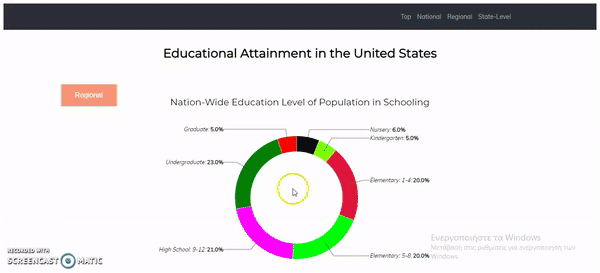
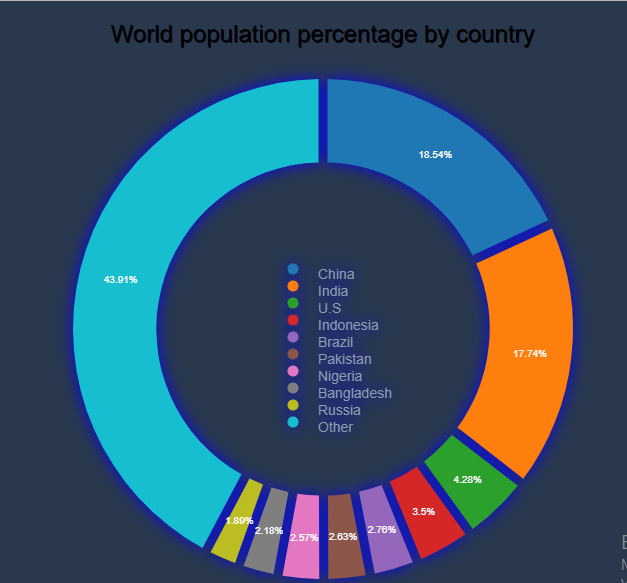
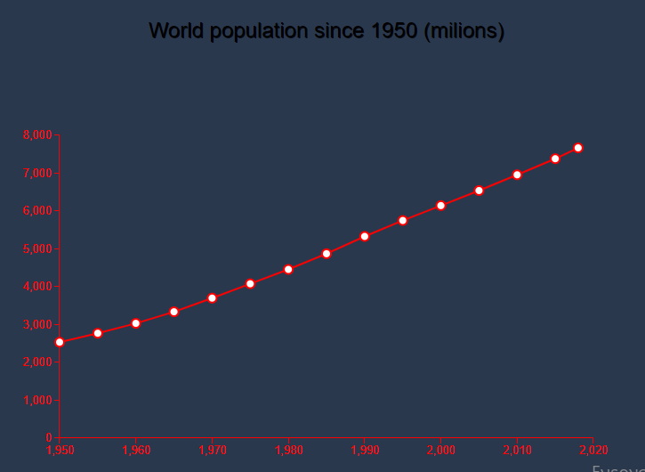

# Επικοινωνία Ανθρώπου-Υπολογιστή
## Εργασία Ανάπτυξης Παραδοτέο 1
### Ονοματεπώνυμο: Κοτσαγιαννίδης Πέτρος
### Αριθμός Μητρώου: Π2017189

**Σύνδεσμος αποθετηρίου https://github.com/p17kots/D3js-US-educational-attainment

**Σύνδεσμος εκτελέσιμου https://p17kots.github.io/D3js-US-educational-attainment/

**Σύνδεσμος στο κλαδί του παραδοτέου https://github.com/p17kots/D3js-US-educational-attainment/tree/gh-pages

#### ΖΗΤΟΥΜΕΝΑ

* Για το πρώτο ζητούμενο έκανα τις κατάλληλες τροποποιήσεις στα αρχεία css,js ώστε να αλλάξω τα χρώματα των γραφημάτων.

* Για το δεύτερο ζητούμενο άλλαξα τις διεπαφές απο το αρχείο js,αλλάζοντας το background-color,το μέγεθος της γραμματοσειράς και τα borders.

* Για το τρίτο ζητούμενο ανέβασα ένα αρχείο ήχου(.mp3) και με τις εντολές onmouseover-onmouseleave ο ήχος ακούγεται όταν ο κέρσορας περνάει πάνω από τις εντολές του μενού.

* Για το τέταρτο ζητούμενο χρησιμοποίησα την βιβλιοθήκη responsivevoice(https://responsivevoice.org/) και με τις αντίστοιχες εντολές όταν ο κέρσορας περνάει πάνω απο κάποιο κείμενο ακούγεται η ανάγνωση κειμένου.

* Αλλαγή χρωμάτων στα 3 γραφήματα

* Αλλαγή διεπαφών

[x] Άλλαξα τα χρώματα στα 3 γραφήματα.

[x] Αντικατέστησα τις διεπαφές στα κουμπιά του 2ου και 3ου γραφήματος.

[x] Όταν το ποντίκι διέρχεται επάνω από κάθε επιλογή του menu στην κορυφή της σελίδας, ακούγεται ήχος.

[x] Όταν το ποντίκι διέρχεται πάνω από κάποια πρόταση/κείμενο της σελίδας ακούγεται αυτόματα η αφήγηση του κειμένου (text-to-speech)

## Εργασία Ανάπτυξης Παραδοτέο 2

 
 
**Σύνδεσμος αποθετηρίου 1 https://github.com/p17kots/D3js-US-educational-attainment

**Σύνδεσμος εκτελέσιμου 1 https://p17kots.github.io/D3js-US-educational-attainment/

**Σύνδεσμος στο κλαδί του παραδοτέου 1 https://github.com/p17kots/D3js-US-educational-attainment/tree/gh-page

**Σύνδεσμος αποθετηρίου 2 https://github.com/p17kots/d3js

**Σύνδεσμος εκτελέσιμου 2 https://p17kots.github.io/d3js/

Όπου (1) απευθύνεται στο αποθετήριο που έχει γίνει fork στο πρώτο παραδοτέο

 Όπου (2) απευθύνεται σε νέο αποθετήριο που δημιούργησα για το δεύτερο παραδοτέο
 
 #### ΖΗΤΟΥΜΕΝΑ
 
 
  Όσον αφορά το πρώτο ζητούμενο πρόσθεσα στην σελίδα κάποια buttons,όπου το καθένα σε μεταφέρει στο αντίστοιχο σχεδιάγραμμα,απενεργοποίησα το scrolling και έτσι με την χρήση των κουμπιών είναι κάθε στιγμή εμφανές μόνο ένα σχεδιάγραμμα.
   
 #### Προβλήματα: Ότι και αν προσπάθησα δεν κατάφερα να κανω την θέση των button συμβατή με όλους τους Browsers και όλες τις οθόνες.Αυτό έχει ως αποτέλεσμα ότι,με τον Browser και την οθόνη που υλοποίησα το ζητούμενο,είναι στην κατάλληλη θέση ενώ με την χρήση διαφορετικών Browser ή οθονών η θέση τους τροποποιείται.
 
* Ενδεικτικό παράδειγμα χρήσης των button
 
 
 
 
 
 Για την υλοποίηση του τρίτου ζητουμένου δημιούργησα ένα νέο αποθετήριο και ξεκίνησα από την αρχή την δημιουργία των σχεδιαγραμμάτων σύμφωνα με το ήδη υπάρχον αποθετήριο(1ο παραδοτεο).Για την εύρεση των σχεδιαγραμμάτων χρησιμοποίησα το Codepen (https://codepen.io/) και με τις κατάλληλες τροποποιήσεις τόσο στον κώδικα όσο και στα data δημιούργησα το τελικό αποτέλεσμα.Τέλος,χρησιμοποίησα την βιβλιοθήκη responsiveVoice(https://responsivevoice.org/) για το text-to-speech όταν το ποντίκι διέρχεται πάνω από τους τίτλους των γραφημάτων
 
 #### Προβλήματα: Παρόλο που στην δημιουργία των 2 πρώτων σχεδιαγραμμάτων δεν αντιμετώπισα καποιο ιδιαίτερο πρόβλημα δεν κατάφερα να εισαγάγω  και τρίτο γράφημα καθώς ότι και αν προσπάθησα η σελίδα index.html δεν το εμφάνιζε.Έτσι,το τελικό αποτέλεσμα έχει 2 και όχι 3 γραφήματα.
 
 
 * Το πρώτο σχεδιάγραμμα
 
 
 
 * Το δεύτερο σχεδιάγραμμα
 
 
 
 
 #### Πηγές για τα στατιστικά στοιχεία:
 
 * 1o: http://www.un.org/en/index.html
 * 2ο: http://www.worldometers.info/world-population/population-by-country/

 
[x]   Τροποποιήστε τον κώδικα και το μενού της εφαρμογής έτσι ώστε κάθε στιγμή να είναι εμφανές μόνο ένα από τα 3 γραφήματα, παραμένοντας πάντα στη σελίδα index.html.

[x]  Σε μια καινούργια σελίδα, να τοποθετήσετε αντίστοιχα 3 νέα διαδραστικά γραφήματα D3js της επιλογής σας, τα οποία θα οπτικοποιούν καινούργια στατιστικά δεδομένα που θα βρείτε από κάποια επίσημη στατιστική αρχή (π.χ. ΕΛΣΤΑΤ, Eurostat κ.λπ.).
 
# Εργασία περιεχομένου

## Παραδοτέο 2: Εισαγωγή διαδραστικών παραδειγμάτων

**Σύνδεσμος αποθετηρίου: https://github.com/p17kots/gr

**Σύνδεσμος εκτελέσιμου: https://p17kots.github.io/gr/

### ΔΙΑΔΡΑΣΤΙΚΑ ΠΑΡΑΔΕΙΓΜΑΤΑ:

(1) Login Button: https://p17kots.github.io/gr/remix/Touch-ID/

(2) Website-list: https://p17kots.github.io/gr/remix/website-list/
