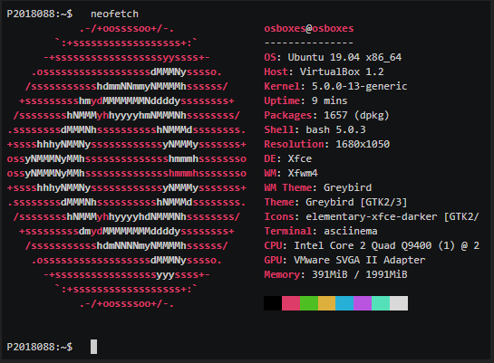
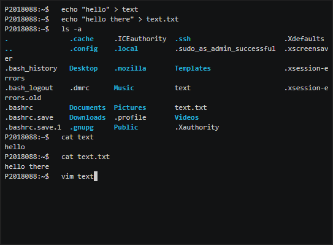
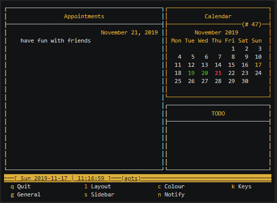
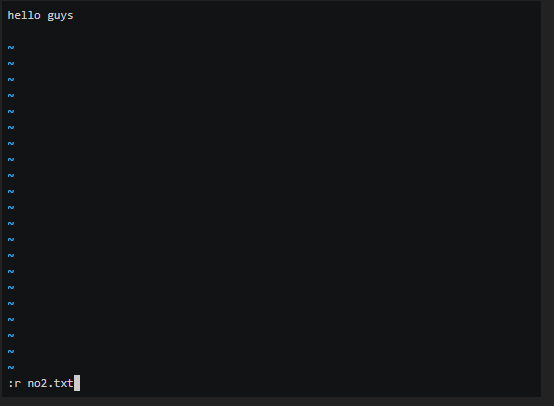

## Μάθημα: Επικοινωνία Ανθρώπου-Υπολογιστή

### Ονοματεπώνυμο: Αλέξανδρος Κοντόπουλος

### Αριθμός Μητρώου Φοιτητή (AM): Π2018088

### [Προφίλ στο github](https://github.com/AlexKontop 'Προφίλ στο github')

#### Άσκηση 1 / Παραδοτέο 1
#### Τα ζητούμενα του πρώτου παραδοτέου είναι τα έξης:
> - Να αλλάξω την γραμμή εντολών με το δίκο μου Αριθμό Μητρώου Φοιτητή.
> - Να εμφανίσω την λίστα με τα dot αρχεία.
> - Να εμφανίσω το shell configuration file.
> - Να εμφανίσω τις πληροφορίες του συστήματος μου όσον αφορά το software και το hardware.

[Asciinema link](https://asciinema.org/a/275458 'Asciinema link')

#### Άσκηση 2 / Παραδοτέο 2
#### Ζητούμενο του δεύτερου παραδοτέου: Να ανοίξω φακέλους μέσα στο σύστημα μου

[Asciinema link](https://asciinema.org/a/278916 'Asciinema link')

## Α Ενδιάμεση Αναφορά - Συμμετοχικό Υλικό
> #### Παρακάτω υπάρχουν οι συνδέσμοι με τις εικόνες οι οποίες έχουν ελεύθερα πνευματικά δικαιώματα (του κανονικού μεγέθους και της επεξεργασμένης έκδοσης στα 160 pixels πλάτος). Επίσης υπάρχουν συνδέσμοι με τις πληροφορίες στον φάκελο _gallery.

> - [Mechanical Keyboard - Κανονικό Μέγεθος](https://github.com/AlexKontop/gr/blob/gh-pages/images/mechanical_keyboard.jpg)
> - [Mechanical Keyboard - 160px](https://github.com/AlexKontop/gr/blob/gh-pages/images/mechanical_keyboard-thumb.jpg)
> - [Mechanical Keyboard - Πληροφορίες](https://github.com/AlexKontop/gr/blob/gh-pages/_gallery/mechanical_keyboard.md)

> - [Code Scanner - Κανονικό Μέγεθος](https://github.com/AlexKontop/gr/blob/gh-pages/images/code_scanner.jpg)
> - [Code Scanner - 160px](https://github.com/AlexKontop/gr/blob/gh-pages/images/code_scanner-thumb.jpg)
> - [Code Scanner - Πληροφορίες](https://github.com/AlexKontop/gr/blob/gh-pages/_gallery/code_scanner.md)

> - [Headphones - Κανονικό Μέγεθος](https://github.com/AlexKontop/gr/blob/gh-pages/images/headphones.jpg)
> - [Headphones - 160px](https://github.com/AlexKontop/gr/blob/gh-pages/images/headphones-thumb.jpg)
> - [Headphones - Πληροφορίες](https://github.com/AlexKontop/gr/blob/gh-pages/_gallery/headphones.md)

> - [Smartwatch - Κανονικό Μέγεθος](https://github.com/AlexKontop/gr/blob/gh-pages/images/smartwatch.jpg)
> - [Smartwatch - 160px](https://github.com/AlexKontop/gr/blob/gh-pages/images/smartwatch-thumb.jpg)
> - [Smartwatch - Πληροφορίες](https://github.com/AlexKontop/gr/blob/gh-pages/_gallery/smartwatch.md)

> - [Sound editing programms - Κανονικό Μέγεθος](https://github.com/AlexKontop/gr/blob/gh-pages/images/sound_editing_programms.jpg)
> - [Sound editing programms - 160px](https://github.com/AlexKontop/gr/blob/gh-pages/images/sound_editing_programms-thumb.jpg)
> - [Sound editing programms - Πληροφορίες](https://github.com/AlexKontop/gr/blob/gh-pages/_gallery/sound_editing_programms.md)

| Author |  Title | Image Url|Caption |Lisence Url|Lisence Text|Categories|Tags|
| :---:  |  :---: | :---:    |:---:    |:---:      |:---:       |:---:     |:---:|
| AlexKontop| Mechanical Keyboard |[Mechanical Keyboard - Κανονικό Μέγεθος](https://github.com/AlexKontop/gr/blob/gh-pages/images/mechanical_keyboard.jpg) [Mechanical Keyboard - 160px](https://github.com/AlexKontop/gr/blob/gh-pages/images/mechanical_keyboard-thumb.jpg)| Ένα μηχανικό πληκτρολόγιο έχει πραγματικούς, φυσικούς διακόπτες στην κάτω μεριά των κουμπιών που δημιουργούν την αίσθηση πληκτρολόγησης σε μια γραφομηχανή. Το πληκτρολόγιο είναι μια περιφερειακή συσκευή, απολύτως απαραίτητη για κάθε ηλεκτρονικό υπολογιστή. Ο κύριος στόχος του είναι η αλληλεπίδραση του χρήστη με τον υπολογιστή.|[License Link](https://pixabay.com/service/license/)|Pixabay License|Technology|Razer|

|||
|:---:|:---:|

| Author |  Title | Image Url|Caption |Lisence Url|Lisence Text|Categories|Tags|
| :---:  |  :---: | :---:    |:---:    |:---:      |:---:       |:---:     |:---:|
| AlexKontop| Code scanner |[Code Scanner - Κανονικό Μέγεθος](https://github.com/AlexKontop/gr/blob/gh-pages/images/code_scanner.jpg) [Code Scanner - 160px](https://github.com/AlexKontop/gr/blob/gh-pages/images/code_scanner-thumb.jpg)|Ο σαρωτής (code scanner) είναι μια σύγχρονη ηλεκτρονική συσκευή ή εφαρμογή ηλεκτρονικής συσκευής η οποία επιτυγχάνει ψηφιοποίηση εικόνας (φωτογραφίας ή σχεδίου) καθώς και κάθε εγγράφου με σκοπό την αποθήκευση ή την επεξεργασία ή και την αποστολή αυτών.|[License Link](https://pixabay.com/service/license/)|Pixabay License|Technology|Xiaomi|

|||
|:---:|:---:|

| Author |  Title | Image Url|Caption |Lisence Url|Lisence Text|Categories|Tags|
| :---:  |  :---: | :---:    |:---:    |:---:      |:---:       |:---:     |:---:|
| AlexKontop| Headphones |[Headphones - Κανονικό Μέγεθος](https://github.com/AlexKontop/gr/blob/gh-pages/images/headphones.jpg) [Headphones - 160px](https://github.com/AlexKontop/gr/blob/gh-pages/images/headphones-thumb.jpg) | Τα ακουστικά (headphones) ειναι ένα ζευγάρι μικρών μεγαφώνων που φοριούνται πάνω από το κεφάλι του χρήστη. Πρόκειται για ηλεκτροακουστικούς μετατροπείς, οι οποίοι μετατρέπουν ένα ηλεκτρικό σήμα σε αντίστοιχο ήχο. Τα ακουστικά επιτρέπουν σε έναν μόνο χρήστη να ακούει μια πηγή ήχου ιδιωτικά, σε αντίθεση με ένα μεγάφωνο, το οποίο εκπέμπει ήχο στον χώρο.|[License Link](https://pixabay.com/service/license/)|Pixabay License|Technology|Razer|

|||
|:---:|:---:|

| Author |  Title | Image Url|Caption |Lisence Url|Lisence Text|Categories|Tags|
| :---:  |  :---: | :---:    |:---:    |:---:      |:---:       |:---:     |:---:|
| AlexKontop| Smartwatch |[Smartwatch - Κανονικό Μέγεθος](https://github.com/AlexKontop/gr/blob/gh-pages/images/smartwatch.jpg) [Smartwatch - 160px](https://github.com/AlexKontop/gr/blob/gh-pages/images/smartwatch-thumb.jpg)  | Ένα smartwatch είναι ένας φορητός υπολογιστής με οθόνη αφής και έχει την μορφή ρολογιού χειρός. Μπορούν να εκτελούν λειτουργίες οπως: υπολογισμούς, μεταφράσεις, αναπαραγωγή παιχνιδιών, αρχείων ήχου, βίντεο και επιτρέπουν την σύνδεση με WiFi / Bluetooth. Ορισμένα smartwatch μπορούν να πραγματοποιούν τηλεφωνικες κλησεις.|[License Link](https://pixabay.com/service/license/)|Pixabay License|Technology|Apple|

|||
|:---:|:---:|

| Author |  Title | Image Url|Caption |Lisence Url|Lisence Text|Categories|Tags|
| :---:  |  :---: | :---:    |:---:    |:---:      |:---:       |:---:     |:---:|
| AlexKontop| Sound editing programms | [Sound editing programms - Κανονικό Μέγεθος](https://github.com/AlexKontop/gr/blob/gh-pages/images/sound_editing_programms.jpg) [Sound editing programms - 160px](https://github.com/AlexKontop/gr/blob/gh-pages/images/sound_editing_programms-thumb.jpg) | Το λογισμικό επεξεργασίας ήχου επιτρέπει την επεξεργασία και την παραγωγή ηχητικών δεδομένων. Υπάρχουν πολλά λογισμικά / προγράμματα.Τα περισσότερα μπορούν να επεξεργαστούν μουσική, να εφαρμόσουν εφέ και φίλτρα, να ρυθμίσουν στερεοφωνικά κανάλια κλπ |[License Link](https://pixabay.com/service/license/)|Pixabay License|Technology|Audacity|

|||
|:---:|:---:|

# ΠΗΓΕΣ ΠΛΗΡΟΦΟΡΙΩΝ
> - [Mechanical Keyboard](https://el.wikipedia.org/wiki/Μηχανικό_πληκτρολόγιο)
> - [Code Scanner](https://el.wikipedia.org/wiki/Σαρωτής)
> - [Headphones](https://en.wikipedia.org/wiki/Headphones)
> - [Smartwatch](https://en.wikipedia.org/wiki/Smartwatch)
> - [Sound editing programms](https://en.wikipedia.org/wiki/Audio_editing_software)

#### Άσκηση 3 / Παραδοτέο 3
#### Τα ζητούμενα του τρίτου παραδοτέου είναι τα έξης:
>add, edit, search for an appointment

[Asciinema link](https://asciinema.org/a/281898 'Asciinema link')

#### Άσκηση 4 / Παραδοτέο 4
vim
[Asciinema link](https://asciinema.org/a/293278 'Asciinema link')

# Γ. Τελική Αναφορά 

Εκφώνηση εργασίας : Γ: 1) μια νέα μελέτη περίπτωσης ή 2) μια νέα βιογραφία, ή 3) ένα νέο διάγραμμα (π.χ., Gordon Bell Nomograph, Xerox Star genealogy, Beaudouin-Lafon Table).

Από τα προαναφερόμενα επιλέγω το 2, προσθέτω στο βιβλίο του μαθήματος την βιογραφία του Bill Gates.

[Σχετικά με τον Bill Gates](https://github.com/AlexKontop/gr/blob/gh-pages/_biography/bill-gates.md '[Σχετικά με τον Bill Gates')

[Σύντομη βιογραφία](https://github.com/AlexKontop/gr/blob/gh-pages/_biography/bio-bill-gates.md '[Σύντομη βιογραφία')

[Bill Gates.jpg](https://github.com/AlexKontop/gr/blob/gh-pages/images/bill-gates.jpg '[Bill Gates.jpg')

[Microsoft.jpg](https://github.com/AlexKontop/gr/blob/gh-pages/images/microsoft.jpg '[Microsoft.jpg')

[Windows 1.0.jpg](https://github.com/AlexKontop/gr/blob/gh-pages/images/win1.jpg '[Windows 1.0.jpg')

[Windows 10.jpg](https://github.com/AlexKontop/gr/blob/gh-pages/images/win10.jpg '[Windows 10.jpg')

# Τέλικη αναφορά

### Ονοματεπώνυμο: Αλέξανδρος Κοντόπουλος

### Αριθμός Μητρώου Φοιτητή (AM): Π2018088

### [Προφίλ στο github](https://github.com/AlexKontop 'Προφίλ στο github')

# Εισαγωγή
Η εργασία αυτή δημιουργήθηκε για το μάθημα Επικοινωνία Ανθρώπου-Υπολογιστή του τρίτου εξαμήνου του τμήματος Πληροφορικής του Ιονίου Πανεπιστήμιου.

# Σύνοψη
Η εργασία αποτελείτε απο 4 ασκήσεις οι οποίες παίρνουν μέρος στο Virtual Box με Ubuntu Linux, την ενδιάμεση και την τελική αναφορά. Στην ενδιάμεση αναφορά πρόσθεσα 5 εικόνες σύμφωνα με την εκφώνηση και στην τελική αναφορά δημιούργησα ένα βιογραφικό σύμφωνα με την εκφώνηση.

# Σύντομη ανάλυση σχετικών έργων και εργαλείων
Το λειτουργικό σύστημα του ηλεκτρονικού υπολογιστή μου είναι windows 7 και για την εκπλήρωση των ασκήσεων χρησιμοποήθηκε το Oracle Vm VirtualBox με Xubuntu 19.04(64bit). Μέσα στο τερματικό linux έκανα κάποιες εγκαταστάσεις με σκοπό την εκπλήρωση των ασκήσεων όπως python, asciinema, neofetch, vim, calcurse και άλλα. Για την εγκατάσταση των παραπάνω πακέτων απλώς έγραψα στο τερματικό του linux την παρακάτω εντολή: sudo apt install <πακέτο> και αυτό εγκαταστάθηκε.

# Μέθοδος και τεχνικές ανάπτυξης
Γενικά οπως προανέφερα όλες οι ασκήσεις παίρνουν μέρος στο terminal του linux, εκεί εξοικειώνομαι και πειραματίζομαι με τις εντολές του περιβάλλοντος.
Στην 1η άσκηση αρχικά αλλάζω την γραμμή εντολών με το δίκο μου Αριθμό Μητρώου Φοιτητή με την χρήση του ~/.bashrc στην συνεχεια εμφανίζω την λίστα με τα dot αρχεία. Έπειτα εμφανίζω το shell configuration file. Τελος εμφανίζω τις πληροφορίες του συστήματος μου όσον αφορά το software και το hardware με την εντολή neofetch.
Στην 2η άσκηση ανοίγω διάφορους φακέλους μέσα στο σύστημα μου με τις εντολές nano, less, cd, cat και άλλες.
Στην 3η άσκηση ασχολούμαι με το calcurse, βάζω ειδοποιήσεις, τις αλλάζω, τις αναζητώ και αλλάζω τα χρωματα των χαρακτήρων μέσω του config.
Στην 4η άσκηση πειραματίζομαι με το vim και ενώνω δύο text αρχεία.
Για την Α ενδιάμεση αναφορά αρχικά πρόσθεσα τις 5 εικόνες στα images σε κανονικό μέγεθος και ακόμη 5 εικόνες σε έκδοση στα 160 pixels πλάτος. Στην συνεχεια έγραψα πληροφορίες για κάθε αντικείμενο που εμφανίζεται στις εικόνες.
Για την Γ τελική αναφορά έψαξα πληροφορίες σχετικά με την βιογραφία του Bill Gates και τα έργα του όπως είναι τα windows και πρόσθεσα κάποιες φωτογραφίες.

# Αποτελέσματα με λεζάντες σε screenshot

Λεζάντα: μέσω της εντολής neofetch εμφανίζονται τα στοιχεία του συστήματος μου.

Λεζάντα: δημιουργώ κάποια text αρχεία και στην συνέχεια τα ανοίγω.

Λεζάντα: δημιουργώ apointments και αλλάζω τα χρώματα των χαρακτήρων.

Λεζάντα: ενώνω δύο text κείμενακια με την εντολη που απεικονίζεται.

# Συμπεράσματα
Μέσω της εργασίας προσαρμόστηκα σε κάποιο βαθμό με το λογισμικό Linux, ήταν μία ευχάριστη εμπειρία επειδή πήρα εμπειρίες και γνώσεις. Έμαθα να μπαίνω στο λογισμικό Linux με το Virtualbox με Xubuntu και έμαθα να γράφω εντολές στο τερματικό και να ανακαλύπτω καινούρια πράγματα. Επίσης μέσω της εργασίας είχα την πρώτη μου επαφή με το github. Το github το βρίσκω αρκετά χρήσιμο εργαλείο και πιστεύω πως αξίζει να το χρησιμοποιώ.

# Βιβλιογραφία
Wikipedia
